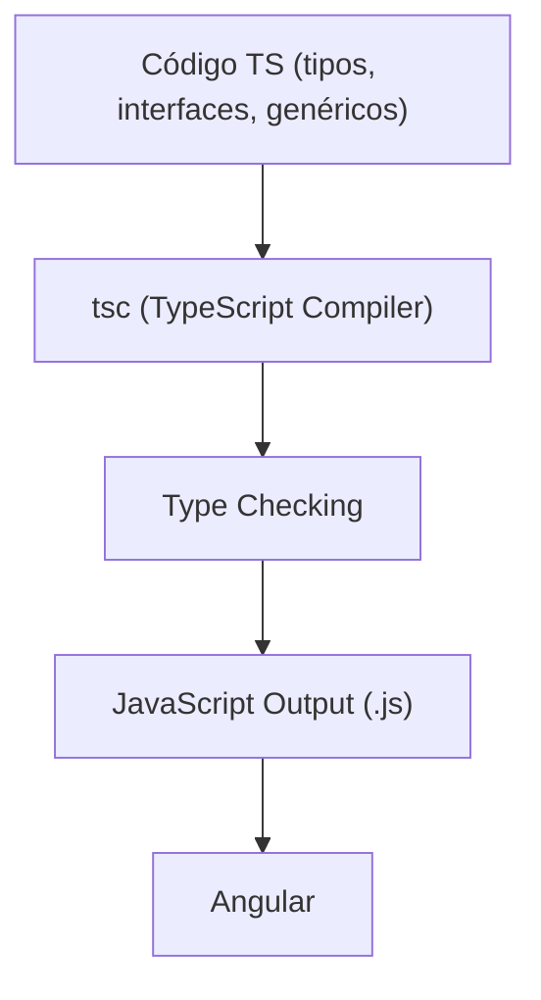

## 01 — Fundamentos de TypeScript para Angular

TypeScript moderno es la base de Angular. Este módulo cubre desde tipos básicos hasta patrones avanzados necesarios para escribir componentes y servicios Angular robustos.

> **Propósito:** Dominar TypeScript moderno como lenguaje base de Angular, cubriendo tipos, genéricos, async/await y patrones avanzados.
>
> **Problema que resuelve:** Sin TypeScript sólido, el código Angular carece de tipado seguro, es propenso a errores en tiempo de ejecución y difícil de mantener en proyectos grandes.
>
> **Cómo lo resuelve:** TypeScript añade tipado estático, genéricos reutilizables, type narrowing y utility types que catchan errores en compilación, no en producción.
>
> **Por qué aprenderlo:** Es la base de todo el ecosistema Angular; cada componente, servicio y pipe se escribe en TypeScript. El 90% de los errores en Angular se previenen con buen tipado.




### Conceptos Clave

- **Tipos básicos**: `string`, `number`, `boolean`, `null`, `undefined`, `void`, `never`
- **Interfaces y Types**: `interface`, `type`, `extends`, intersecciones (`&`), uniones (`|`)
- **Genéricos**: `<T>`, constraints, utility types (`Partial`, `Required`, `Pick`, `Omit`, `Record`)
- **Union Types y Type Narrowing**: discriminated unions, type guards, `typeof`, `instanceof`
- **Async/Await**: `Promise<T>`, `async/await`, `Promise.all`, error handling
- **Módulos ES**: `import`/`export`, barrel files, path aliases
- **Decoradores**: Class decorators, property decorators (base para Angular)
- **Utility Types**: `Awaited`, `ReturnType`, `Parameters`, `NonNullable`, `Satisfies`

### Proyecto

CLI interactiva en TypeScript que procesa datos de usuarios con tipos genéricos, uniones discriminadas y async/await.

### Ejercicios

1. Define una interfaz `User<T>` genérica con `id`, `name`, `role` y `data: T`
2. Crea un type guard `isAdmin(user: User<unknown>): user is User<AdminProfile>`
3. Implementa una función fetch genérica `getResource<T>(url: string): Promise<T>`
4. Usa `satisfies` para tipar un objeto de configuración
5. Crea un mapped type que convierta todas las propiedades a `Readonly`

### Cómo ejecutar

```bash
cd 01-fundamentos-ts
npx ts-node src/index.ts
```
