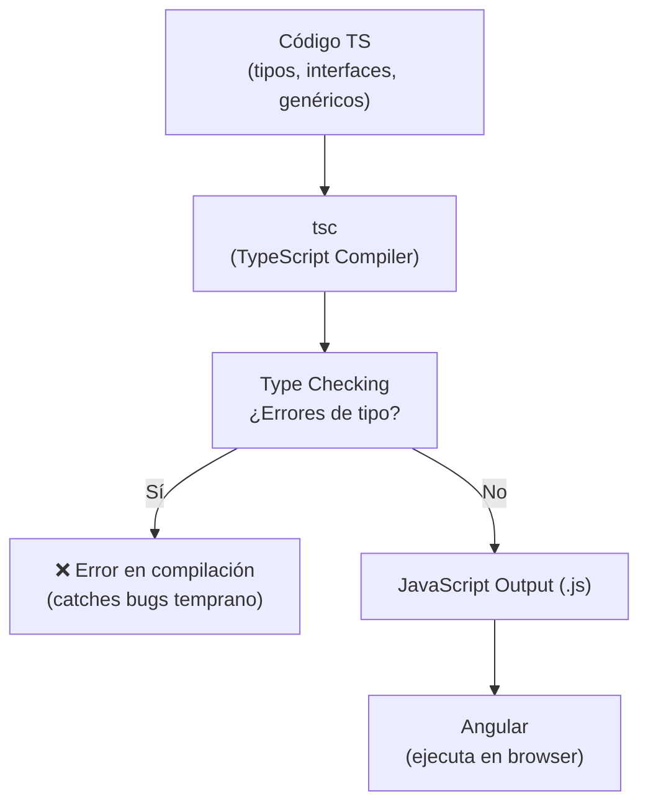

## 01 — Fundamentos de TypeScript para Angular

### Propósito

Aprender los conceptos de TypeScript que Angular usa diariamente: tipos, interfaces, genéricos, async/await y type guards.

### Problema que resuelve

Sin TypeScript, JavaScript permite errores silenciosos que aparecen solo en el navegador:
- Mezclar tipos sin aviso (`let x = 'hola'; x = 42;` → sin error hasta runtime)
- Pasar objetos incompletos a funciones → errores inesperados
- No saber qué tipo de datos devuelve una función → código frágil

### Cómo lo resuelve

TypeScript añade **tipado estático**: el compilador verifica los tipos **antes** de ejecutar el código. Si algo está mal, lo atrapa en el editor, no en producción.

### Por qué aprenderlo

Angular está escrito en TypeScript. Cada componente, servicio y pipe usa tipos. Sin TypeScript sólido:
- `HttpClient.get()` devuelve `Observable<any>` → pierdes autocomplete y type checking
- Los inputs de componentes no están validados → errores en runtime
- Los servicios no pueden reutilizarse con diferentes tipos → código duplicado



---

### 1. Tipos Básicos

**Qué es:** TypeScript añade anotaciones de tipo que el compilador verifica pero elimina al generar JavaScript.

**Por qué Angular lo necesita:** Angular CLI, el template compiler y el dependency injection dependen de tipos para generar código optimizado. Sin tipos, Angular no puede hacer tree-shaking ni verificación de templates.

```typescript
// JavaScript permite esto (sin errores en compilación):
let nombre = 'Angular';
nombre = 42; // ❌ Error solo en runtime

// TypeScript lo atrapa en compilación:
const nombre: string = 'Angular 22';
nombre = 42; // ❌ Error: Type 'number' is not assignable to type 'string'
```

**`unknown` vs `any`:**
- `any` desactiva completamente el type checking → equivalente a JavaScript
- `unknown` fuerza a hacer narrowing antes de usar → seguro y flexible

```typescript
let algo: unknown = 'puede ser cualquier cosa';
// algo.length; // ❌ Error: 'unknown' no tiene propiedades

if (typeof algo === 'string') {
  algo.length; // ✅ TypeScript sabe que es string
}
```

**En Angular:** Los datos de APIs externas, valores de formularios y parámetros de rutas llegan como `unknown`. TypeScript fuerza a validarlos antes de usarlos.

---

### 2. Interfaces y Types

**Interfaces** definen la "forma" de un objeto. **Types** pueden hacer lo mismo pero también crear aliases de tipos primitivos, uniones e intersecciones.

**Cuándo usar cuál:**
- `interface` → para objetos que pueden ser extendidos (componentes, servicios)
- `type` → para uniones, intersecciones, tipos compuestos, o cuando necesitas `satisfies`

```typescript
// Interface: ideal para objetos que otros van a extender
interface Persona {
  readonly id: number;  // readonly: no se puede reasignar después de crear
  nombre: string;
  email?: string;       // opcional: puede no existir
}

// Type con intersección: combina dos tipos
type Empleado = Persona & { departamento: string };
// Empleado tiene: id, nombre, email?, departamento
```

**`readonly` en interfaces:** En Angular, los inputs de componentes son inmutables por convención. `readonly` refleja esa intención en el tipo.

**Propiedades opcionales (`?`):** En Angular, muchos datos de APIs pueden no estar presentes. `email?` dice "este campo puede no existir", y TypeScript obliga a manejar ese caso.

---

### 3. Genéricos

**Qué son:** Funciones o tipos que trabajan con **cualquier** tipo, pero de forma segura. Como un molde que acepta diferentes materiales.

**Por qué Angular los usa constantemente:**
- `HttpClient.get<T>(url)` → devuelve `Observable<T>`, no `Observable<any>`
- `Observable<User[]>` → el subscribe sabe que recibe un array de Users
- `@Input<T>()` → valida el tipo del input en compile time

```typescript
// Sin genéricos: función que solo sirve para números
function firstNumber(arr: number[]): number | undefined {
  return arr[0];
}

// Con genéricos: función reutilizable para CUALQUIER tipo
function first<T>(arr: T[]): T | undefined {
  return arr[0];
}

first([1, 2, 3]);       // T = number → devuelve number | undefined
first(['a', 'b']);       // T = string → devuelve string | undefined
first([true, false]);    // T = boolean → devuelve boolean | undefined
```

**Constraints (`extends`):** Restringe qué tipos puede aceptar el genérico.

```typescript
// T y U deben ser objetos (no primitivos)
function merge<T extends object, U extends object>(a: T, b: U): T & U {
  return { ...a, ...b };
}

merge({ a: 1 }, { b: 2 });       // ✅ { a: 1, b: 2 }
merge({ a: 1 }, 'texto');         // ❌ Error: 'string' no es un objeto
```

**En Angular real:**

```typescript
// Servicio genérico reutilizable
@Injectable({ providedIn: 'root' })
export class ApiService {
  get<T>(endpoint: string): Observable<T> {
    return this.http.get<T>(`${this.baseUrl}/${endpoint}`);
  }
}

// Uso: cada llamada sabe qué tipo devuelve
this.api.get<User[]>('users')  // Observable<User[]>
this.api.get<Product>('products/1')  // Observable<Product>
```

---

### 4. Utility Types

TypeScript viene con tipos predefinidos que transforman otros tipos. Son la herramienta diaria en Angular.

| Utility Type | Qué hace | Ejemplo en Angular |
|---|---|---|
| `Partial<T>` | Todas las props opcionales | Formulario de edición (campos opcionales) |
| `Required<T>` | Todas las props obligatorias | Validar que un objeto esté completo |
| `Pick<T, K>` | Solo las props que eliges | Extraer solo `nombre` y `email` de un User |
| `Omit<T, K>` | Todo excepto las props que quitas | User sin el campo `password` |
| `Record<K, V>` | Diccionario tipado | Mapa de configuración por ID |

```typescript
// Partial: useful para formularios de edición
// El usuario puede editar solo algunos campos
type UpdateUser = Partial<Persona>;
// equivalente a: { id?: number; nombre?: string; email?: string }

// Pick: extraer solo lo que necesitas
type SoloNombre = Pick<Persona, 'nombre'>;
// equivalente a: { nombre: string }

// Omit: excluir campos sensibles
type UserSinPassword = Omit<Persona, 'id'>;
// equivalente a: { nombre: string; email?: string }

// Record: diccionario tipado
type Notas = Record<string, number>;
// { [key: string]: number }
const notas: Notas = { math: 95, english: 87 };
```

---

### 5. Union Types y Type Narrowing

**Union Types:** Un valor puede ser uno de varios tipos. TypeScript permite definir esto con `|`.

**Type Narrowing:** TypeScript **automáticamente** sabe qué tipo es después de una verificación. Esto es lo que hace que Angular templates sean seguros.

```typescript
// Unión discriminada: el campo 'status' define qué datos existen
type ResultadoAPI<T> =
  | { status: 'success'; data: T }      // si success → tiene .data
  | { status: 'error'; error: string }   // si error → tiene .error
  | { status: 'loading' };               // si loading → no tiene datos

function handleResult(result: ResultadoAPI<number>) {
  // TypeScript hace NARROWING automáticamente
  if (result.status === 'success') {
    console.log(result.data);     // ✅ TypeScript SABE que .data existe
  } else if (result.status === 'error') {
    console.log(result.error);    // ✅ TypeScript SABE que .error existe
  }
  // No hay .data ni .error cuando status === 'loading'
}
```

**En Angular:** Este patrón es **exactamente** cómo funcionan los signals, estado de peticiones HTTP, y el manejo de carga en componentes:

```typescript
// Patrón real en Angular
type EstadoCarga<T> =
  | { estado: 'idle' }
  | { estado: 'loading' }
  | { estado: 'success'; datos: T }
  | { estado: 'error'; mensaje: string };
```

---

### 6. Async/Await

**Qué es:** Azúcar sintáctico para Promesas. Hace que código asíncrono se lea como código síncrono.

**Por qué Angular lo necesita:** Casi todo en Angular es asíncrono: HTTP requests, eventos de usuario, timers, WebSockets. Sin async/await, el código se vuelve un infierno de `.then()`.

```typescript
// Sin async/await (Promise chain): difícil de leer
function fetchUser(id: number): Promise<Persona> {
  return fetch(`/api/users/${id}`)
    .then(res => res.json())
    .then(data => data as Persona);
}

// Con async/await: se lee como código síncrono
async function fetchUser(id: number): Promise<Persona> {
  const res = await fetch(`/api/users/${id}`);
  if (!res.ok) throw new Error(`HTTP ${res.status}`);
  return res.json();
}

// Promise.all: ejecutar múltiples peticiones en paralelo
const [usuario, productos] = await Promise.all([
  fetchUser(1),
  fetchProductos(),
]);
```

**En Angular:** Los servicios inyectados usan `Observable`, pero los componentes frecuentemente usan `async` pipes o `firstValueFrom()` para convertir a Promesas.

---

### 7. Type Guards

**Qué son:** Funciones que le dicen a TypeScript qué tipo es un valor en un momento dado. Retornan un "type predicate": `valor is Tipo`.

**Por qué importa en Angular:** Angular no puede inferir tipos en templates HTML. Los type guards permiten que el componente "ensene" al template qué tipo de datos tiene.

```typescript
// Type guard: función que retorna true si el valor es del tipo indicado
function isString(value: unknown): value is string {
  return typeof value === 'string';
}

function isNumber(value: unknown): value is number {
  return typeof value === 'number' && !isNaN(value);
}

// Uso: TypeScript hace narrowing automático
function process(value: unknown) {
  if (isString(value)) {
    // Aquí TypeScript SABE que value es string
    console.log(value.length);  // ✅ sin error
  } else if (isNumber(value)) {
    // Aquí TypeScript SABE que value es number
    console.log(value ** 2);    // ✅ sin error
  }
}
```

**En Angular real:** Los type guards se usan en pipes, directivas y componentes para manejar datos de tipos desconocidos de forma segura.

---

### 8. `satisfies`

**Qué hace:** Verifica que un objeto cumple con un tipo **sin cambiar el tipo inferido**. Diferente de la aserción (`as`) que fuerza un tipo.

```typescript
type Palette = { [key: string]: string };

// Con 'as': fuerza el tipo, pierde información específica
const colors1 = { primary: '#007bff', secondary: '#6c757d' } as Palette;
colors1.primary.toUpperCase(); // ❌ Error: Palette no garantiza .primary

// Con 'satisfies': valida que cumple, PERO mantiene el tipo literal
const colors2 = {
  primary: '#007bff',
  secondary: '#6c757d',
} satisfies Palette;
colors2.primary.toUpperCase(); // ✅ TypeScript SABE que .primary es string
```

**Diferencia clave:**
- `as Palette` → "confía en mí, esto es Palette" (puede estar mal)
- `satisfies Palette` → "verifica que esto cumple Palette y recuerda qué tiene"

**En Angular:** Útil para configuraciones de rutas, validadores de formularios, y configuraciones de módulos donde necesitas que TypeScript valide la estructura pero mantenga los tipos literales.

---

### Ejercicios

1. Define una interfaz `User<T>` genérica con `id`, `name`, `role` y `data: T`
2. Crea un type guard `isAdmin(user: User<unknown>): user is User<AdminProfile>`
3. Implementa una función fetch genérica `getResource<T>(url: string): Promise<T>`
4. Usa `satisfies` para tipar un objeto de configuración de columnas de tabla
5. Crea un mapped type que convierta todas las propiedades de un tipo a `Readonly`

### Cómo ejecutar

```bash
cd 01-fundamentos-ts
npx tsx src/index.ts
```

### Archivos del Proyecto

| Archivo | Contenido |
|---|---|
| `src/index.ts` | Demo de todos los conceptos con comentarios explicativos |
| `src/helper.ts` | Type guards, utilidades genéricas y tipos reutilizables |
| `src/ejercicios.ts` | Soluciones a los 5 ejercicios propuestos |
