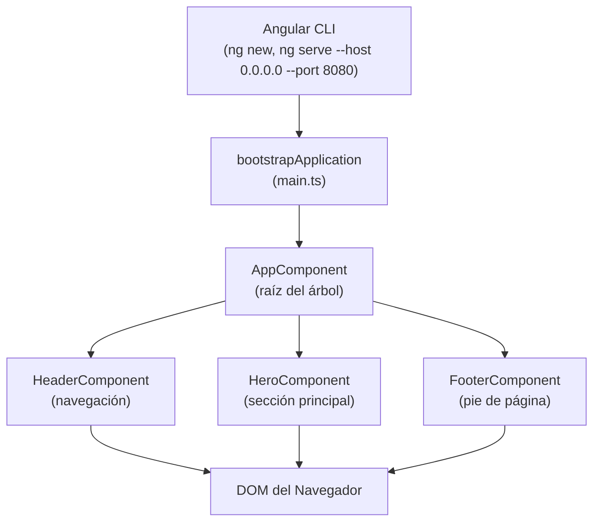

## 02 — Introducción a Angular con CLI

### Objetivo de Aprendizaje

Crear tu primera aplicación Angular 22 usando componentes standalone, entender cómo Angular organiza el código y cómo los componentes se comunican entre sí con property binding y event binding.

### Por Qué Angular

Angular es un framework opinionado para SPAs. A diferencia de React o Vue, Angular impone una estructura clara: componentes, servicios, dependencias inyectadas. Esto facilita el trabajo en equipos grandes pero tiene una curva de aprendizaje más pronunciada.



---

### 1. Angular CLI

**Qué es:** Línea de comandos para crear, desarrollar y compilar proyectos Angular.

**Comandos esenciales:**

| Comando | Qué hace |
|---|---|
| `ng new <nombre>` | Crea un proyecto nuevo con toda la configuración |
| `ng serve --host 0.0.0.0 --port 8080` | Inicia el servidor de desarrollo con hot reload |
| `ng build` | Compila el proyecto para producción |
| `ng generate component <nombre>` | Genera un componente con su template, estilos y spec |

```bash
# Crear proyecto nuevo
ng new mi-proyecto --standalone
# --standalone: genera componentes standalone por defecto (Angular 22+)

# Iniciar servidor de desarrollo
ng serve --host 0.0.0.0 --port 8080
# Abre en http://localhost:4200
# Hot reload: los cambios se reflejan automáticamente

# Generar un componente
ng generate component header
# Crea: src/app/header/header.component.ts
#        src/app/header/header.component.html
#        src/app/header/header.component.css
```

---

### 2. Standalone Components

**Qué es:** Componentes que se declaran a sí mismos como independientes, sin necesidad de NgModules.

**Angular 19+:** Los componentes son standalone por defecto. No necesitas `standalone: true` explícito.

**Antes (Angular < 19):**
```typescript
// Necesitabas un módulo para declarar componentes
@NgModule({
  declarations: [AppComponent, HeaderComponent],
  imports: [BrowserModule],
  bootstrap: [AppComponent]
})
export class AppModule {}
```

**Ahora (Angular 22):**
```typescript
// El componente se declara a sí mismo
@Component({
  selector: 'app-root',
  standalone: true,  // opcional en Angular 22, es el default
  imports: [HeaderComponent],  // importas directamente los componentes hijos
  template: `<app-header />`
})
export class AppComponent {}
```

**Por qué importa:** Menos boilerplate, más fácil de entender, mejor tree-shaking.

---

### 3. Estructura del Proyecto

```
02-intro-angular/
├── src/
│   ├── app/
│   │   ├── app.component.ts      ← Componente raíz
│   │   ├── app.config.ts         ← Configuración de providers
│   │   ├── header/               ← Componente hijo
│   │   ├── hero/                 ← Componente hijo
│   │   └── footer/               ← Componente hijo
│   ├── main.ts                   ← Punto de entrada (bootstrap)
│   ├── index.html                ← HTML base
│   └── styles.css                ← Estilos globales
├── angular.json                  ← Configuración de Angular CLI
├── package.json                  ← Dependencias
└── tsconfig.json                 ← Configuración de TypeScript
```

**Archivos clave:**

| Archivo | Propósito |
|---|---|
| `main.ts` | Punto de entrada. Llama `bootstrapApplication` para iniciar la app |
| `app.config.ts` | Configuración global: providers, router, HTTP client |
| `app.component.ts` | Componente raíz. Contiene todos los demás componentes |
| `index.html` | HTML que Angular carga. `<app-root>` es donde se monta la app |
| `angular.json` | Configuración de build, serve, y assets |

---

### 4. Interpolación `{{ }}`

**Qué es:** Inserta valores del componente TypeScript en el template HTML.

```typescript
// En el componente
@Component({
  template: `<h1>{{ title }}</h1>`
})
export class HeaderComponent {
  title = 'Mi Portfolio';  // Se muestra como: <h1>Mi Portfolio</h1>
}
```

**Qué puede ir dentro de `{{ }}`:**
- Propiedades del componente: `{{ title }}`
- Expresiones TypeScript: `{{ 2 + 2 }}` → `4`
- Llamadas a métodos: `{{ getName() }}`
- Operador ternario: `{{ isActive ? 'Activo' : 'Inactivo' }}`

**No puede ir:**
- Asignaciones: `{{ title = 'nuevo' }}` ❌
- Statements: `{{ for(i=0; i<10; i++) }}` ❌
- Side effects: `{{ console.log('test') }}` ❌

---

### 5. Property Binding `[property]`

**Qué es:** Enlaza una propiedad del componente a una propiedad del elemento HTML.

```typescript
@Component({
  // [src] enlaza la propiedad src del elemento  con la variable imageUrl
  template: ``
})
export class HeroComponent {
  imageUrl = 'https://example.com/photo.jpg';
  userName = 'Edgardo';
}
```

**Diferencia con interpolación:**
- `{{ imageUrl }}` → inserta el valor como texto
- `[src]="imageUrl"` → enlaza a la propiedad del DOM (puede ser URL, booleano, objeto)

**Property binding es necesario cuando:**
- El valor no es texto (URLs, booleanos, objetos)
- Necesitas enlazar a propiedades que no son atributos HTML

```html
<!-- Estos son equivalentes para atributos simples -->


<!-- Property binding es necesario para propiedades del DOM -->
<input [disabled]="isDisabled">
<div [hidden]="isVisible">
```

---

### 6. Event Binding `(event)`

**Qué es:** Escucha eventos del DOM y ejecuta un método del componente.

```typescript
@Component({
  // (click) escucha el evento click del botón
  // notify.emit() envía un mensaje al componente padre
  template: `<button (click)="notify.emit('¡Hola!')">Contáctame</button>`
})
export class HeroComponent {
  @Output() notify = new EventEmitter<string>();
}
```

**Sintaxis:**
- `(click)="metodo()"` → click del ratón
- `(input)="onInput($event)"` → cambio en input
- `(keyup.enter)="onEnter()"` → tecla Enter
- `(mouseover)="onHover()"` → ratón sobre elemento

**`$event`:** Objeto con información del evento. Para inputs, `$event.target.value` es el valor actual.

---

### 7. @Input y @Output

**`@Input()`** — Pasa datos del componente padre al hijo:

```typescript
// Padre (app.component.ts)
template: `<app-header [title]="pageTitle" [navLinks]="navLinks" />`
pageTitle = 'Angular Portfolio';
navLinks = ['Inicio', 'Proyectos', 'Contacto'];

// Hijo (header.component.ts)
@Input({ required: true }) title!: string;
@Input({ required: true }) navLinks!: string[];
```

**`@Output()`** — El hijo notifica al padre:

```typescript
// Hijo (hero.component.ts)
@Output() notify = new EventEmitter<string>();
// Cuando el usuario hace click, emite un mensaje al padre

// Padre (app.component.ts)
template: `<app-hero (notify)="onNotify($event)" />`
onNotify(msg: string) {
  alert(msg);  // Recibe el mensaje del hijo
}
```

**Flujo de datos:**
```
Padre → [property] → Hijo  (datos bajan)
Padre ← (event) ← Hijo    (eventos suben)
```

---

### 8. @for Control Flow

**Qué es:** Directiva estructural para iterar sobre arrays. Reemplaza a `*ngFor` de versiones anteriores.

```typescript
// En header.component.ts
template: `
  <nav>
    @for (link of navLinks; track link) {
      <a href="#">{{ link }}</a>
    }
  </nav>
`
// navLinks = ['Inicio', 'Proyectos', 'Contacto']
// Genera 3 elementos <a>
```

**`track` es obligatorio:** Angular necesita saber cómo identificar cada elemento para optimizar el DOM. Usa `track` con un valor único (id, índice, o el mismo elemento si es primitivo).

```typescript
// Para objetos con id
@for (item of items; track item.id) {
  <div>{{ item.name }}</div>
}

// Para arrays de primitivos
@for (link of navLinks; track link) {
  <a>{{ link }}</a>
}
```

---

### 9. Bootstrap Application

**Qué es:** Función que inicializa la aplicación Angular. Es el punto de entrada.

```typescript
// main.ts
import { bootstrapApplication } from '@angular/platform-browser';
import { AppComponent } from './app/app.component';
import { appConfig } from './app/app.config';

// bootstrapApplication: crea la aplicación y la monta en el DOM
// Parámetros:
//   1. Componente raíz (AppComponent)
//   2. Configuración (providers, router, etc.)
bootstrapApplication(AppComponent, appConfig).catch((err) => console.error(err));
```

**`app.config.ts`:** Define los providers globales (servicios, router, HTTP client):

```typescript
import { ApplicationConfig } from '@angular/core';

export const appConfig: ApplicationConfig = {
  providers: [
    // Aquí van los providers: provideRouter(), provideHttpClient(), etc.
  ],
};
```

---

### 10. Solución de Problemas Comunes

#### Error: `@angular-devkit/build-angular:dev-server` deprecated

Angular 22 migra el builder. Actualiza `angular.json`:

```json
"serve": {
  "builder": "@angular/build:dev-server"
}
```

#### Error: `EACCES: permission denied` en puertos

Windows Firewall bloquea puertos 4200/4201. Soluciones:

```bash
# Opción 1: usar un puerto diferente (8080 funciona)
ng serve --host 0.0.0.0 --port 8080 --host 0.0.0.0 --port 8080

# Opción 2: agregar regla de firewall (como Administrador)
netsh advfirewall firewall add rule name="Angular Dev" dir=in action=allow protocol=TCP localport=4200-4210
```

#### Error: `Need to install the following packages: ts-node`

Usa `tsx` en lugar de `ts-node` para ES modules:

```bash
# Incorrecto
npx ts-node src/index.ts

# Correcto
npx tsx src/index.ts
```

---

### Ejercicios

1. Crea un proyecto con `ng new portfolio --standalone`
2. Genera 3 componentes: `Header`, `Hero`, `Footer`
3. Usa interpolación para mostrar título y descripción
4. Aplica property binding a imágenes y event binding a botones
5. Configura `bootstrapApplication` con providers

### Cómo ejecutar

```bash
cd 02-intro-angular
npm install
ng serve --host 0.0.0.0 --port 8080 --host 0.0.0.0 --port 8080
```

Abrir en `http://localhost:8080`

### Archivos del Proyecto

| Archivo | Contenido |
|---|---|
| `src/main.ts` | Punto de entrada: `bootstrapApplication` |
| `src/app/app.component.ts` | Componente raíz con datos y manejo de eventos |
| `src/app/app.config.ts` | Configuración de providers globales |
| `src/app/header/` | Navegación con `@Input` y `@for` |
| `src/app/hero/` | Sección principal con `@Input` y `@Output` |
| `src/app/footer/` | Pie de página con `@Input` |
