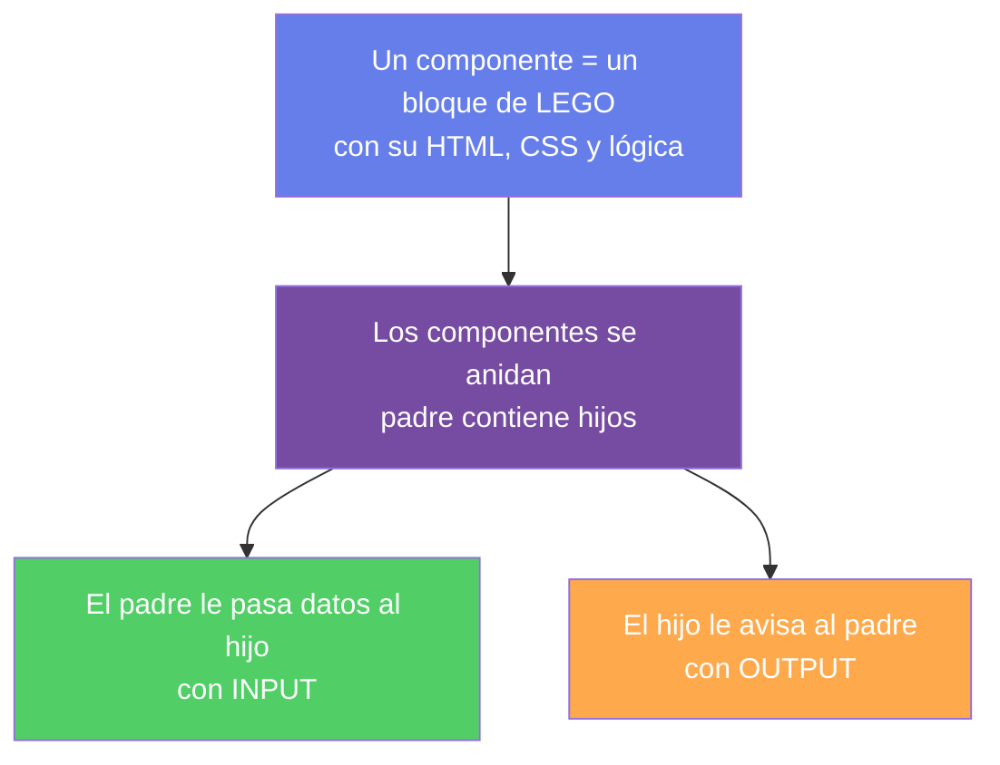
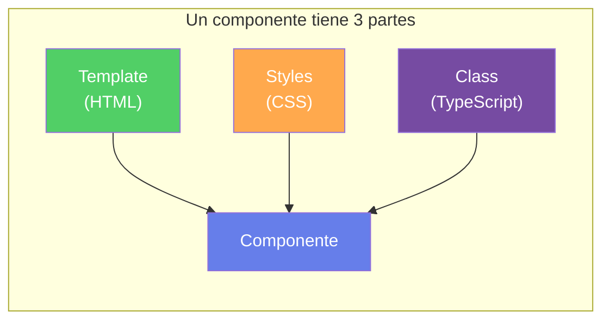
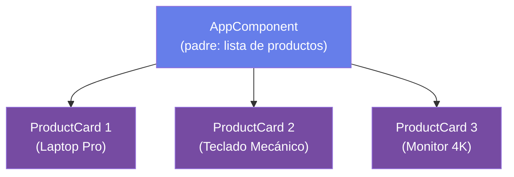
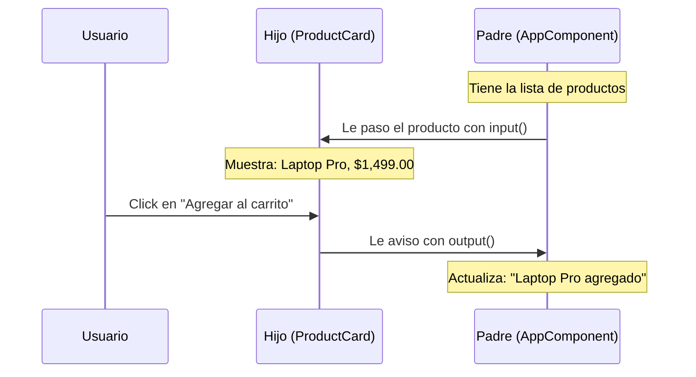
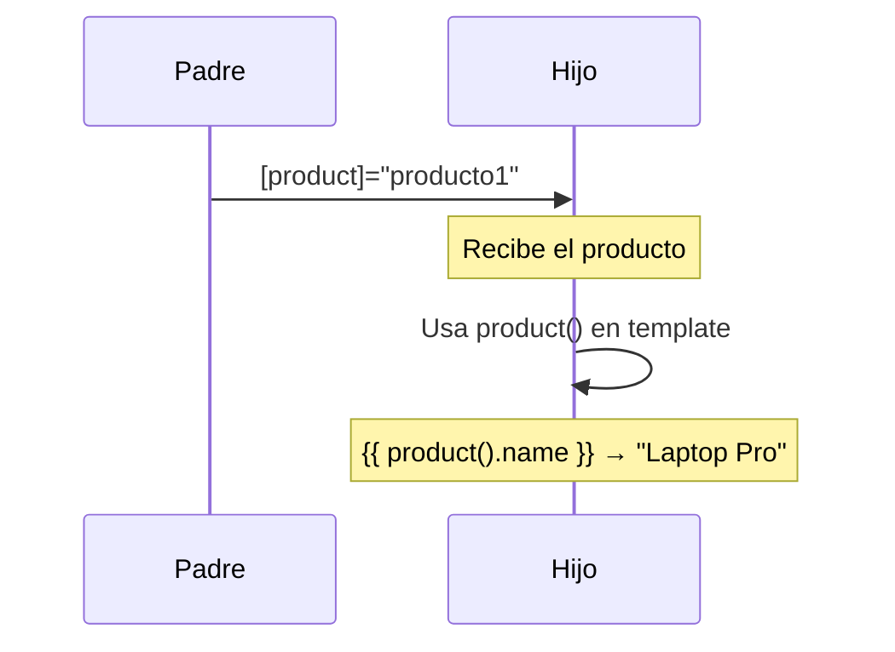
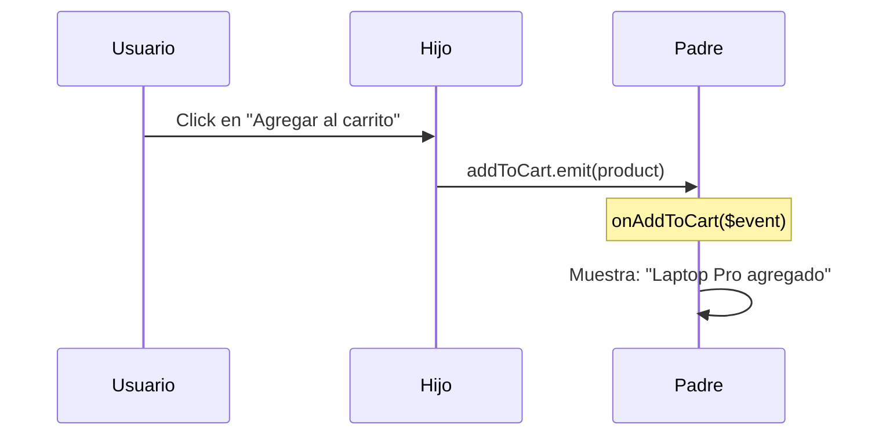
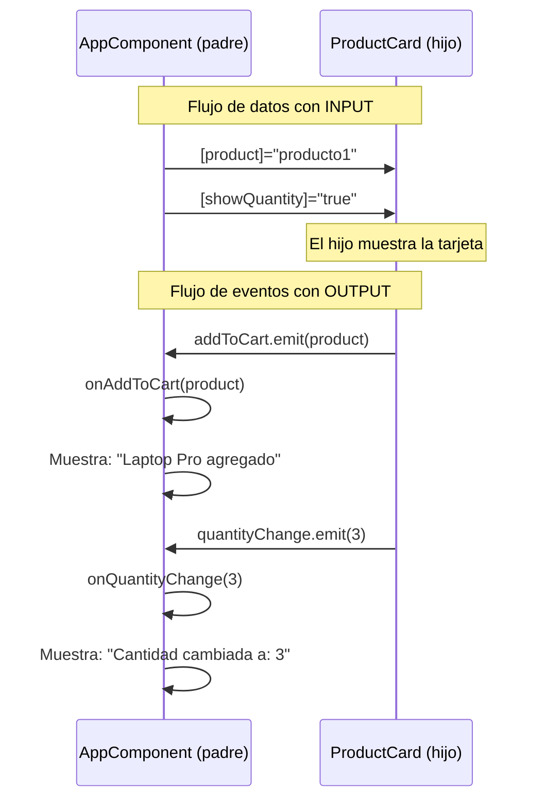

## 03 — Componentes, Input y Output

### ¿Qué vamos a aprender?

Cómo funcionan los componentes Angular y cómo se comunican entre sí.



---

### Glosario Básico

#### `interface` — Contrato de datos

Define **qué datos tiene un objeto**. Es como un formulario que dice "este objeto debe tener un nombre, un precio y una imagen".

```typescript
interface Product {
  id: number;      // debe tener un id que es número
  name: string;    // debe tener un name que es texto
  price: number;   // debe tener un price que es número
  image: string;   // debe tener un image que es texto (URL)
}
```

Si intentas crear un objeto que no cumple el contrato, TypeScript da error:

```typescript
const producto: Product = { id: 1, name: 'Laptop' };
// ❌ Error: falta 'price' e 'image'
```

---

#### `@Component` — Decorador

Es una **etiqueta** que le dice a Angular: "esta clase es un componente". Sin este decorador, Angular no sabe que existe.

```typescript
@Component({
  selector: 'app-product-card',   // nombre del componente en HTML
  standalone: true,                // es independiente (no necesita módulo)
  template: `<h1>Hola</h1>`,      // HTML del componente
  styles: [`h1 { color: red; }`]   // CSS del componente
})
export class ProductCardComponent { }
```

El decorador es como una **ficha técnica**: le da al componente su nombre, su HTML y sus estilos.

---

#### `template` — El HTML del componente

Es el **HTML que se muestra en pantalla**.

```typescript
template: `
  <div class="card">
    <h3>{{ product.name }}</h3>        <!-- {{ }} = mostrar dato -->
    <button (click)="onSubmit()">OK</button>  <!-- (click) = escuchar click -->
  </div>
`
```

- `{{ product.name }}` → muestra el valor de la propiedad
- `[src]="product.image"` → enlaza un atributo HTML
- `(click)="onSubmit()"` → ejecuta una función cuando hacen click

---

#### `styles` — El CSS del componente

Son los estilos que aplican **solo a este componente**. No se filtran a otros.

```typescript
styles: [`
  .card { border: 1px solid #ccc; border-radius: 8px; }
  h3 { color: #333; }
`]
```

---

#### `export class` — La clase del componente

Es el **código TypeScript** que define qué datos tiene el componente y qué hace.

```typescript
export class ProductCardComponent {
  name = 'Laptop';      // propiedad
  price = 999;          // propiedad
  onSubmit() { }        // método
}
```

- `export` → permite que otros archivos importen esta clase
- `class` → define un objeto con propiedades y métodos

---

#### `standalone: true` — Componente independiente

Significa que el componente **no necesita un NgModule** para funcionar. Es la forma moderna de Angular (17+).

---

#### `imports` — Componentes hijos

Lista los componentes que este componente **usa en su template**.

```typescript
@Component({
  imports: [HeaderComponent, FooterComponent],
  template: `
    <app-header />
    <app-footer />
  `
})
```

Es como decir: "para usar `<app-header>` en mi HTML, necesito importarlo aquí".

---

#### `selector` — Nombre del componente en HTML

```typescript
@Component({ selector: 'app-product-card' })
// En el HTML: <app-product-card />
```

---

### ¿Qué es un componente?

Un componente es un **bloque de LEGO** con su propia lógica y apariencia.



Ejemplo: una tarjeta de producto es un componente. Tiene imagen, nombre, precio y un botón.

---

### ¿Cómo se organizan los componentes?

Los componentes se organizan como un **árbol familiar**: un padre que contiene hijos.



- **Padre (AppComponent)**: tiene la lista de productos y maneja los eventos
- **Hijos (ProductCard)**: cada uno muestra una tarjeta con su producto

---

### ¿Por qué necesitan comunicarse?

Imagina que tienes un carrito de compras:
- El **padre** muestra la lista de productos
- Cada **hijo** es una tarjeta de producto

Cuando haces click en "Agregar al carrito" en un hijo, el padre necesita saberlo para actualizar el total. Eso es **comunicación**.



---

### Concepto 1: Input — El padre le pasa datos al hijo

**Analogía:** Como cuando le pasas una pelota a alguien. Tú le das el dato, él lo recibe.



**En el hijo** (define qué datos necesita recibir):

```typescript
export class ProductCardComponent {
  // "Necesito que el padre me pase un Product"
  product = input.required<Product>();

  // "Si el padre no me dice nada, uso false"
  showQuantity = input(false);
}
```

**En el padre** (le pasa los datos al hijo):

```typescript
template: `
  <app-product-card
    [product]="producto1"           ← le paso el producto
    [showQuantity]="true"           ← le paso si muestra cantidad
  />
`
```

**¿Cómo funciona?**

1. El padre dice: `[product]="producto1"` → "hijo, toma este producto"
2. El hijo recibe: `product = input.required<Product>()` → "ok, tengo el producto"
3. El hijo lo usa en su template: `{{ product().name }}` → "Laptop Pro"

---

### Concepto 2: Output — El hijo le avisa al padre

**Analogía:** Como cuando alguien te llama por tu nombre. Él hace algo y te avisa.



**En el hijo** (define qué eventos puede emitir):

```typescript
export class ProductCardComponent {
  // "Puedo emitir un Product al padre"
  addToCart = output<Product>();

  // "Puedo emitir un number al padre"
  viewDetails = output<number>();
}
```

**En el hijo** (template, emite el evento):

```typescript
template: `
  <!-- Cuando hacen click, emito el producto al padre -->
  <button (click)="addToCart.emit(product)">Agregar al carrito</button>
`
```

**En el padre** (escucha el evento):

```typescript
template: `
  <app-product-card (addToCart)="onAddToCart($event)" />
`

onAddToCart(product: Product) {
  alert(`Agregaste ${product.name}`);
}
```

**¿Cómo funciona?**

1. El usuario hace click en "Agregar al carrito"
2. El hijo ejecuta: `addToCart.emit(product)` → "¡padre, mira este producto!"
3. Angular detecta el evento y llama: `onAddToCart($event)`
4. El padre ejecuta: `alert("Agregaste Laptop Pro")`

**¿Qué es `$event`?** Es el dato que el hijo envió. En este caso, el objeto `Product`.

---

### Diagrama completo: Cómo fluyen los datos



**Regla de oro:**
- **Datos** → van de padre a hijo (con `[property]`)
- **Eventos** → van de hijo a padre (con `(event)`)

---

### Código completo del proyecto

Veamos el código línea por línea.

#### 1. El hijo: `product-card.component.ts`

```typescript
import { Component, input, output } from '@angular/core';
import { CurrencyPipe } from '@angular/common';

// interface: define la forma de un objeto
// Es como un molde que dice "todo producto debe tener id, name, price, image"
export interface Product {
  id: number;
  name: string;
  price: number;
  image: string;
}

@Component({
  selector: 'app-product-card',
  standalone: true,
  imports: [CurrencyPipe],

  template: `
    <div class="card">
      <!--
        [src]="product().image" → le digo al navegador:
        "pon la imagen que está en product().image"
      -->
      

      <div class="body">
        <!-- {{ product().name }} → muestra el nombre -->
        <h3>{{ product().name }}</h3>

        <!-- {{ product().price | currency }} → precio formateado: $1,499.00 -->
        <p class="price">{{ product().price | currency }}</p>

        <!--
          (click)="addToCart.emit(product())" → cuando hacen click:
          1. llamo a addToCart.emit() para avisar al padre
          2. le paso el producto completo
        -->
        <button (click)="addToCart.emit(product())">Agregar al carrito</button>

        <!-- @if (showQuantity()) → solo muestro esto SI showQuantity() es true -->
        @if (showQuantity()) {
          <input type="number" [value]="quantity()"
                 (input)="quantityChange.emit(Number($event.target.value))" />
        }
      </div>
    </div>
  `
})
export class ProductCardComponent {
  // ─── INPUTS: datos que recibo del padre ───
  readonly product = input.required<Product>();  // obligatorio
  readonly showQuantity = input(false);          // opcional, default false
  readonly quantity = input(1);                  // opcional, default 1

  // ─── OUTPUTS: eventos que le aviso al padre ───
  readonly addToCart = output<Product>();
  readonly viewDetails = output<number>();
  readonly quantityChange = output<number>();

  protected readonly Number = Number;
}
```

#### 2. El padre: `app.component.ts`

```typescript
import { Component } from '@angular/core';
import { ProductCardComponent, Product } from './product-card/product-card.component';

@Component({
  selector: 'app-root',
  standalone: true,
  imports: [ProductCardComponent],

  template: `
    <h1>Catálogo de Productos</h1>

    <div class="grid">
      <!--
        @for → por cada producto, creo un <app-product-card>
        y le paso datos con [property]
      -->
      @for (product of products; track product.id) {
        <app-product-card
          [product]="product"
          [showQuantity]="true"
          (addToCart)="onAddToCart($event)"
          (quantityChange)="onQuantityChange($event)"
        />
      }
    </div>

    <!-- @if → solo muestro esto si hay una acción -->
    @if (lastAction) {
      <div class="log">{{ lastAction }}</div>
    }
  `
})
export class AppComponent {
  // Lista de productos
  readonly products: Product[] = [
    { id: 1, name: 'Laptop Pro', price: 1499, image: 'https://picsum.photos/seed/laptop/400/300' },
    { id: 2, name: 'Teclado Mecánico', price: 129, image: 'https://picsum.photos/seed/keyboard/400/300' },
    { id: 3, name: 'Monitor 4K', price: 599, image: 'https://picsum.photos/seed/monitor/400/300' },
  ];

  lastAction = '';

  // Cuando el hijo dice "agregué al carrito", yo muestro un mensaje
  onAddToCart(product: Product) {
    this.lastAction = `"${product.name}" agregado al carrito — $${product.price}`;
  }

  // Cuando el hijo dice "cambié la cantidad", yo actualizo
  onQuantityChange(qty: number) {
    this.lastAction = `Cantidad cambiada a: ${qty}`;
  }
}
```

---

### Ejercicios

1. Crea un componente `ProductCard` con `input()` y `output()`
2. Pásale datos desde el padre con `[product]="producto"`
3. Emite un evento con `addToCart.emit(product)`
4. Escucha el evento en el padre con `(addToCart)="onAddToCart($event)"`
5. Usa un pipe `currency` para mostrar el precio formateado

### Cómo ejecutar

```bash
cd 03-componentes-input
npm install
ng serve --host 0.0.0.0 --port 8080
```

Abrir en `http://localhost:8080`

### Archivos del Proyecto

| Archivo | Qué hace |
|---|---|
| `src/main.ts` | Inicia la aplicación |
| `src/app/app.component.ts` | El **padre**: muestra la lista de productos y maneja eventos |
| `src/app/product-card/product-card.component.ts` | El **hijo**: tarjeta de producto que recibe datos y emite eventos |
