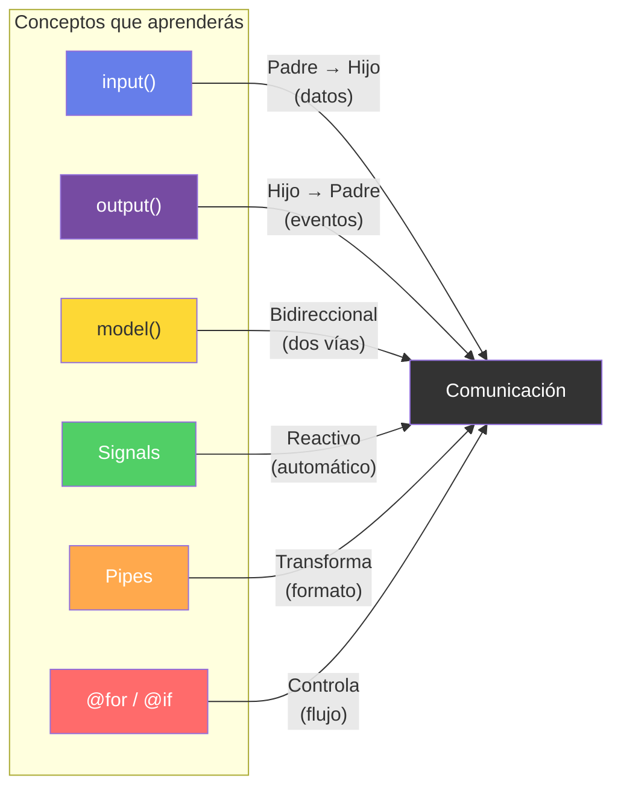
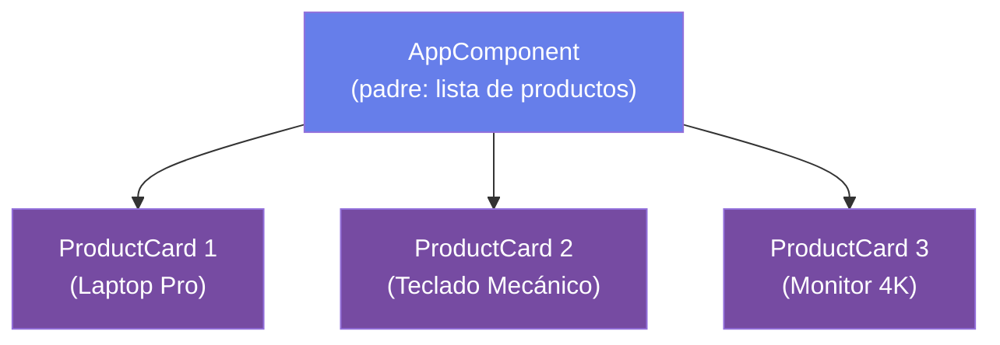
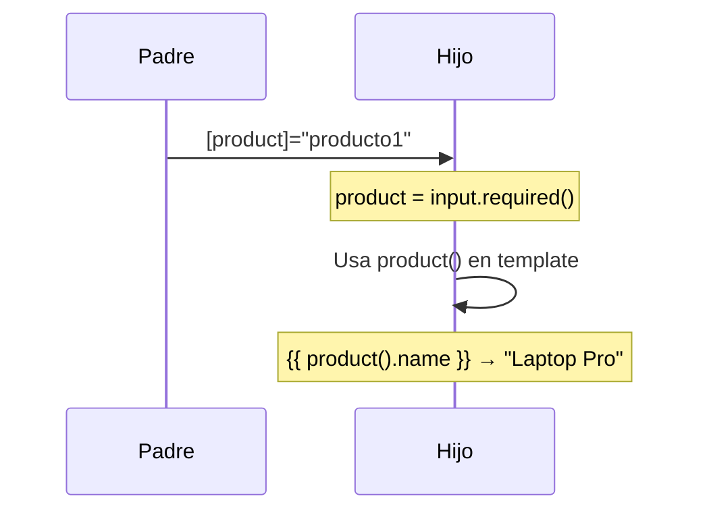
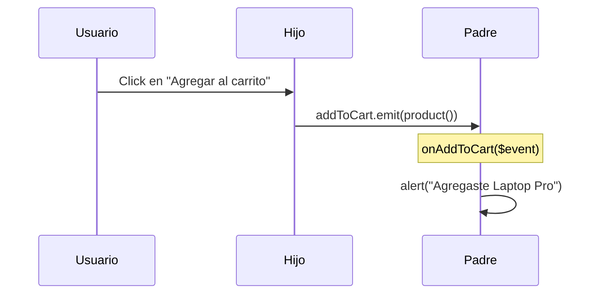
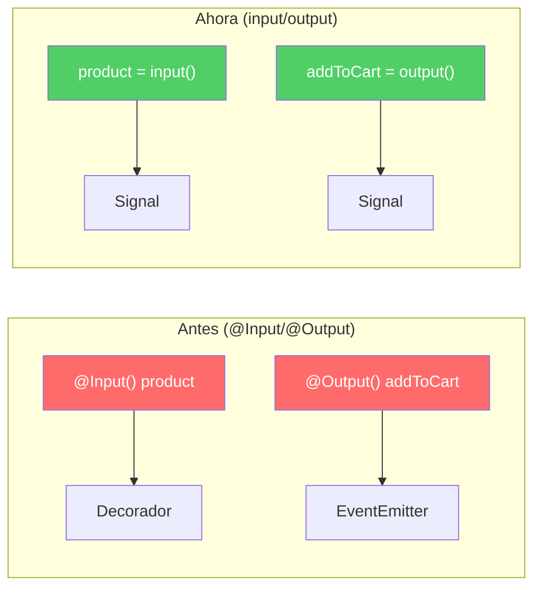
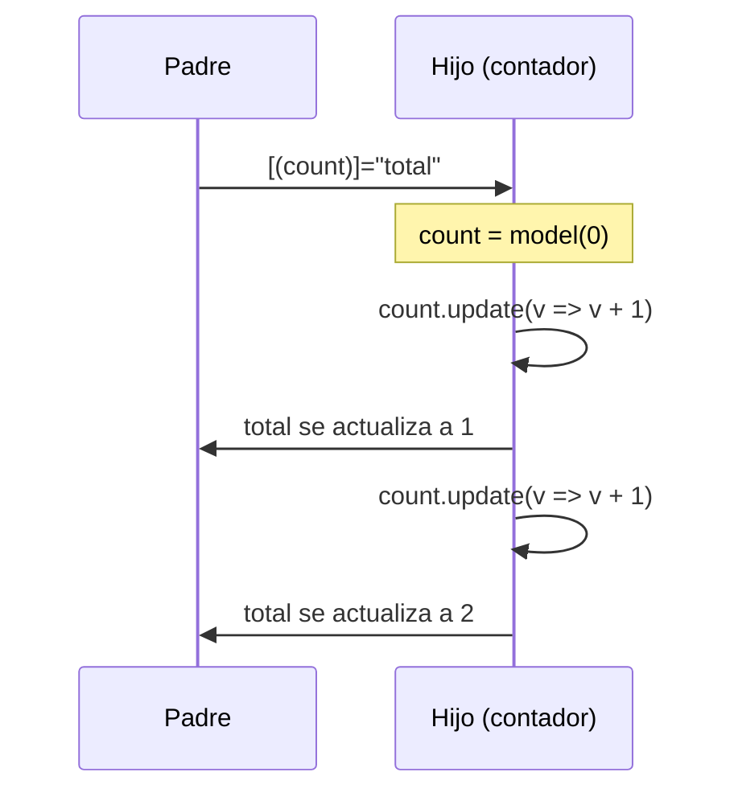
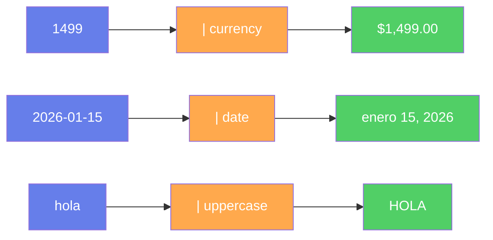
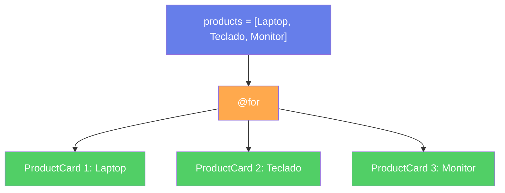
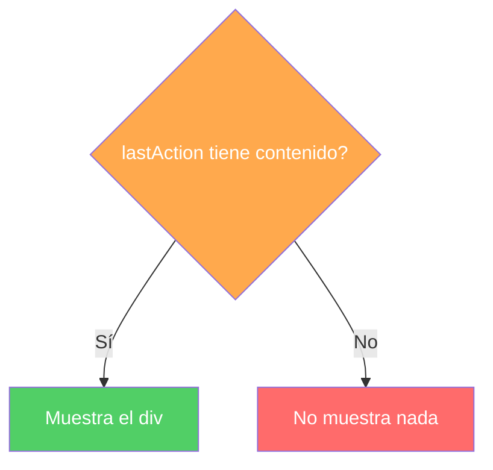
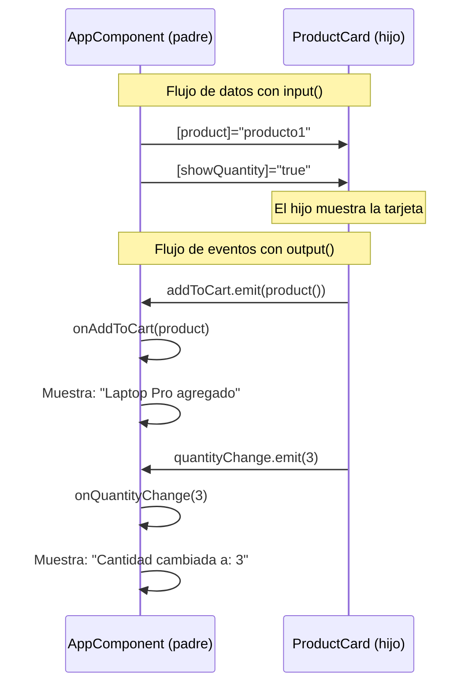

## 03 — Componentes, Input y Output

### ¿Qué vamos a aprender?

Cómo hacer que dos componentes Angular se comuniquen entre sí. Uno le pasa datos al otro, y el otro le responde con eventos.



### ¿Qué es un componente?

Un componente es un **bloque de LEGO** con su propia lógica y apariencia. Cada bloque tiene:
- Un **template** (HTML) → cómo se ve
- Un **estilo** (CSS) → cómo se diseña
- Una **clase** (TypeScript) → qué hace

Ejemplo: una tarjeta de producto es un componente. Tiene imagen, nombre, precio y un botón.

### ¿Por qué necesitan comunicarse?

Imagina que tienes un carrito de compras:
- El **padre** muestra la lista de productos
- Cada **hijo** es una tarjeta de producto

Cuando haces click en "Agregar al carrito" en un hijo, el padre necesita saberlo para actualizar el total. Eso es **comunicación**.



---

### Concepto 1: `input()` — El padre le pasa datos al hijo

**Analogía:** Como cuando le pasas una pelota a alguien. Tú le das el dato, él lo recibe.

```typescript
// EN EL HIJO (product-card.component.ts)
// "Yo necesito que me pases un producto y si quiero mostrar cantidad"
product = input.required<Product>();  // obligatorio
showQuantity = input(false);          // opcional, valor por defecto false
```

```typescript
// EN EL PADRE (app.component.ts)
// Le paso los datos al hijo
<app-product-card
  [product]="producto1"          ← le paso el producto
  [showQuantity]="true"          ← le paso si muestra cantidad
/>
```

**¿Cómo funciona?**



1. El padre dice: `[product]="producto1"` → "hijo, toma este producto"
2. El hijo recibe: `product = input.required<Product>()` → "ok, tengo el producto"
3. El hijo lo usa en su template: `{{ product().name }}` → "Laptop Pro"

**Nota:** Los paréntesis `()` en `product()` son porque `input()` retorna una **función**. Es como llamar a una caja para sacar el valor.

---

### Concepto 2: `output()` — El hijo le avisa al padre

**Analogía:** Como cuando alguien te llama por tu nombre. Él hace algo y te avisa.

```typescript
// EN EL HIJO (product-card.component.ts)
// "Cuando el usuario haga click, le aviso al padre"
addToCart = output<Product>();   // emite un Producto
viewDetails = output<number>();  // emite un ID (número)
```

```typescript
// EN EL HIJO (template)
<!-- Cuando hacen click, emito el producto al padre -->
<button (click)="addToCart.emit(product())">Agregar al carrito</button>
```

```typescript
// EN EL PADRE (app.component.ts)
// "Cuando el hijo me avise, yo hago algo"
<app-product-card (addToCart)="onAddToCart($event)" />

onAddToCart(product: Product) {
  alert(`Agregaste ${product.name}`);
}
```

**¿Cómo funciona?**



1. El usuario hace click en "Agregar al carrito"
2. El hijo ejecuta: `addToCart.emit(product())` → "¡padre, mira este producto!"
3. Angular detecta el evento y llama: `onAddToCart($event)`
4. El padre ejecuta: `alert(`Agregaste ${product.name}`)`

**¿Qué es `$event`?** Es el dato que el hijo envió. En este caso, el objeto `Product`.

---

### Concepto 3: Signals — La novedad de Angular 17+

**Antes (Angular < 17):**
```typescript
@Input() product!: Product;    // decorador clásico
@Output() addToCart = new EventEmitter<Product>();
```

**Ahora (Angular 17+):**
```typescript
product = input.required<Product>();  // signal
addToCart = output<Product>();         // signal
```



**¿Por qué es mejor?**
- `input()` es un **Signal**: Angular sabe automáticamente cuándo cambió
- No necesita `ngOnChanges` para detectar cambios
- Más corto y limpio
- TypeScript infiere el tipo solo

**Signals son como interruptores de luz:**
- Cuando cambias el valor del interruptor, la luz se enciende automáticamente
- No necesitas avisarle a nadie, Angular lo detecta solo

---

### Concepto 4: `model()` — Two-Way Binding

**Analogía:** Como un elevador: tú presionas un piso y el elevador te lleva. Tú cambias el valor, el elevador se actualiza.



```typescript
// EN EL HIJO
count = model<number>(0);  // valor inicial 0

// EN EL PADRE
<app-contador [(count)]="total" />
// total se actualiza automáticamente cuando el hijo cambia count
```

**¿Cuándo usar `model()` vs `output()`?**
- `model()` → cuando el padre necesita el valor modificado en tiempo real
- `output()` → cuando el padre solo necesita saber que pasó algo

---

### Concepto 5: Pipes — Traductores de datos

**Analogía:** es como un traductor: convierte un dato de un formato a otro.

```typescript
// Sin pipe: 1499 (número feo)
// Con pipe: $1,499.00 (número bonito)
{{ product().price | currency }}
```



**Pipes comunes:**
| Pipe | Qué hace | Ejemplo |
|---|---|---|
| `currency` | Convierte a moneda | `1499` → `$1,499.00` |
| `date` | Convierte a fecha | `2026-01-15` → `enero 15, 2026` |
| `uppercase` | Convierte a mayúsculas | `hola` → `HOLA` |
| `json` | Muestra JSON formateado | `{name: "Ana"}` → `{ "name": "Ana" }` |

---

### Concepto 6: `@for` y `@if` — Repetir y decidir

**`@for` — Repetir algo:**
```typescript
// "Por cada producto en la lista, crea una tarjeta"
@for (product of products; track product.id) {
  <app-product-card [product]="product" />
}
```



**`@if` — Mostrar algo solo si se cumple una condición:**
```typescript
// "Solo muestra el log si hay una acción"
@if (lastAction) {
  <div>Última acción: {{ lastAction }}</div>
}
```



---

### Diagrama completo: Cómo fluyen los datos



---

### Código completo del proyecto

#### 1. El hijo: `product-card.component.ts`

```typescript
import { Component, input, output } from '@angular/core';
import { CurrencyPipe } from '@angular/common';

// Interface: define qué datos tiene un producto
export interface Product {
  id: number;
  name: string;
  price: number;
  image: string;
}

@Component({
  selector: 'app-product-card',
  standalone: true,
  imports: [CurrencyPipe],
  template: `
    <div class="card">
      <!-- Le digo al padre que pase la imagen -->
      

      <div class="body">
        <h3>{{ product().name }}</h3>

        <!-- Pipe: convierte 1499 a $1,499.00 -->
        <p class="price">{{ product().price | currency }}</p>

        <!-- Botón que le avisa al padre -->
        <button (click)="addToCart.emit(product())">Agregar al carrito</button>

        <!-- Si showQuantity es true, muestro el input -->
        @if (showQuantity()) {
          <input type="number" [value]="quantity()"
                 (input)="quantityChange.emit(Number($event.target))" />
        }
      </div>
    </div>
  `
})
export class ProductCardComponent {
  // Inputs: datos que recibo del padre
  readonly product = input.required<Product>();
  readonly showQuantity = input(false);
  readonly quantity = input(1);

  // Outputs: eventos que le aviso al padre
  readonly addToCart = output<Product>();
  readonly viewDetails = output<number>();
  readonly quantityChange = output<number>();

  protected readonly Number = Number;
}
```

#### 2. El padre: `app.component.ts`

```typescript
import { Component } from '@angular/core';
import { ProductCardComponent, Product } from './product-card/product-card.component';

@Component({
  selector: 'app-root',
  standalone: true,
  imports: [ProductCardComponent],
  template: `
    <h1>Catálogo de Productos</h1>

    <div class="grid">
      <!-- Por cada producto, creo una tarjeta y le paso datos -->
      @for (product of products; track product.id) {
        <app-product-card
          [product]="product"              ← le paso el producto
          [showQuantity]="true"            ← le digo que muestre cantidad
          (addToCart)="onAddToCart($event)" ← escucho cuando agrega al carrito
          (quantityChange)="onQuantityChange($event)" ← escucho cuando cambia cantidad
        />
      }
    </div>

    <!-- Muestro la última acción si existe -->
    @if (lastAction) {
      <div class="log">{{ lastAction }}</div>
    }
  `
})
export class AppComponent {
  // Lista de productos (datos hardcodeados, en una app real viene de una API)
  readonly products: Product[] = [
    { id: 1, name: 'Laptop Pro', price: 1499, image: 'https://picsum.photos/seed/laptop/400/300' },
    { id: 2, name: 'Teclado Mecánico', price: 129, image: 'https://picsum.photos/seed/keyboard/400/300' },
    { id: 3, name: 'Monitor 4K', price: 599, image: 'https://picsum.photos/seed/monitor/400/300' },
  ];

  lastAction = '';

  // Cuando el hijo dice "agregué al carrito", yo muestro un mensaje
  onAddToCart(product: Product) {
    this.lastAction = `"${product.name}" agregado al carrito — $${product.price}`;
  }

  // Cuando el hijo dice "cambié la cantidad", yo actualizo
  onQuantityChange(qty: number) {
    this.lastAction = `Cantidad cambiada a: ${qty}`;
  }
}
```

---

### Ejercicios

1. Crea un componente `ProductCard` con `input()` y `output()`
2. Pásale datos desde el padre con `[product]="producto"`
3. Emite un evento con `addToCart.emit(product())`
4. Escucha el evento en el padre con `(addToCart)="onAddToCart($event)"`
5. Usa un pipe `currency` para mostrar el precio formateado

### Cómo ejecutar

```bash
cd 03-componentes-input
npm install
ng serve --host 0.0.0.0 --port 8080
```

Abrir en `http://localhost:8080`

### Archivos del Proyecto

| Archivo | Qué hace |
|---|---|
| `src/main.ts` | Inicia la aplicación |
| `src/app/app.component.ts` | El **padre**: muestra la lista de productos y maneja eventos |
| `src/app/product-card/product-card.component.ts` | El **hijo**: tarjeta de producto que recibe datos y emite eventos |
