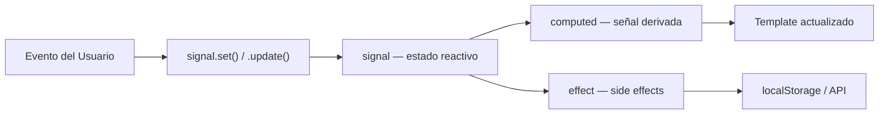
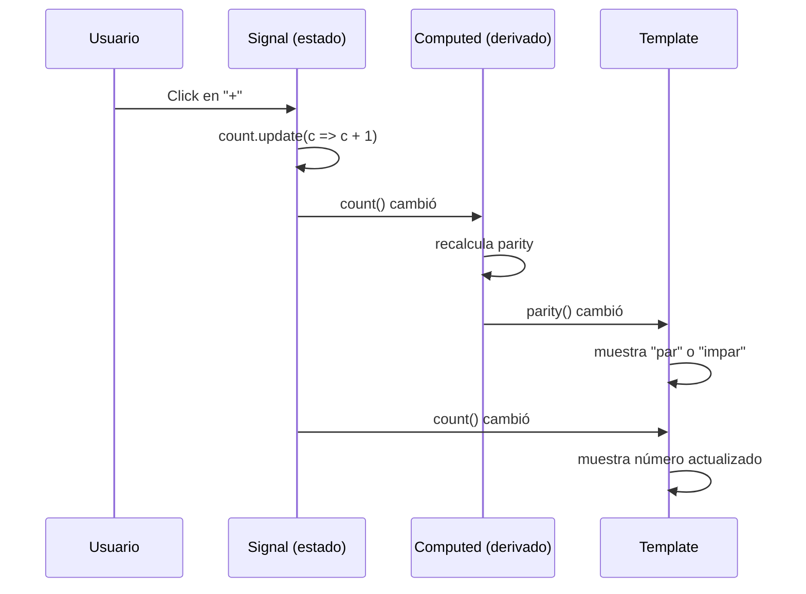

## 04 — Estados y Eventos con Signals

### Propósito

Aprender a manejar estado reactivo en Angular usando signals: crear, leer, actualizar valores y reaccionar a cambios automáticamente.

### Problema que resuelve

En JavaScript vanilla, cuando cambias una variable, el navegador no sabe que debe actualizar la pantalla. Tienes que hacerlo manualmente. Esto lleva a:
- Renders innecesarios (actualizar cosas que no cambiaron)
- Renders faltantes (olvidar actualizar algo)
- Bugs difíciles de rastrear (el estado está en 10 lugares diferentes)

### Cómo lo resuelve

Angular Signals crean **unidades de estado reactivo**. Cuando una señal cambia, Angular actualiza automáticamente solo lo que necesita. No hay código manual de actualización.

### Por qué aprenderlo

Signals son el corazón de la reactividad en Angular moderno. Reemplazan a RxJS para estado síncrono y mejoran drásticamente la performance. Todo componente nuevo usa signals.



---

### Glosario Básico

#### `signal()` — Variable reactiva

Es como una variable normal, pero Angular sabe cuándo cambia.

```typescript
// Crear una señal con valor inicial
count = signal(0);

// Leer el valor (llamar como función)
count();  // → 0

// Actualizar el valor
count.set(5);           // → 5
count.update(c => c + 1);  // → 6
```

**Analogía:** Es como un termómetro. Cuando la temperatura cambia, el termómetro se actualiza solo. No necesitas "avisarle" al termómetro.

---

#### `computed()` — Valor derivado

Es una señal que depende de otra señal. Se actualiza automáticamente cuando la original cambia.

```typescript
count = signal(0);
parity = computed(() => count() % 2 === 0 ? 'par' : 'impar');

// count() = 0 → parity() = 'par'
// count() = 1 → parity() = 'impar'
// count() = 2 → parity() = 'par'
```

**Analogía:** Es como un display digital conectado a un sensor. El sensor mide (signal), el display muestra (computed). Cuando el sensor cambia, el display se actualiza solo.

---

#### `effect()` — Reaccionar a cambios

Ejecuta una función cada vez que una señal que usa cambia. Útil para guardar en localStorage, enviar a una API, etc.

```typescript
private countEffect = effect(() => {
  const c = this.count();
  // Esta línea se ejecuta cada vez que count() cambia
  console.log('Contador actualizado:', c);
});
```

**Analogía** es como un vigilante que observa una señal. Cuando cambia, hace algo (guarda, envía, notifica).

---

#### `model()` — Two-way binding

Permite que el padre pase un valor Y el hijo pueda modificarlo.

```typescript
// Hijo
message = model('Hola');

// Padre
<input [(ngModel)]="message" />
// message() se actualiza cuando el usuario escribe
```

---

#### `@let` — Variable local en template

Crea una variable temporal en el template (Angular 22+).

```typescript
@let doubled = count() * 2;
<p>El doble es: {{ doubled }}</p>
```

---

#### Eventos del DOM

Escuchar eventos del usuario con `(evento)`:

```typescript
// Click
<button (click)="increment()">+</button>

// Teclado
<input (keydown)="onKeydown($event)" />

// Input
<input (input)="onInput($event)" />
```

**`$event`** contiene la información del evento (tecla presionada, valor del input, etc.).

---

### Conceptos del Ejemplo

#### 1. Crear y leer un signal

```typescript
count = signal(0);  // crear con valor 0
count();            // leer: retorna 0
```

#### 2. Actualizar un signal

```typescript
count.set(5);              // establecer un valor específico
count.update(c => c + 1);  // actualizar basado en el valor actual
```

#### 3. Computed: valor derivado

```typescript
parity = computed(() => count() % 2 === 0 ? 'par' : 'impar');
// Se actualiza automáticamente cuando count() cambia
```

#### 4. Effect: side effects

```typescript
private countEffect = effect(() => {
  const c = count();
  // Se ejecuta cada vez que count() cambia
  console.log('Contador:', c);
});
```

#### 5. Eventos del DOM

```typescript
// $event es el objeto del evento
onKeydown(event: KeyboardEvent, inputValue: string) {
  this.lastKey.set(event.key);
}
```

#### 6. Template reference variable

```typescript
// #keyInput es una referencia al elemento input del DOM
<input #keyInput (keydown)="onKeydown($event, keyInput.value)" />
```

#### 7. @let en template

```typescript
@let doubled = count() * 2;
<p>Doble: {{ doubled }}</p>
```

---

### Diagrama: Flujo de datos con Signals



---

### Código completo del proyecto

#### `app.component.ts`

```typescript
import { Component, signal, computed, effect, model } from '@angular/core';
import { FormsModule } from '@angular/forms';
import { DatePipe } from '@angular/common';

// interface: define la forma de un log
interface LogEntry {
  action: string;
  timestamp: Date;
}

@Component({
  selector: 'app-root',
  standalone: true,
  imports: [FormsModule, DatePipe],
  template: `
    <h1>Contador interactivo con Signals</h1>

    <section>
      <!-- {{ count() }} → lee el valor del signal -->
      <h2>Contador: {{ count() }}</h2>

      <!-- (click) → escucha el evento click del botón -->
      <button (click)="increment()">+</button>
      <button (click)="decrement()">-</button>
      <button (click)="reset()">Reset</button>

      <!-- {{ parity() }} → lee el valor del computed -->
      <p>El número es <strong>{{ parity() }}</strong></p>

      <!-- @let → crea una variable local en el template -->
      @let doubled = count() * 2;
      <p>El doble (&#64;let) es: <strong>{{ doubled }}</strong></p>
    </section>

    <section>
      <h3>Mensaje personalizado (two-way binding)</h3>
      <!-- [(ngModel)] → two-way binding: lee y escribe -->
      <input [(ngModel)]="message" placeholder="Escribe algo..." />
      <p>Mensaje: <strong>{{ message() }}</strong></p>
    </section>

    <section>
      <h3>Evento de teclado</h3>
      <!-- #keyInput → referencia al elemento input del DOM -->
      <!-- (keydown) → escucha cuando se presiona una tecla -->
      <input #keyInput placeholder="Presiona una tecla..."
        (keydown)="onKeydown($event, keyInput.value)" />
      @if (lastKey()) {
        <p>Última tecla presionada: <strong>{{ lastKey() }}</strong></p>
      }
    </section>

    <section>
      <h3>Historial de acciones</h3>
      @if (logs().length === 0) {
        <p>No hay acciones registradas.</p>
      }
      <ul>
        <!-- @for → itera sobre el array de logs -->
        @for (entry of logs(); track entry.timestamp) {
          <!-- {{ entry.timestamp | date:'HH:mm:ss' }} → pipe de fecha -->
          <li>{{ entry.timestamp | date:'HH:mm:ss' }} — {{ entry.action }}</li>
        }
      </ul>
    </section>
  `,
  styles: [`
    section { margin: 1.5rem 0; padding: 1rem; background: #fff; border-radius: 8px; }
    button { margin-right: 0.5rem; padding: 0.4rem 1rem; font-size: 1.2rem; cursor: pointer; }
    input { padding: 0.4rem; font-size: 1rem; width: 250px; }
    ul { margin-top: 0.5rem; padding-left: 1.5rem; }
    li { margin: 0.25rem 0; }
    h2 { margin-bottom: 0.5rem; }
    h3 { margin-bottom: 0.5rem; }
  `]
})
export class AppComponent {
  // ─── SIGNALS: estado reactivo ───
  count = signal(0);              // signal<number>: contador
  message = model('Hola Signals'); // model<string>: two-way binding
  lastKey = signal('');           // signal<string>: última tecla presionada
  logs = signal<LogEntry[]>([]);  // signal<LogEntry[]>: historial de acciones

  // ─── COMPUTED: valor derivado ───
  // Se actualiza automáticamente cuando count() cambia
  parity = computed(() => this.count() % 2 === 0 ? 'par' : 'impar');

  // ─── EFFECT: side effects ───
  // Se ejecuta cada vez que count() cambia
  private countEffect = effect(() => {
    const c = this.count();
    this.addLog(`[effect] Contador actualizado → ${c}`);
  });

  // ─── MÉTODOS: actualizan el estado ───
  increment() {
    this.count.update(c => c + 1);  // update: basado en valor actual
    this.addLog('Incremento');
  }

  decrement() {
    this.count.update(c => c - 1);
    this.addLog('Decremento');
  }

  reset() {
    this.count.set(0);  // set: establecer un valor específico
    this.addLog('Reset');
  }

  onKeydown(event: KeyboardEvent, inputValue: string) {
    this.lastKey.set(event.key);  // set: actualizar lastKey
    this.addLog(`Tecla presionada: ${event.key}`);
  }

  // ─── UTILIDADES ───
  private addLog(action: string) {
    // update: agregar un elemento al array sin mutar el original
    this.logs.update(entries => [...entries, { action, timestamp: new Date() }]);
  }
}
```

---

### Ejercicios

1. Crea un `signal<number>` para un contador con botones +/-
2. Implementa un `computed` que muestre si es par o impar
3. Usa `effect()` para guardar en localStorage al cambiar
4. Convierte un input de texto a señal con two-way binding
5. Usa `@let` para crear variables locales en el template

### Cómo ejecutar

```bash
cd 04-estados-eventos
npm install
ng serve --host 0.0.0.0 --port 8080
```

### Archivos del Proyecto

| Archivo | Qué hace |
|---|---|
| `src/main.ts` | Inicia la aplicación |
| `src/app/app.component.ts` | Contador interactivo con signals, computed, effect y eventos |
| `src/app/app.config.ts` | Configuración de providers |
