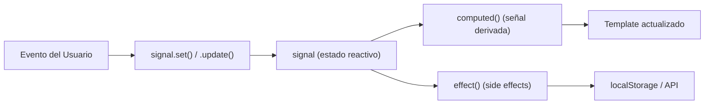

## 04 — Estados y Eventos con Signals

Señales (`signal()`) como unidad fundamental de reactividad en Angular 22. Eventos del DOM, two-way binding y actualización de estado.

> **Propósito:** Manejar estado reactivo con signals (signal, computed, effect, model) para construir interfaces que reaccionan automáticamente a cambios.
>
> **Problema que resuelve:** El estado mutable y la detección de cambios manual lleva a bugs difíciles de rastrear, renders innecesarios y mala performance.
>
> **Cómo lo resuelve:** Signals proporcionan reactividad fina-granular: solo los componentes que usan una señal se actualizan cuando esta cambia, eliminando detección de cambios manual.
>
> **Por qué aprenderlo:** Signals son el corazón de la reactividad en Angular moderno; reemplazan a RxJS para estado síncrono y mejoran drásticamente la performance.




### Conceptos Clave

- **`signal()`**: creación, lectura (ejecución como función), `set()`, `update()`
- **`computed()`**: señales derivadas y memoizadas
- **Eventos del DOM**: `(click)`, `(input)`, `(change)`, `(keydown)`, `$event`
- **Two-way binding**: `[(ngModel)]`, `[(value)]` con `model()`
- **Template reference variables**: `#myVar` para acceder al DOM
- **`@let`**: variables locales en templates (Angular 22+)
- **`effect()`**: reaccionar a cambios de señal

### Proyecto

Contador interactivo con señales: incremento, decremento, reset, historial de cambios usando `effect()`.

### Ejercicios

1. Crea un `signal<number>` para un contador con botones +/-
2. Implementa un `computed` que muestre si es par o impar
3. Usa `effect()` para guardar en localStorage al cambiar
4. Convierte un input de texto a señal con two-way binding
5. Usa `@let` para crear variables locales en el template

### Cómo ejecutar

```bash
cd 04-estados-eventos
npm install
ng serve
```
