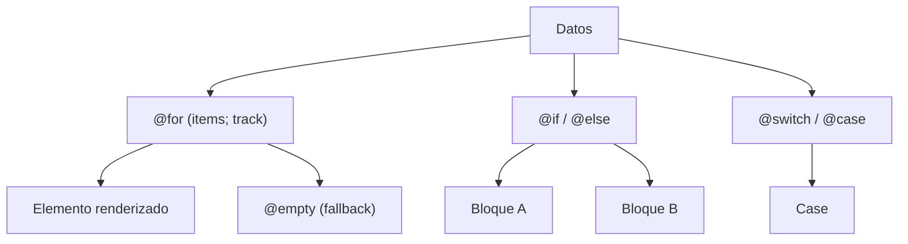

## 05 — Control Flow: @if, @for, @switch

Angular 17+ reemplazó `*ngIf`/`*ngFor`/`*ngSwitch` con el nuevo bloque de control flow sintáctico.

> **Propósito:** Utilizar el nuevo control flow de Angular (@if, @for, @switch) para escribir templates declarativos y más eficientes.
>
> **Problema que resuelve:** *ngIf/*ngFor/*ngSwitch son directivas estructurales que tienen peor rendimiento, no son tree-shakeables y complican el código anidado.
>
> **Cómo lo resuelve:** El nuevo control flow es built-in del compilador, con mejor rendimiento (@for con track automático), sintaxis más limpia y @empty para casos vacíos.
>
> **Por qué aprenderlo:** Es el estándar desde Angular 17; el *ngIf clásico está deprecado. Más rápido, menos código, mejor legibilidad.

### Analogía del Mundo Real

- **@if/@else** = Un semáforo: "Si está verde, cruza; si está rojo, espera"
- **@for con track** = Una fila de personas con gafetes: cada quien tiene un ID único para saber quién es quién
- **@empty** = Un estante vacío: cuando no hay productos, muestras un letrero de "Agotado"
- **@switch** = Un ascensor con botones: según el piso que presionas, te lleva a un lugar diferente



### Conceptos Clave

- **`@if` / `@else`**: condicionales con bloques, else y else-if anidados
- **`@for`**: iteración con `track` obligatorio para rendimiento
- **`@empty`**: bloque cuando el array está vacío
- **`@switch` / `@case` / `@default`**: switch estructural
- **`track`**: función de seguimiento para `@for` (requerido)
- **Variables implícitas**: `$index`, `$first`, `$last`, `$even`, `$odd`, `$count`
- **Comparación con directivas clásicas**: migración de `*ngIf`/`*ngFor`

### Proyecto

Lista de tareas (todo-list) con filtros, búsqueda y estados vacíos usando solo control flow nativo.

### Ejercicios

1. Renderiza una lista de tareas con `@for` y `track item.id`
2. Añade `@empty` para cuando no hay tareas
3. Filtra tareas completadas/pendientes con `@if`
4. Usa `@switch` para mostrar el estado (pendiente/en-progreso/completada)
5. Reemplaza un `*ngFor` existente con el nuevo `@for`

### Cómo ejecutar

```bash
cd 05-control-flow
npm install
ng serve --host 0.0.0.0 --port 8080
```

### Archivos del Proyecto

| Archivo | Propósito |
|---------|-----------|
| `src/app/app.component.ts` | Componente principal con demostración de @if, @for, @switch, @empty |
| `src/app/app.config.ts` | Configuración de la aplicación (providers vacíos) |
| `src/main.ts` | Punto de entrada: bootstrap del componente raíz |
| `src/index.html` | HTML base donde se monta la app |
| `src/styles.css` | Estilos globales (reset, body) |
| `angular.json` | Configuración del build de Angular |
| `tsconfig.json` | Configuración de TypeScript |
| `tsconfig.app.json` | Configuración de TypeScript para la app |
| `package.json` | Dependencias y scripts del proyecto |

### Glosario

| Término | Definición |
|---------|------------|
| **Control flow** | Sistema de sintaxis del compilador para manejar flujo en templates: @if, @for, @switch |
| **@if** | Bloque que renderiza contenido solo si la condición es verdadera |
| **@for** | Bloque que itera sobre un arreglo y renderiza un elemento por cada item |
| **@empty** | Bloque alternativo que se muestra cuando el arreglo de @for está vacío |
| **@switch** | Bloque que selecciona un caso según el valor de una expresión |
| **track** | Parámetro obligatorio de @for que identifica cada elemento (evita re-renders innecesarios) |
| **Signal** | Variable reactiva creada con `signal()` que notifica cambios automáticamente |
| **$index, $first, $last, $even, $odd** | Variables implícitas de @for con información de la posición actual |
| **Standalone** | Componente que no necesita NgModule para funcionar (Angular 15+) |
| **Two-way binding** | Vinculación bidireccional: el template actualiza la variable y la variable actualiza el template |
