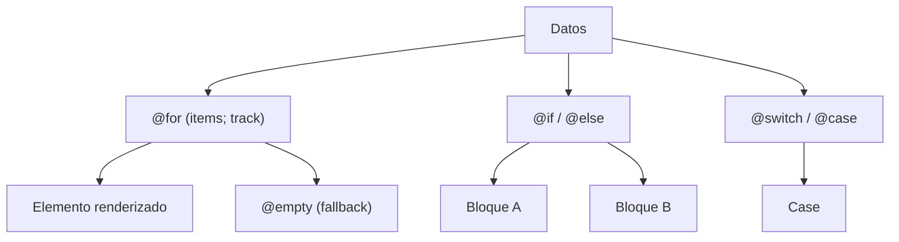

## 05 — Control Flow: @if, @for, @switch

Angular 17+ reemplazó `*ngIf`/`*ngFor`/`*ngSwitch` con el nuevo bloque de control flow sintáctico.

> **Propósito:** Utilizar el nuevo control flow de Angular (@if, @for, @switch) para escribir templates declarativos y más eficientes.
>
> **Problema que resuelve:** *ngIf/*ngFor/*ngSwitch son directivas estructurales que tienen peor rendimiento, no son tree-shakeables y complican el código anidado.
>
> **Cómo lo resuelve:** El nuevo control flow es built-in del compilador, con mejor rendimiento (@for con track automático), sintaxis más limpia y @empty para casos vacíos.
>
> **Por qué aprenderlo:** Es el estándar desde Angular 17; el *ngIf clásico está deprecado. Más rápido, menos código, mejor legibilidad.




### Conceptos Clave

- **`@if` / `@else`**: condicionales con bloques, else y else-if anidados
- **`@for`**: iteración con `track` obligatorio para rendimiento
- **`@empty`**: bloque cuando el array está vacío
- **`@switch` / `@case` / `@default`**: switch estructural
- **`track`**: función de seguimiento para `@for` (requerido)
- **Variables implícitas**: `$index`, `$first`, `$last`, `$even`, `$odd`, `$count`
- **Comparación con directivas clásicas**: migración de `*ngIf`/`*ngFor`

### Proyecto

Lista de tareas (todo-list) con filtros, búsqueda y estados vacíos usando solo control flow nativo.

### Ejercicios

1. Renderiza una lista de tareas con `@for` y `track item.id`
2. Añade `@empty` para cuando no hay tareas
3. Filtra tareas completadas/pendientes con `@if`
4. Usa `@switch` para mostrar el estado (pendiente/en-progreso/completada)
5. Reemplaza un `*ngFor` existente con el nuevo `@for`

### Cómo ejecutar

```bash
cd 05-control-flow
npm install
ng serve
```
