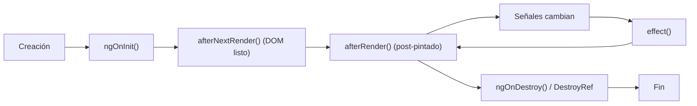

## 06 — Ciclo de Vida y Efectos

Hooks de ciclo de vida, `effect()` para reactividad, y `afterNextRender`/`afterRender` para interacciones con el DOM y APIs del navegador.

> **Propósito:** Entender y usar correctamente el ciclo de vida de componentes Angular (ngOnInit, afterNextRender, DestroyRef) para controlar inicialización y limpieza.
>
> **Problema que resuelve:** Recursos como subscriptions, timers y event listeners deben inicializarse y limpiarse en el momento exacto. Errores aquí causan memory leaks y comportamiento impredecible.
>
> **Cómo lo resuelve:** Los hooks de ciclo de vida y DestroyRef proporcionan puntos de control precisos para setup/teardown, con afterNextRender para código seguro post-pintado.
>
> **Por qué aprenderlo:** Esencial para evitar memory leaks y asegurar que los componentes se comporten correctamente durante toda su vida útil.

### Analogía del Mundo Real

- **ngOnInit** = El día de tu nacimiento: te preparan para el mundo (carga datos iniciales)
- **ngAfterViewInit** = Tu primer paso: ya estás en el mundo y puedes interactuar con el DOM
- **afterRender** = Cada paso que das después: el DOM ya existe y puedes medirte
- **effect** = Tus reacciones automáticas: si hace frío, te pones abrigo (si cambia una signal, ejecuta código)
- **ngOnDestroy** = Tu último día: apaga las luces, cierra las puertas, limpia todo
- **DestroyRef** = Una nota que dejas: "cuando me vaya, haz esto" (limpieza moderna)



### Conceptos Clave

- **`ngOnInit()`**: inicialización del componente
- **`ngAfterViewInit()`**: después de que la vista se renderiza
- **`ngOnDestroy()`**: cleanup, unsubscribe, destroyRef
- **`effect()`**: ejecuta efectos cuando las señales cambian
- **`afterNextRender()`**: ejecuta una vez después del próximo render
- **`afterRender()`**: ejecuta después de cada render (específico para DOM)
- **`DestroyRef`**: alternativa moderna a `ngOnDestroy` para cleanup
- **`takeUntilDestroyed()`**: operador RxJS para cleanup automático

### Proyecto

Cronómetro con efectos: start/stop, tiempo transcurrido, log de vueltas, persistencia con `effect()`.

### Ejercicios

1. Usa `ngOnInit` para cargar datos iniciales
2. Implementa `effect()` para sincronizar estado con localStorage
3. Usa `afterNextRender` para medir un elemento del DOM
4. Limpia un interval con `DestroyRef`
5. Usa `takeUntilDestroyed` en un Observable

### Cómo ejecutar

```bash
cd 06-ciclo-vida
npm install
ng serve --host 0.0.0.0 --port 8080
```

### Archivos del Proyecto

| Archivo | Propósito |
|---------|-----------|
| `src/app/app.component.ts` | Cronómetro con demostración de hooks de ciclo de vida y efectos |
| `src/app/app.config.ts` | Configuración de la aplicación (providers vacíos) |
| `src/main.ts` | Punto de entrada: bootstrap del componente raíz |
| `src/index.html` | HTML base donde se monta la app |
| `src/styles.css` | Estilos globales (reset, body) |
| `angular.json` | Configuración del build de Angular |
| `tsconfig.json` | Configuración de TypeScript |
| `tsconfig.app.json` | Configuración de TypeScript para la app |
| `package.json` | Dependencias y scripts del proyecto |

### Glosario

| Término | Definición |
|---------|------------|
| **Ciclo de vida** | Secuencia de eventos que ocurren desde que un componente se crea hasta que se destruye |
| **ngOnInit** | Hook que se ejecuta una vez después del primer cambio de detección |
| **ngAfterViewInit** | Hook que se ejecuta cuando la vista (template) está lista en el DOM |
| **ngOnDestroy** | Hook que se ejecuta cuando el componente se destruye (limpieza de recursos) |
| **effect()** | Función que ejecuta código cada vez que una signal que lee cambia su valor |
| **afterNextRender()** | Función que ejecuta una vez después del primer render (seguro para DOM) |
| **afterRender()** | Función que ejecuta después de cada ciclo de render |
| **DestroyRef** | Referencia al punto de destrucción del componente para registrar cleanup |
| **computed()** | Signal derivada que se recalcula automáticamente cuando sus dependencias cambian |
| **Memory leak** | Fuga de memoria: recursos que no se liberan y consumen RAM innecesariamente |
| **Interval** | Temporizador que ejecuta una función cada N milisegundos (debe limpiarse con clearInterval) |
| **Signal** | Variable reactiva que notifica cuando su valor cambia |
