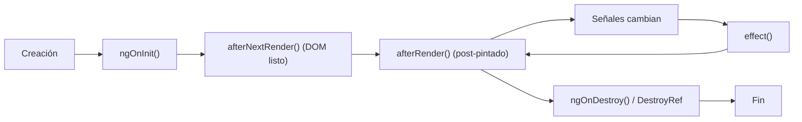

## 06 — Ciclo de Vida y Efectos

Hooks de ciclo de vida, `effect()` para reactividad, y `afterNextRender`/`afterRender` para interacciones con el DOM y APIs del navegador.

> **Propósito:** Entender y usar correctamente el ciclo de vida de componentes Angular (ngOnInit, afterNextRender, DestroyRef) para controlar inicialización y limpieza.
>
> **Problema que resuelve:** Recursos como subscriptions, timers y event listeners deben inicializarse y limpiarse en el momento exacto. Errores aquí causan memory leaks y comportamiento impredecible.
>
> **Cómo lo resuelve:** Los hooks de ciclo de vida y DestroyRef proporcionan puntos de control precisos para setup/teardown, con afterNextRender para código seguro post-pintado.
>
> **Por qué aprenderlo:** Esencial para evitar memory leaks y asegurar que los componentes se comporten correctamente durante toda su vida útil.




### Conceptos Clave

- **`ngOnInit()`**: inicialización del componente
- **`ngAfterViewInit()`**: después de que la vista se renderiza
- **`ngOnDestroy()`**: cleanup, unsubscribe, destroyRef
- **`effect()`**: ejecuta efectos cuando las señales cambian
- **`afterNextRender()`**: ejecuta una vez después del próximo render
- **`afterRender()`**: ejecuta después de cada render (específico para DOM)
- **`DestroyRef`**: alternativa moderna a `ngOnDestroy` para cleanup
- **`takeUntilDestroyed()`**: operador RxJS para cleanup automático

### Proyecto

Cronómetro con efectos: start/stop, tiempo transcurrido, log de vueltas, persistencia con `effect()`.

### Ejercicios

1. Usa `ngOnInit` para cargar datos iniciales
2. Implementa `effect()` para sincronizar estado con localStorage
3. Usa `afterNextRender` para medir un elemento del DOM
4. Limpia un interval con `DestroyRef`
5. Usa `takeUntilDestroyed` en un Observable

### Cómo ejecutar

```bash
cd 06-ciclo-vida
npm install
ng serve --host 0.0.0.0 --port 8080
```
