## 07 — Formularios Reactivos

Reactive Forms en Angular: FormGroup, FormControl, FormArray, validación síncrona/asíncrona, y FormRecord.

> **Propósito:** Crear formularios complejos con validación reactiva usando FormBuilder, FormArray, validadores personalizados y async validators.
>
> **Problema que resuelve:** Los formularios HTML nativos no tienen validación robusta, manejo de estado complejo ni soporte para formularios dinámicos anidados.
>
> **Cómo lo resuelve:** Angular Reactive Forms proporcionan un modelo de datos inmutable, validación síncrona/asíncrona, FormArray para grupos dinámicos y control total sobre el estado.
>
> **Por qué aprenderlo:** Los formularios son la interacción más común en apps empresariales; Angular Forms es el sistema más maduro del ecosistema frontend.

### Analogía del Mundo Real

- **FormGroup** = Un examen de opción múltiple con varias secciones
- **FormControl** = Una pregunta individual del examen
- **FormArray** = Una pregunta donde puedes agregar más respuestas (ej: teléfonos)
- **Validators** = El corrector automático que marca si respondiste bien o mal
- **Validador personalizado** = Una regla especial: "la contraseña de confirmación debe coincidir"
- **AsyncValidator** = Llamar a la oficina para verificar si tu email ya está registrado
- **patchValue** = Llenar solo las preguntas que sabes, sin tocar las demás
- **reset** = Borrar todo el examen y empezar de cero

```mermaid
flowchart TB
    FB["FormBuilder"] --> FG["FormGroup"]
    FG --> FC["FormControl"]
    FC --> VAL["Validadores"]
    FG --> FORM["<form [formGroup]>"]
    FC --> INP["<input formControlName>"]
    VAL --> ERR["Mensajes de error"]
    FORM --> SUB["submit()"]
    SUB --> MODEL["Modelo de datos"]
```



### Conceptos Clave

- **`FormControl`**: control individual con valor y validación
- **`FormGroup`**: grupo de controles anidados
- **`FormArray`**: array dinámico de controles
- **`FormRecord`**: diccionario de controles (nuevo en Angular)
- **Validadores**: `Validators.required`, `Validators.email`, `Validators.pattern`, `Validators.minLength`
- **Validadores personalizados**: funciones que retornan `ValidationErrors | null`
- **Validación asíncrona**: `AsyncValidatorFn`, verificación contra API
- **`form.status`, `form.value`, `form.errors`**: observables de estado
- **`valueChanges`, `statusChanges`**: streams reactivos del formulario
- **Form Bindings**: `[formGroup]`, `formControlName`, `formArrayName`

### Proyecto

Formulario de registro multi-step con validación: datos personales, dirección, preferencias y resumen.

### Ejercicios

1. Crea un `FormGroup` con validaciones básicas
2. Implementa un validador personalizado (contraseñas coinciden)
3. Añade un `FormArray` para teléfonos dinámicos
4. Agrega validación asíncrona (email único contra API)
5. Resetea y parcha valores con `patchValue` y `reset`

### Cómo ejecutar

```bash
cd 07-formularios
npm install
ng serve --host 0.0.0.0 --port 8080
```

### Archivos del Proyecto

| Archivo | Propósito |
|---------|-----------|
| `src/app/app.component.ts` | Formulario multi-step con validación completa |
| `src/app/app.config.ts` | Configuración de la aplicación |
| `src/main.ts` | Punto de entrada: bootstrap del componente raíz |
| `src/index.html` | HTML base donde se monta la app |
| `src/styles.css` | Estilos globales (reset, body) |
| `angular.json` | Configuración del build de Angular |
| `tsconfig.json` | Configuración de TypeScript |
| `tsconfig.app.json` | Configuración de TypeScript para la app |
| `package.json` | Dependencias y scripts del proyecto |

### Glosario

| Término | Definición |
|---------|------------|
| **Reactive Forms** | Sistema de formularios basado en modelo de datos inmutable (no directivas) |
| **FormGroup** | Agrupa varios FormControl con validación a nivel de grupo |
| **FormControl** | Campo individual del formulario con valor, estado y validación |
| **FormArray** | Array dinámico de FormControl (para listas que crecen/encogen) |
| **Validators** | Funciones de validación: required, email, minLength, pattern, min, etc. |
| **Validador personalizado** | Función que retorna `ValidationErrors | null` según una regla custom |
| **AsyncValidator** | Validador que retorna una Promise/Observable (consulta una API) |
| **valueChanges** | Observable que emite cada vez que el valor del formulario cambia |
| **statusChanges** | Observable que emite cada vez que el estado (VALID/INVALID/PENDING) cambia |
| **patchValue** | Actualiza solo los campos especificados sin tocar los demás |
| **reset** | Limpia todos los valores del formulario a su estado inicial |
| **markAsTouched** | Marca un campo como "tocado" para mostrar errores de validación |
| **multi-step** | Formulario dividido en pasos (wizard) donde se valida por secciones |
