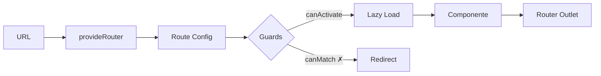

## 08 — Routing y Navegación

Angular Router: lazy loading, guards funcionales, data resolvers, nested routes y `@let` en templates.

> **Propósito:** Configurar navegación SPA con lazy loading, guards funcionales, resolvers y view transitions para apps multi-página eficientes.
>
> **Problema que resuelve:** Las SPAs sin router tienen URLs no compartibles, carga total en cada navegación y falta de control de acceso lateral.
>
> **Cómo lo resuelve:** Angular Router proporciona lazy loading (carga bajo demanda), guards funcionales (canActivate, canMatch), resolvers para datos previos y view transitions nativas.
>
> **Por qué aprenderlo:** El router es la columna vertebral de toda SPA; sin él no hay navegación, ni lazy loading, ni protección de rutas.

### Analogía del Mundo Real

- **Router** = Un GPS que te guía de una página a otra según la URL
- **Routes** = Las carreteras que conectan los destinos
- **Lazy loading** = Cargar el mapa de la ciudad solo cuando vas a ir ahí (no todos a la vez)
- **Guards** = Guardias de seguridad en ciertas puertas (solo pasas si tienes acceso)
- **canActivate** = "¿Estás autenticado? Si no, vuelve a la entrada"
- **canMatch** = "¿Tienes el rol correcto para esta ruta?"
- **router-outlet** = La pantalla del GPS que muestra el mapa actual
- **routerLink** = El botón de "Ir a" que提前知道 la dirección
- **View Transitions** = Transiciones suaves al cambiar de pantalla



### Conceptos Clave

- **Router**: `provideRouter`, `withComponentInputBinding`, `withViewTransitions`
- **Rutas**: `Routes`, `path`, `component`, `loadComponent`, `loadChildren`
- **Lazy Loading**: `loadComponent` para standalone, `loadChildren` para rutas hijas
- **Guards funcionales**: `canActivateFn`, `canMatchFn`, `canDeactivateFn`, `canActivateChildFn`
- **Resolvers**: `ResolveFn`, datos antes de navegar
- **RouterLink**: `[routerLink]`, `routerLinkActive`, `queryParams`
- **Parámetros**: `@Input()` binding con `withComponentInputBinding()`, `params`, `queryParams`
- **View Transitions**: navegación con transiciones animadas nativas
- **`@let`**: variables reactivas en templates

### Proyecto

App multi-página con lazy loading: Home, Productos (con detalle), Auth (login/register), Dashboard protegido.

### Ejercicios

1. Configura rutas con `provideRouter` y lazy loading
2. Implementa `canActivateFn` para proteger rutas
3. Usa `canMatchFn` para redirigir según rol
4. Activa `withComponentInputBinding` y recibe params como input
5. Añade `withViewTransitions` para transiciones suaves

### Cómo ejecutar

```bash
cd 08-routing
npm install
ng serve --host 0.0.0.0 --port 8080
```

### Archivos del Proyecto

| Archivo | Propósito |
|---------|-----------|
| `src/app/app.component.ts` | Componente raíz con navbar y router-outlet |
| `src/app/app.config.ts` | Configuración del router con provideRouter |
| `src/app/app.routes.ts` | Definición de rutas con lazy loading |
| `src/app/auth.service.ts` | Servicio de autenticación (isLoggedIn, role) |
| `src/app/guards/auth.guard.ts` | Guard funcional: verifica autenticación |
| `src/app/guards/admin.guard.ts` | Guard funcional: verifica rol admin |
| `src/app/pages/home/home.component.ts` | Página de inicio con features del proyecto |
| `src/app/pages/products/products.component.ts` | Lista de productos con links al detalle |
| `src/app/pages/product-detail/product-detail.component.ts` | Detalle de producto con @Input por URL |
| `src/app/pages/dashboard/dashboard.component.ts` | Dashboard protegido por auth guard |
| `src/main.ts` | Punto de entrada: bootstrap del componente raíz |
| `src/index.html` | HTML base donde se monta la app |
| `src/styles.css` | Estilos globales |
| `angular.json` | Configuración del build de Angular |
| `tsconfig.json` | Configuración de TypeScript |
| `package.json` | Dependencias y scripts del proyecto |

### Glosario

| Término | Definición |
|---------|------------|
| **Router** | Sistema de navegación SPA que mapea URLs a componentes |
| **Routes** | Arreglo que define las rutas: path, componente, guards, lazy loading |
| **Lazy loading** | Carga de componentes bajo demanda (solo cuando el usuario navega a esa ruta) |
| **Guard** | Función que intercepta la navegación y puede permitir, bloquear o redirigir |
| **canActivateFn** | Guard que verifica si se puede acceder a una ruta (ej: autenticación) |
| **canMatchFn** | Guard que verifica si la ruta coincide con el contexto actual (ej: rol) |
| **router-outlet** | Directive que actúa como placeholder para el componente de la ruta activa |
| **routerLink** | Directive que crea links de navegación SPA (sin recargar la página) |
| **routerLinkActive** | Directive que agrega una clase CSS cuando la ruta está activa |
| **withComponentInputBinding** | Habilita que los parámetros de URL se inyecten como @Input() |
| **withViewTransitions** | Habilita transiciones animadas nativas entre páginas |
| **@let** | Variable reactiva local en el template (Angular 18+) |
| **Singleton** | Instancia única de un servicio compartida en toda la app |
