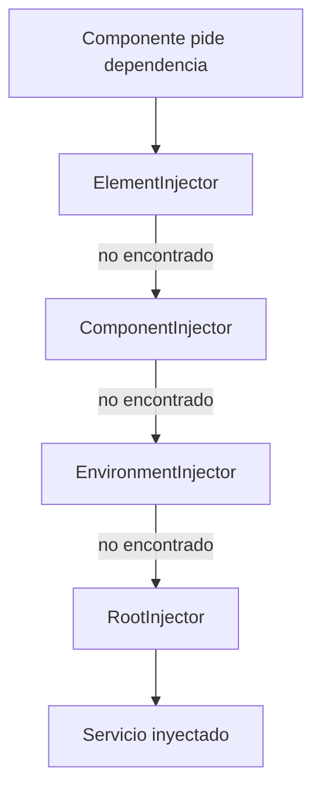

## 09 — Dependency Injection

Sistema de inyección de dependencias de Angular: jerarquía, providers, injection tokens, y la función `inject()`.

> **Propósito:** Maestro de la inyección de dependencias en Angular: inject(), InjectionToken, providers (useClass/useFactory/useValue) y jerarquía de inyectores.
>
> **Problema que resuelve:** Sin DI, las dependencias se crean manualmente creando acoplamiento fuerte, imposibilidad de mockear y violación del principio de inversión de dependencias.
>
> **Cómo lo resuelve:** El DI de Angular proporciona un contenedor centralizado con jerarquía por módulos/componentes, permitiendo intercambiar implementaciones sin modificar el consumidor.
>
> **Por qué aprenderlo:** Es el patrón arquitectónico central de Angular; entender DI es entender cómo Angular gestiona servicios, componentes y pipes.

### Analogía del Mundo Real

- **DI** = Un restaurante automático: tú solo pides el plato, no te importa quién lo cocinó
- **InjectionToken** = Un número de pedido único: garantiza que obtienes EXACTAMENTE lo que pediste
- **useValue** = Darle al mesero una receta escrita: "usa ESTOS ingredientes exactos"
- **useClass** = "Cuérame el plato de ESTA receta pero con otro chef"
- **useFactory** = "Prepárame algo según los ingredientes que tengas disponibles"
- **@Optional()** = "Si no tienes este plato, no pasa nada — dame otro"
- **@Host()** = "Solo busca en ESTA cocina, no en otras"
- **Jerarquía de inyectores** = Como una cadena de mando: primero preguntas al jefe local, luego al regional, luego al global



### Conceptos Clave

- **`@Injectable()`**: decorador de servicios, `providedIn: 'root'`
- **`inject()`**: función para obtener dependencias (alternativa a constructor DI)
- **`InjectionToken<T>`**: tokens para valores no-clase
- **Providers**: `useClass`, `useValue`, `useFactory`, `useExisting`
- **Jerarquía**: `EnvironmentInjector`, `ElementInjector`, resolución jerárquica
- **`@Optional()`**: dependencias opcionales
- **`@Host()`**: límite de resolución al inyector actual
- **`@Self()`**: solo el inyector del propio elemento
- **`@SkipSelf()`**: salta el inyector del propio elemento
- **`runInInjectionContext()`**: ejecutar fuera del contexto de DI

### Proyecto

Sistema de configuración multi-tenant con tokens de inyección, providers por entorno y servicios jerárquicos.

### Ejercicios

1. Define un `InjectionToken<AppConfig>` para configuración global
2. Crea un servicio con `providedIn: 'root'` y otro con `providedIn: 'platform'`
3. Usa `inject()` en lugar de constructor DI
4. Implementa un `useFactory` provider con dependencias
5. Crea un `EnvironmentInjector` para contexto aislado

### Cómo ejecutar

```bash
cd 09-dependency-injection
npm install
ng serve --host 0.0.0.0 --port 8080
```

### Archivos del Proyecto

| Archivo | Propósito |
|---------|-----------|
| `src/app/app.component.ts` | Demostración de DI: inject, tokens, @Optional, runInInjectionContext |
| `src/app/app.config.ts` | Configuración de providers (useValue, useFactory, useClass) |
| `src/app/config.ts` | Definición de InjectionTokens (APP_CONFIG, OPTIONAL_FEATURE) |
| `src/app/services/logger.service.ts` | Servicio de logging condicional (providedIn: 'root') |
| `src/app/services/user.service.ts` | Servicio de usuarios CRUD (providedIn: 'platform') |
| `src/app/services/analytics.service.ts` | Clase abstracta + implementaciones Console y Mock |
| `src/main.ts` | Punto de entrada: bootstrap del componente raíz |
| `src/index.html` | HTML base donde se monta la app |
| `src/styles.css` | Estilos globales |
| `angular.json` | Configuración del build de Angular |
| `tsconfig.json` | Configuración de TypeScript |
| `package.json` | Dependencias y scripts del proyecto |

### Glosario

| Término | Definición |
|---------|------------|
| **Dependency Injection (DI)** | Patrón donde un objeto recibe sus dependencias de fuera en vez de crearlas |
| **@Injectable()** | Decorador que marca una clase como susceptible de inyectar dependencias |
| **providedIn: 'root'** | El servicio se crea como singleton global (una instancia para toda la app) |
| **providedIn: 'platform'** | El servicio se comparte entre todas las apps Angular en la misma plataforma |
| **inject()** | Función moderna para obtener dependencias (reemplaza al constructor DI) |
| **InjectionToken** | Token único y tipado para inyectar valores que no son clases |
| **Provider** | Instrucción que le dice a Angular cómo crear una dependencia |
| **useValue** | Provider que provee un valor estático (constantes, configuración) |
| **useClass** | Provider que provee una instancia de una clase específica |
| **useFactory** | Provider que ejecuta una función para crear el valor |
| **useExisting** | Provider que aliasa otro provider existente |
| **@Optional()** | Modificador que permite que la dependencia sea null si no existe |
| **@Host()** | Modificador que limita la búsqueda al inyector del componente actual |
| **@Self()** | Modificador que solo busca en el inyector del propio elemento |
| **@SkipSelf()** | Modificador que salta el inyector del propio elemento |
| **Injector** | Contenedor que gestiona la creación y resolución de dependencias |
| **runInInjectionContext** | Función que permite usar inject() fuera del contexto de Angular |
| **Clase abstracta** | Clase que no se puede instanciar, solo heredar (define un contrato) |
| **Singleton** | Patrón donde solo existe UNA instancia de una clase en toda la app |
