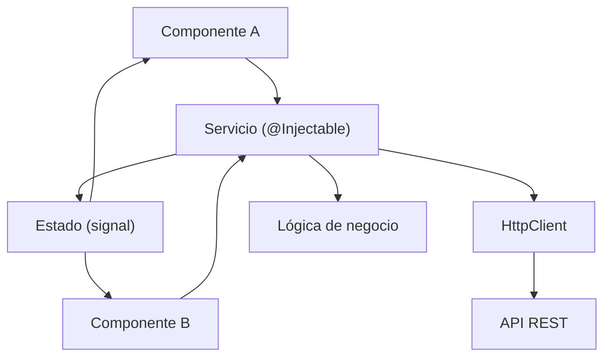

## 10 — Servicios y RxJS

Servicios en Angular con señales y RxJS: Subjects, BehaviorSubject, operadores, `toSignal` y `toObservable`.

> **Propósito:** Implementar servicios con RxJS y signals para manejar estado compartido, operaciones asíncronas y comunicación entre componentes desacoplados.
>
> **Problema que resuelve:** El estado compartido entre componentes hermanos sin un servicio central lleva a props drilling y estado duplicado inconsistente.
>
> **Cómo lo resuelve:** Servicios con BehaviorSubject + toSignal convierten streams RxJS en señales reactivas, combinando lo mejor de RxJS (operadores) con signals (reactividad simple).
>
> **Por qué aprenderlo:** Los servicios son el mecanismo de estado compartido en Angular; sin ellos cada componente es una isla de datos.

### Analogía del Mundo Real

- **Servicio** = Un mayordomo que lleva la cuenta de todo lo que compras
- **BehaviorSubject** = Una caja fuerte que siempre tiene algo adentro (el valor actual)
- **toSignal()** = Convertir el "stream de noticias" a un "tablero de anuncios" que se actualiza solo
- **toObservable()** = Convertir el "tablero de anuncios" a un "stream de noticias"
- **computed()** = Una calculadora que suma automáticamente cada vez que agregas algo
- **effect()** = Un "autoguardado" que persiste cada cambio en disco
- **debounceTime** = Un portero que no abre la puerta en cada paso, solo cuando te quedas parado
- **switchMap** = Cancelar la búsqueda anterior cuando empiezas una nueva



### Conceptos Clave

- **Servicios**: lógica compartida, estado, comunicación cross-component
- **`Subject`**: observable multicástico básico
- **`BehaviorSubject`**: observable con valor inicial (último valor siempre disponible)
- **`ReplaySubject`**: replay de N valores anteriores
- **`AsyncSubject`**: solo emite el último valor al completarse
- **Operadores RxJS**: `map`, `filter`, `switchMap`, `debounceTime`, `catchError`, `takeUntil`
- **`toSignal()`**: convierte Observable a señal (read-only)
- **`toObservable()`**: convierte señal a Observable
- **`async` pipe**: suscripción automática en templates
- **Unsubscribe**: `takeUntilDestroyed()`, `DestroyRef`

### Proyecto

Servicio de carrito de compras con señales y RxJS: agregar/remover items, total calculado con computed, sincronización con API.

### Ejercicios

1. Crea un servicio con `BehaviorSubject` para estado del carrito
2. Convierte el observable a señal con `toSignal()`
3. Usa `switchMap` para cancelar peticiones previas en búsqueda
4. Implementa debounce en un input de búsqueda con `debounceTime`
5. Limpia suscripciones con `takeUntilDestroyed()`

### Cómo ejecutar

```bash
cd 10-servicios
npm install
ng serve --host 0.0.0.0 --port 8080
```

### Archivos del Proyecto

| Archivo | Propósito |
|---------|-----------|
| `src/app/app.component.ts` | UI del carrito de compras con búsqueda debounce |
| `src/app/app.config.ts` | Configuración de la aplicación |
| `src/app/services/cart.service.ts` | Servicio de carrito con BehaviorSubject, signals, computed, effect |
| `src/main.ts` | Punto de entrada: bootstrap del componente raíz |
| `src/index.html` | HTML base donde se monta la app |
| `src/styles.css` | Estilos globales |
| `angular.json` | Configuración del build de Angular |
| `tsconfig.json` | Configuración de TypeScript |
| `tsconfig.app.json` | Configuración de TypeScript para la app |
| `package.json` | Dependencias y scripts del proyecto |

### Glosario

| Término | Definición |
|---------|------------|
| **Servicio** | Clase inyectable que encapsula lógica de negocio, estado o comunicación |
| **@Injectable()** | Decorador que permite inyectar dependencias en una clase |
| **providedIn: 'root'** | Singleton global: una instancia compartida en toda la app |
| **Subject** | Observable multicástico que no tiene valor inicial |
| **BehaviorSubject** | Subject con valor inicial y que siempre emite el valor actual a nuevos suscriptores |
| **ReplaySubject** | Subject que repite los últimos N valores a nuevos suscriptores |
| **AsyncSubject** | Subject que solo emite el último valor cuando se completa |
| **Observable** | Stream de datos asíncronos que se puede suscribir |
| **Subscriber** | Suscriptor que recibe valores de un Observable |
| **toSignal()** | Convierte un Observable a una Signal read-only |
| **toObservable()** | Convierte una Signal a un Observable |
| **computed()** | Signal derivada que se recalcula cuando sus dependencias cambian |
| **effect()** | Función que ejecuta código cuando cambian las signals que lee |
| **debounceTime(ms)** | Operador que espera N ms después del último valor antes de emitir |
| **distinctUntilChanged()** | Operador que solo emite si el valor es diferente al anterior |
| **switchMap()** | Operador que cancela la suscripción anterior y crea una nueva |
| **takeUntilDestroyed()** | Operador que completa la suscripción cuando el componente se destruye |
| **DestroyRef** | Referencia al punto de destrucción para registrar cleanup |
| **BehaviorSubject** | Observable con valor inicial que siempre tiene un valor actual |
| **Inmutabilidad** | No modificar el objeto original, sino crear uno nuevo con los cambios |
