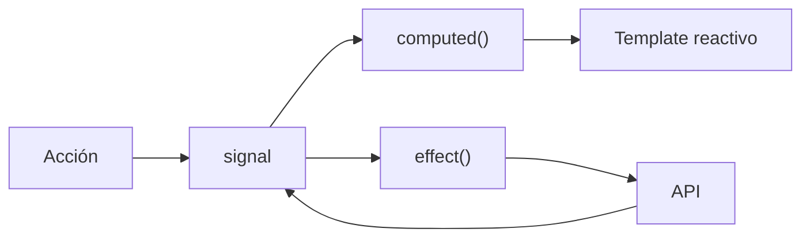

## 11 — Signals y Estado Local

Gestión de estado con señales: `signal()`, `computed()`, `effect()`, `untracked()`, y `linkedSignal()` para estado derivado.

> **Propósito:** Construir estado reactivo complejo con signals: linkedSignal, computed avanzado, untracked, effect con cleanup y persistencia localStorage.
>
> **Problema que resuelve:** El estado de aplicación (carrito de compras, preferencias de usuario) necesita reactividad fina, derivaciones computadas y persistencia sin lógica repetitiva en cada componente.
>
> **Cómo lo resuelve:** Signals con computed derivan estado automáticamente, linkedSignal enlaza señales dependientes, effects con cleanup manejan side effects como persistencia localStorage.
>
> **Por qué aprenderlo:** Signals componibles permiten estado reactivo sin librerías externas; linkedSignal y computed son las herramientas para estado derivado complejo.




### Conceptos

#### 1. `signal()` — Estado Reactivo Mutable

- **Qué es:** Una función que crea un contenedor de valor que notifica automáticamente cuando cambia.
- **Por qué importa:** Signals son la base de la reactividad en Angular moderno; reemplazan `@Input` y `BehaviorSubject` para estado local.
- **Código:**
  ```typescript
  // Crear un signal con valor inicial
  private tasksInternal = signal<Task[]>([]);
  
  // Leer el valor
  const tasks = this.tasksInternal();
  
  // Modificar con set()
  this.tasksInternal.set(nuevaLista);
  
  // Modificar con update() (basado en valor anterior)
  this.tasksInternal.update(t => [...t, nuevaTarea]);
  ```
- **Analogía:** Es como una pizarra compartida en una oficina. Cuando alguien la modifica, todos lo ven inmediatamente.

#### 2. `computed()` — Estado Derivado Memoizado

- **Qué es:** Un signal de solo lectura que se recalcula automáticamente cuando sus dependencias cambian.
- **Por qué importa:** Evita duplicar lógica de filtrado/ordenamiento en cada componente; garantiza consistencia.
- **Código:**
  ```typescript
  // Se recalcula cuando tasksInternal, filter o categoryFilter cambian
  readonly filteredTasks = computed(() => {
    const tasks = this.tasksInternal();
    const cat = this.categoryFilter();
    const f = this.filter();
    return tasks.filter(t => {
      if (cat !== 'all' && t.category !== cat) return false;
      if (f === 'active') return !t.completed;
      if (f === 'completed') return t.completed;
      return true;
    });
  });
  ```
- **Analogía:** Como un empleado que revisa la pizarra y filtra las tareas según los criterios seleccionados.

#### 3. `effect()` — Efectos Secundarios

- **Qué es:** Ejecuta código (como persistencia) cada vez que cambian las señales que lee.
- **Por qué importa:** Permite sincronizar estado con localStorage, APIs o DOM sin lógica repetitiva.
- **Código:**
  ```typescript
  effect(() => {
    const tasks = this.tasksInternal();
    untracked(() => {
      localStorage.setItem('ng-task-store', JSON.stringify(tasks));
    });
  });
  ```
- **Analogía:** Como un empleado que siempre anota en la pizarra lo que se modifica, para que no se pierda el registro.

#### 4. `linkedSignal()` — Señal Vinculada

- **Qué es:** Un signal que se resetea automáticamente cuando cambia su señal fuente.
- **Por qué importa:** Resuelve el problema de mantener estado derivado que depende de otra señal y necesita reset.
- **Código:**
  ```typescript
  // Cuando el filtro cambia, editId se resetea a null
  readonly editId = linkedSignal<Filter, number | null>({
    source: () => this.filter(),
    computation: () => null,
  });
  ```
- **Analogía:** Si cambias de página en un libro, se cierra el marcador de la página anterior.

#### 5. `untracked()` — Lectura Sin Dependencias

- **Qué es:** Permite leer una señal sin crear una dependencia en el effect actual.
- **Por qué importa:** Evita re-ejecuciones innecesarias de effects cuando no necesitas reaccionar a esa señal.
- **Código:**
  ```typescript
  effect(() => {
    const tasks = this.tasksInternal(); // ← crea dependencia
    untracked(() => {
      localStorage.setItem('key', JSON.stringify(tasks)); // ← NO crea dependencia
    });
  });
  ```
- **Analogía:** Como mirar un reloj sin que eso haga que cambies de actividad.

### Proyecto

Gestor de tareas avanzado con señales: filtros, búsqueda, persistencia, historial de cambios con linkedSignal.

### Ejercicios

1. **Store básico:** Crea un `TaskStoreService` con `signal<Task[]>([])` y métodos `addTask`, `removeTask`, `toggleTask` usando `update()` con inmutabilidad (spread operator).
2. **Computed derivado:** Implementa `filteredTasks` con `computed()` que filtre por estado (all/active/completed) y por categoría. Agrega `pendingCount` y `completedCount`.
3. **Persistencia con effect:** Usa `effect()` para guardar automáticamente las tareas en `localStorage` cada vez que cambian. Carga los datos guardados en el constructor.
4. **LinkedSignal para reset:** Crea un `linkedSignal` que mantenga el ID de la tarea en edición y se resetee a `null` cuando el usuario cambie el filtro de estado.
5. **Untracked para logging:** Implementa un `effect()` que registre en consola cada cambio de tareas, usando `untracked()` para acceder a `localStorage` sin crear dependencia circular.

### Cómo ejecutar

```bash
cd 11-signals-estado
npm install
ng serve --host 0.0.0.0 --port 8080
```

### Archivos del Proyecto

| Archivo | Propósito | Ruta |
|---------|-----------|------|
| `angular.json` | Configuración del proyecto Angular | `angular.json` |
| `package.json` | Dependencias y scripts del proyecto | `package.json` |
| `tsconfig.json` | Configuración base de TypeScript | `tsconfig.json` |
| `tsconfig.app.json` | Configuración TypeScript de la aplicación | `tsconfig.app.json` |
| `src/index.html` | Punto de entrada HTML de la aplicación | `src/index.html` |
| `src/main.ts` | Punto de entrada principal de Angular | `src/main.ts` |
| `src/styles.css` | Estilos globales de la aplicación | `src/styles.css` |
| `src/app/app.config.ts` | Configuración de providers de la aplicación | `src/app/app.config.ts` |
| `src/app/app.component.ts` | Componente raíz de la aplicación | `src/app/app.component.ts` |
| `src/app/services/task-store.service.ts` | Store con señales para gestión de tareas | `src/app/services/task-store.service.ts` |
