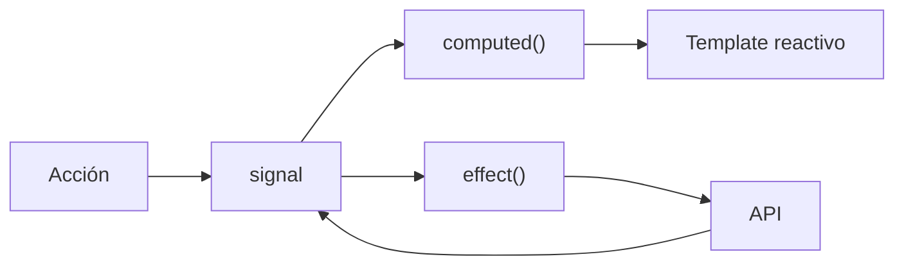

## 11 — Signals y Estado Local

Gestión de estado con señales: `signal()`, `computed()`, `effect()`, `untracked()`, y `linkedSignal()` para estado derivado.

> **Propósito:** Construir estado reactivo complejo con signals: linkedSignal, computed avanzado, untracked, effect con cleanup y persistencia localStorage.
>
> **Problema que resuelve:** El estado de aplicación (carrito de compras, preferencias de usuario) necesita reactividad fina, derivaciones computadas y persistencia sin lógica repetitiva en cada componente.
>
> **Cómo lo resuelve:** Signals con computed derivan estado automáticamente, linkedSignal enlaza señales dependientes, effects con cleanup manejan side effects como persistencia localStorage.
>
> **Por qué aprenderlo:** Signals componibles permiten estado reactivo sin librerías externas; linkedSignal y computed son las herramientas para estado derivado complejo.




### Conceptos Clave

- **`signal()`**: estado reactivo mutable
- **`computed()`**: estado derivado memoizado (solo lectura)
- **`effect()`**: reaccionar a cambios (timing, cleanup)
- **`untracked()`**: leer señales sin crear dependencias
- **`linkedSignal()`**: señal vinculada que se resetea cuando su fuente cambia
- **`signal.equal()`**: comparador personalizado para evitar renders innecesarios
- **Patrón de stores**: encapsular señales en servicios con API pública
- **Estado inmutable**: actualizar objetos/arrays con spread operator o `structuredClone`

### Proyecto

Gestor de tareas avanzado con señales: filtros, búsqueda, persistencia, historial de cambios con linkedSignal.

### Ejercicios

1. Implementa un store de señales para lista de tareas con add/remove/toggle
2. Usa `computed` para tareas filtradas y conteo
3. Usa `linkedSignal` para un selector que se resetea al cambiar la categoría
4. Persiste estado con `effect()` y localStorage
5. Implementa `untracked` para logging sin dependencias

### Cómo ejecutar

```bash
cd 11-signals-estado
npm install
ng serve
```
