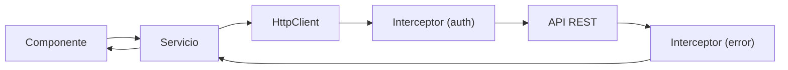

## 12 — HttpClient e Interceptors

Comunicación HTTP con Angular: `HttpClient`, interceptores funcionales, `HttpContext`, y manejo de errores.

> **Propósito:** Configurar HttpClient con interceptores funcionales, HttpContextToken, retry automático y manejo global de errores HTTP.
>
> **Problema que resuelve:** Llamadas HTTP sin una capa centralizada resultan en código repetitivo, error handling inconsistente y nula trazabilidad de peticiones.
>
> **Cómo lo resuelve:** HttpClient con interceptores funcionales (log, retry, auth), HttpContextToken para metadatos por petición, y manejo unificado de errores en el pipe RxJS.
>
> **Por qué aprenderlo:** Toda app Angular se comunica con un backend; HttpClient e interceptores son la capa de comunicación estándar y extensible.




### Conceptos

#### 1. `HttpClient` y `provideHttpClient()` — Cliente HTTP Tipado

- **Qué es:** Servicio de Angular para hacer peticiones HTTP (GET, POST, PUT, DELETE) con tipado genérico.
- **Por qué importa:** Toda app Angular se comunica con un backend; HttpClient es la capa estándar con soporte para Observables, interceptores y manejo de errores.
- **Código:**
  ```typescript
  // Configurar en app.config.ts
  provideHttpClient(withFetch(), withInterceptors([...]))
  
  // Usar en un servicio
  private http = inject(HttpClient);
  
  getProducts(): Observable<Product[]> {
    return this.http.get<Product[]>('/api/products', {
      params: new HttpParams().set('_limit', '10')
    });
  }
  ```
- **Analogía:** Como un traductor que se comunica con el servidor por ti, llevando y trayendo datos en el formato correcto.

#### 2. Interceptores Funcionales — `HttpInterceptorFn`

- **Qué es:** Funciones que procesan cada petición HTTP antes de enviarla y cada respuesta antes de recibirla.
- **Por qué importa:** Permiten lógica transversal (logging, auth, errores) sin duplicar código en cada petición.
- **Código:**
  ```typescript
  export const authInterceptor: HttpInterceptorFn = (req, next) => {
    if (req.context.get(SKIP_AUTH)) return next(req);
    const token = authToken();
    if (!token) return next(req);
    const cloned = req.clone({
      setHeaders: { Authorization: `Bearer ${token}` }
    });
    return next(cloned);
  };
  ```
- **Analogía:** Como los controles de seguridad en un aeropuerto: cada pasajero (petición) debe pasar por cada control (interceptor).

#### 3. `HttpContextToken` — Metadatos por Petición

- **Qué es:** Tokens tipados para pasar información a interceptores sin modificar la petición HTTP.
- **Por qué importa:** Permite a interceptores saber qué hacer con cada petición (ej: omitir auth) sin parámetros booleanos en la URL.
- **Código:**
  ```typescript
  // Definir el token
  export const SKIP_AUTH = new HttpContextToken<boolean>(() => false);
  
  // Usar en el servicio
  this.http.post(url, body, {
    context: new HttpContext().set(SKIP_AUTH, true)
  });
  
  // Leer en el interceptor
  if (req.context.get(SKIP_AUTH)) return next(req);
  ```
- **Analogía:** Como un "vale" o "pase especial" que agregas a una petición para que el interceptor sepa que debe saltarse un paso.

#### 4. Manejo de Errores con `catchError` y `retry`

- **Qué es:** Patrón RxJS para capturar errores HTTP y reintentar peticiones fallidas automáticamente.
- **Por qué importa:** Sin manejo centralizado, cada componente debe manejar errores por separado; interceptores unifican la lógica.
- **Código:**
  ```typescript
  export const errorInterceptor: HttpInterceptorFn = (req, next) => {
    return next(req).pipe(
      retry({
        count: 1,
        delay: (error) => delay(1000)(throwError(() => error)),
      }),
      catchError((error) => {
        console.error(`Error: ${error.status}`);
        return throwError(() => error);
      }),
    );
  };
  ```
- **Analogía:** Como un mecánico de emergencia que intenta arreglar el problema antes de reportarlo.

#### 5. `HttpParams` y `HttpHeaders` — Parámetros y Headers

- **Qué es:** Clases para construir query params y headers de forma tipada y segura.
- **Por qué importa:** Evitan errores de concatenación de strings y garantizan encoding correcto de parámetros.
- **Código:**
  ```typescript
  // HttpParams para query strings
  const params = new HttpParams()
    .set('_limit', '10')
    .set('_page', '1');
  
  // Headers personalizados
  const headers = new HttpHeaders({
    'X-Custom-Header': 'valor'
  });
  ```
- **Analogía:** Como llenar un formulario estandarizado en lugar de escribir una carta libre.

### Proyecto

API Client para un CRUD de productos con interceptors: logging, auth token, error handling, retry.

### Ejercicios

1. **Configuración básica:** Configura `provideHttpClient` con `withFetch()` y `withInterceptors()` en `app.config.ts`. Registra al menos 2 interceptores.
2. **Interceptor de logging:** Crea un interceptor funcional que registre en consola el método HTTP, URL y tiempo de cada petición usando `tap()` y `performance.now()`.
3. **Interceptor de auth:** Implementa un interceptor que agregue un header `Authorization: Bearer` a cada petición, usando `HttpContextToken` para omitirlo en endpoints públicos.
4. **Interceptor de errores con retry:** Crea un interceptor que use `retry()` para reintentar 1 vez peticiones fallidas con 1 segundo de delay, y `catchError()` para logging centralizado.
5. **Servicio CRUD completo:** Implementa un `ProductService` con métodos `getProducts`, `getProduct`, `createProduct`, `updateProduct`, `deleteProduct` usando los 4 verbos HTTP y transformando datos con `pipe(map())`.

### Cómo ejecutar

```bash
cd 12-http-client
npm install
ng serve --host 0.0.0.0 --port 8080
```

### Archivos del Proyecto

| Archivo | Propósito | Ruta |
|---------|-----------|------|
| `angular.json` | Configuración del proyecto Angular | `angular.json` |
| `package.json` | Dependencias y scripts del proyecto | `package.json` |
| `tsconfig.json` | Configuración base de TypeScript | `tsconfig.json` |
| `tsconfig.app.json` | Configuración TypeScript de la aplicación | `tsconfig.app.json` |
| `src/index.html` | Punto de entrada HTML de la aplicación | `src/index.html` |
| `src/main.ts` | Punto de entrada principal de Angular | `src/main.ts` |
| `src/styles.css` | Estilos globales de la aplicación | `src/styles.css` |
| `src/app/app.config.ts` | Configuración de providers con HttpClient | `src/app/app.config.ts` |
| `src/app/app.component.ts` | Componente raíz de la aplicación | `src/app/app.component.ts` |
| `src/app/services/product.service.ts` | Servicio CRUD de productos con HttpClient | `src/app/services/product.service.ts` |
| `src/app/interceptors/auth.interceptor.ts` | Interceptor funcional para token Bearer | `src/app/interceptors/auth.interceptor.ts` |
| `src/app/interceptors/error.interceptor.ts` | Interceptor funcional para manejo global de errores | `src/app/interceptors/error.interceptor.ts` |
| `src/app/interceptors/logging.interceptor.ts` | Interceptor funcional para logging de peticiones | `src/app/interceptors/logging.interceptor.ts` |
| `src/app/interceptors/skip-auth.context.ts` | Token HttpContext para saltar autenticación | `src/app/interceptors/skip-auth.context.ts` |
