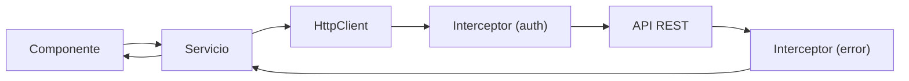

## 12 — HttpClient e Interceptors

Comunicación HTTP con Angular: `HttpClient`, interceptores funcionales, `HttpContext`, y manejo de errores.

> **Propósito:** Configurar HttpClient con interceptores funcionales, HttpContextToken, retry automático y manejo global de errores HTTP.
>
> **Problema que resuelve:** Llamadas HTTP sin una capa centralizada resultan en código repetitivo, error handling inconsistente y nula trazabilidad de peticiones.
>
> **Cómo lo resuelve:** HttpClient con interceptores funcionales (log, retry, auth), HttpContextToken para metadatos por petición, y manejo unificado de errores en el pipe RxJS.
>
> **Por qué aprenderlo:** Toda app Angular se comunica con un backend; HttpClient e interceptores son la capa de comunicación estándar y extensible.




### Conceptos Clave

- **`HttpClient`**: servicio para peticiones HTTP, tipado genérico
- **`provideHttpClient()`**: configuración con `withFetch`, `withInterceptors`
- **Interceptores funcionales**: `HttpInterceptorFn`, `next(req).pipe()`
- **HttpContext**: tokens de contexto para interceptores
- **`HttpParams`**: query params tipados
- **`HttpHeaders`**: headers personalizados
- **`HttpEvent`**: eventos del ciclo de vida (sent, response, upload progress)
- **`HttpProgressEvent`**: progreso de subida/descarga
- **Manejo de errores**: `catchError`, retry, error handling unificado
- **`@angular/common/http`**: `HttpErrorResponse`, `HttpStatusCode`

### Proyecto

API Client para un CRUD de productos con interceptors: logging, auth token, error handling, retry.

### Ejercicios

1. Configura `provideHttpClient` con `withFetch` y `withInterceptors`
2. Implementa un interceptor funcional para logs de petición
3. Añade interceptor de autenticación (Bearer token)
4. Crea un interceptor de error handling con retry
5. Usa `HttpContext` para pasar metadatos a interceptores

### Cómo ejecutar

```bash
cd 12-http-client
npm install
ng serve
```
