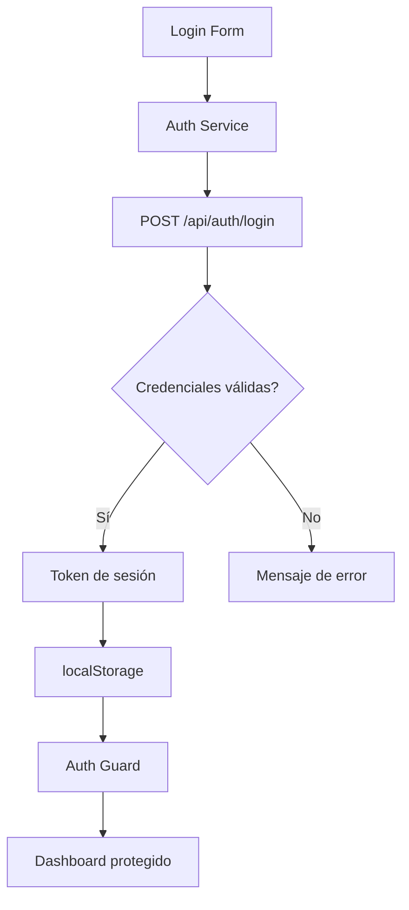

## 13 — Login Básico con Servicios + localStorage

Autenticación básica con servicio de señales, localStorage y guard funcional.

> **Propósito:** Implementar autenticación completa con signals, guards funcionales, lazy loading de páginas protegidas y estado de sesión persistente.
>
> **Problema que resuelve:** Sin autenticación, cualquier usuario puede acceder a rutas protegidas y datos sensibles, comprometiendo la seguridad de la aplicación.
>
> **Cómo lo resuelve:** AuthService con signal de estado, efecto localStorage para persistencia, canActivateFn para proteger rutas, y lazy loading para cargar pages de login/dashboard bajo demanda.
>
> **Por qué aprenderlo:** La autenticación es el requisito más común en apps empresariales; este módulo sienta las bases para cualquier sistema de login.




### Conceptos Clave

- **Servicio Auth**: estado de sesión con `signal<AuthState>`
- **`canActivateFn`**: guard funcional que verifica autenticación
- **Persistencia**: `localStorage` para token/estado
- **Login/Logout**: formulario reactivo + servicio
- **Rutas protegidas**: redirect a login si no autenticado
- **HttpClient interceptor**: attach token automáticamente
- **Auth signals**: `isLoggedIn`, `currentUser`, `isLoading`

### Proyecto

Login básico con email/contraseña, sesión persistente, dashboard protegido y cierre de sesión.

### Ejercicios

1. Crea `AuthService` con `signal<AuthState>()`
2. Implementa formulario reactivo de login
3. Crea `canActivateFn` para proteger rutas
4. Persiste sesión en `localStorage` con `effect()`
5. Muestra usuario autenticado en navbar

### Cómo ejecutar

```bash
cd 13-login-basico
npm install
ng serve --host 0.0.0.0 --port 8080
```

### Archivos del Proyecto

| Archivo | Propósito | Ruta |
|---------|-----------|------|
| `angular.json` | Configuración del proyecto Angular | `angular.json` |
| `package.json` | Dependencias y scripts del proyecto | `package.json` |
| `tsconfig.json` | Configuración base de TypeScript | `tsconfig.json` |
| `tsconfig.app.json` | Configuración TypeScript de la aplicación | `tsconfig.app.json` |
| `src/index.html` | Punto de entrada HTML de la aplicación | `src/index.html` |
| `src/main.ts` | Punto de entrada principal de Angular | `src/main.ts` |
| `src/styles.css` | Estilos globales de la aplicación | `src/styles.css` |
| `src/app/app.config.ts` | Configuración de providers de la aplicación | `src/app/app.config.ts` |
| `src/app/app.component.ts` | Componente raíz de la aplicación | `src/app/app.component.ts` |
| `src/app/app.routes.ts` | Definición de rutas con lazy loading | `src/app/app.routes.ts` |
| `src/app/guards/auth.guard.ts` | Guard funcional `canActivateFn` para proteger rutas | `src/app/guards/auth.guard.ts` |
| `src/app/services/auth.service.ts` | Servicio de autenticación con señales y localStorage | `src/app/services/auth.service.ts` |
| `src/app/pages/home/home.component.ts` | Componente de página de inicio | `src/app/pages/home/home.component.ts` |
| `src/app/pages/login/login.component.ts` | Componente de formulario de login | `src/app/pages/login/login.component.ts` |
| `src/app/pages/dashboard/dashboard.component.ts` | Componente de dashboard protegido | `src/app/pages/dashboard/dashboard.component.ts` |
