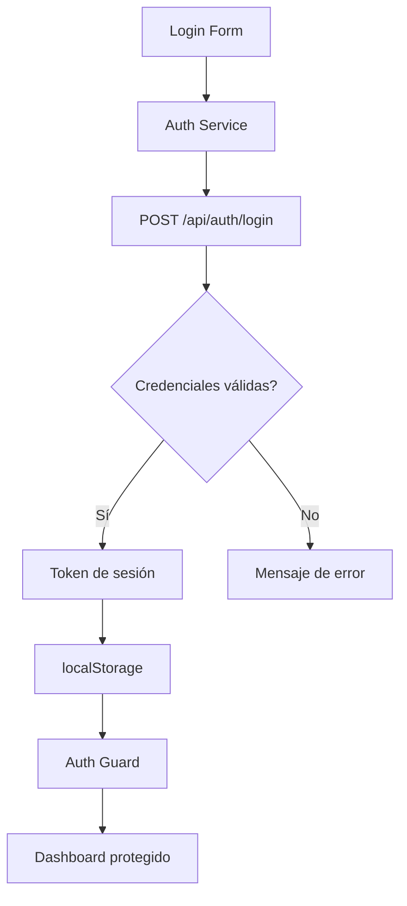

## 13 — Login Básico con Servicios + localStorage

Autenticación básica con servicio de señales, localStorage y guard funcional.

> **Propósito:** Implementar autenticación completa con signals, guards funcionales, lazy loading de páginas protegidas y estado de sesión persistente.
>
> **Problema que resuelve:** Sin autenticación, cualquier usuario puede acceder a rutas protegidas y datos sensibles, comprometiendo la seguridad de la aplicación.
>
> **Cómo lo resuelve:** AuthService con signal de estado, efecto localStorage para persistencia, canActivateFn para proteger rutas, y lazy loading para cargar pages de login/dashboard bajo demanda.
>
> **Por qué aprenderlo:** La autenticación es el requisito más común en apps empresariales; este módulo sienta las bases para cualquier sistema de login.




### Conceptos

#### 1. Servicio Auth con `signal<AuthState>` — Estado de Sesión

- **Qué es:** Un servicio que encapsula el estado de autenticación (usuario, token) en un signal reactivo.
- **Por qué importa:** Centraliza la lógica de login/logout y permite que cualquier componente reaccione a cambios de sesión.
- **Código:**
  ```typescript
  private state = signal<AuthState | null>(null);
  
  readonly isLoggedIn = computed(() => this.state() !== null);
  readonly currentUser = computed(() => this.state());
  
  login(email: string, password: string): boolean {
    const token = btoa(`${email}:${Date.now()}`);
    this.state.set({ email, name: email.split('@')[0], token });
    return true;
  }
  
  logout() {
    this.state.set(null);
  }
  ```
- **Analogía:** Como una caja que puede estar vacía (no autenticado) o tener datos del usuario (autenticado).

#### 2. `canActivateFn` — Guard Funcional de Rutas

- **Qué es:** Una función que se ejecuta ANTES de que el usuario acceda a una ruta, verificando si tiene permiso.
- **Por qué importa:** Protege rutas privadas sin lógica en cada componente; redirige automáticamente a login si no autenticado.
- **Código:**
  ```typescript
  export const authGuardFn = () => {
    const auth = inject(AuthService);
    const router = inject(Router);
    if (auth.isLoggedIn()) return true;
    return router.parseUrl('/login');
  };
  
  // En rutas
  { path: 'dashboard', canActivate: [authGuardFn], ... }
  ```
- **Analogía:** Como un portero que verifica tu credencial antes de dejarte entrar al edificio.

#### 3. Persistencia con `effect()` y `localStorage`

- **Qué es:** Usar un effect para guardar/cargar automáticamente el estado de sesión en localStorage.
- **Por qué importa:** Mantiene la sesión entre recargas de página sin lógica repetitiva en cada componente.
- **Código:**
  ```typescript
  constructor() {
    // Cargar sesión al iniciar
    const stored = localStorage.getItem('auth_user');
    if (stored) this.state.set(JSON.parse(stored));
    
    // Guardar automáticamente cuando cambia
    effect(() => {
      const user = this.state();
      if (user) {
        localStorage.setItem('auth_user', JSON.stringify(user));
      } else {
        localStorage.removeItem('auth_user');
      }
    });
  }
  ```
- **Analogía:** Como llegar a la oficina y revisar si quedaron tareas anotadas de ayer.

#### 4. Lazy Loading de Rutas

- **Qué es:** Cargar componentes solo cuando se visita su ruta, no al inicio de la app.
- **Por qué importa:** Reduce el tamaño inicial del bundle y mejora el tiempo de carga de la aplicación.
- **Código:**
  ```typescript
  export const routes: Routes = [
    {
      path: 'dashboard',
      loadComponent: () => import('./pages/dashboard/dashboard.component')
        .then(m => m.DashboardComponent),
      canActivate: [authGuardFn],
    },
  ];
  ```
- **Analogía:** Como abrir un capítulo del libro solo cuando lo necesitas, no todos a la vez.

#### 5. Formulario Reactivo de Login

- **Qué es:** Formulario con validación en tiempo real usando `FormsModule` y two-way binding.
- **Por qué importa:** Los formularios reactivos son la forma estándar de capturar datos del usuario con validación integrada.
- **Código:**
  ```typescript
  // En el template
  <input [(ngModel)]="email" type="email" required />
  <input [(ngModel)]="password" type="password" required />
  <button (click)="onLogin()">Iniciar Sesión</button>
  
  // En el componente
  onLogin() {
    if (this.auth.login(this.email, this.password)) {
      this.router.navigate(['/dashboard']);
    }
  }
  ```
- **Analogía:** Como llenar un formulario de recepción donde debes escribir tu nombre y motivo de visita.

### Proyecto

Login básico con email/contraseña, sesión persistente, dashboard protegido y cierre de sesión.

### Ejercicios

1. **AuthService con signals:** Crea un `AuthService` con `signal<AuthState | null>`, `computed isLoggedIn` y `computed currentUser`. Implementa `login()` que establezca el state y `logout()` que lo limpie a null.
2. **Formulario reactivo:** Implementa un `LoginComponent` con campos email y password usando `[(ngModel)]`. Valida que ambos campos estén presentes antes de llamar a `authService.login()`.
3. **Guard funcional:** Crea un `authGuardFn` que use `inject(AuthService)` y `inject(Router)`. Si el usuario no está autenticado, redirige a `/login` con `router.parseUrl()`.
4. **Persistencia en localStorage:** Agrega un `effect()` en el constructor del AuthService que guarde el state en `localStorage` cuando hay usuario, y lo elimine cuando no. Carga los datos al iniciar.
5. **Dashboard protegido:** Crea un `DashboardComponent` que muestre el nombre del usuario desde `auth.currentUser()` y un botón de logout. Registra la ruta con `canActivate: [authGuardFn]`.

### Cómo ejecutar

```bash
cd 13-login-basico
npm install
ng serve --host 0.0.0.0 --port 8080
```

### Archivos del Proyecto

| Archivo | Propósito | Ruta |
|---------|-----------|------|
| `angular.json` | Configuración del proyecto Angular | `angular.json` |
| `package.json` | Dependencias y scripts del proyecto | `package.json` |
| `tsconfig.json` | Configuración base de TypeScript | `tsconfig.json` |
| `tsconfig.app.json` | Configuración TypeScript de la aplicación | `tsconfig.app.json` |
| `src/index.html` | Punto de entrada HTML de la aplicación | `src/index.html` |
| `src/main.ts` | Punto de entrada principal de Angular | `src/main.ts` |
| `src/styles.css` | Estilos globales de la aplicación | `src/styles.css` |
| `src/app/app.config.ts` | Configuración de providers de la aplicación | `src/app/app.config.ts` |
| `src/app/app.component.ts` | Componente raíz de la aplicación | `src/app/app.component.ts` |
| `src/app/app.routes.ts` | Definición de rutas con lazy loading | `src/app/app.routes.ts` |
| `src/app/guards/auth.guard.ts` | Guard funcional `canActivateFn` para proteger rutas | `src/app/guards/auth.guard.ts` |
| `src/app/services/auth.service.ts` | Servicio de autenticación con señales y localStorage | `src/app/services/auth.service.ts` |
| `src/app/pages/home/home.component.ts` | Componente de página de inicio | `src/app/pages/home/home.component.ts` |
| `src/app/pages/login/login.component.ts` | Componente de formulario de login | `src/app/pages/login/login.component.ts` |
| `src/app/pages/dashboard/dashboard.component.ts` | Componente de dashboard protegido | `src/app/pages/dashboard/dashboard.component.ts` |
