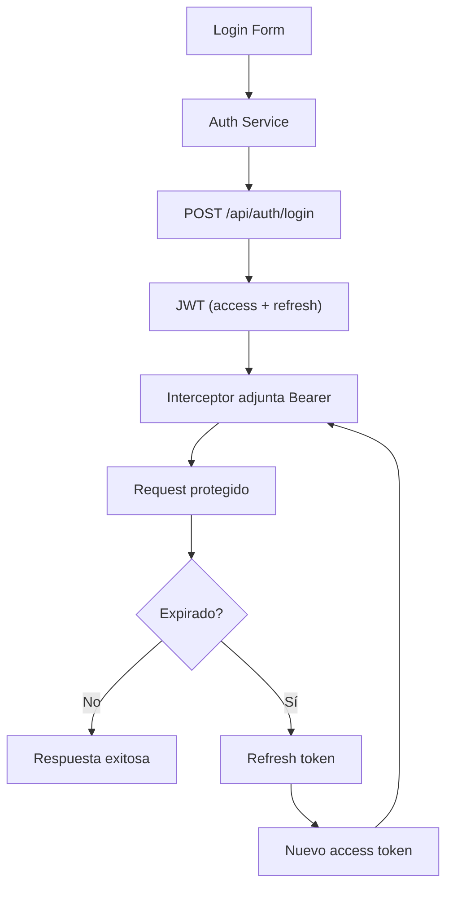

## 14 — Autenticación JWT Completa

JWT con access y refresh tokens, interceptor de autenticación, renovación automática, guards de roles.

> **Propósito:** Implementar autenticación JWT completa con interceptor Bearer, refresh tokens automáticos, mock backend y guard por roles.
>
> **Problema que resuelve:** JWT requiere manejo de tokens expirados, refresh automático, almacenamiento seguro y rutas por rol; mal implementado causa fugas de sesión y peticiones fallidas.
>
> **Cómo lo resuelve:** AuthService con refresh token automático (intercepta 401 → refresh → retry), jwtDecode para roles, canMatchFn guard por rol, mock backend interceptor para desarrollo.
>
> **Por qué aprenderlo:** JWT es el estándar de autenticación moderno; toda app que consuma APIs REST lo necesita. El patrón refresh token es crítico para UX.




### Conceptos

#### 1. JWT — Access Token y Refresh Token

- **Qué es:** Tokens de autenticación: el access token expira rápido (minutos), el refresh token dura horas/días para renovar el access.
- **Por qué importa:** El patrón refresh token evita que el usuario deba hacer login constantemente; mejora la UX sin comprometer seguridad.
- **Código:**
  ```typescript
  interface AuthState {
    user: User | null;
    accessToken: string | null;   // Corta duración
    refreshToken: string | null;  // Larga duración
  }
  
  login(email: string, password: string) {
    return this.http.post<AuthState>('/api/auth/login', { email, password }).pipe(
      tap(res => this.state.set(res)),
    );
  }
  
  refreshTokens() {
    return this.http.post<{ accessToken: string; refreshToken: string }>(
      '/api/auth/refresh',
      { refreshToken: this.state().refreshToken }
    ).pipe(
      tap(res => this.state.update(s => ({ ...s, ...res }))),
    );
  }
  ```
- **Analogía:** El access token es como un pase de un día, y el refresh token es como tu credencial permanente que te permite obtener pases nuevos.

#### 2. Interceptor JWT con Refresh Automático

- **Qué es:** Interceptor que detecta errores 401, renueva el token y reintenta la petición original.
- **Por qué importa:** El usuario no percibe la expiración del token; la renovación es transparente.
- **Código:**
  ```typescript
  export const authInterceptor: HttpInterceptorFn = (req, next) => {
    const auth = inject(AuthService);
    const token = auth.getAccessToken();
    if (token) {
      req = req.clone({ setHeaders: { Authorization: `Bearer ${token}` } });
    }
    return next(req).pipe(
      catchError((error: HttpErrorResponse) => {
        if (error.status === 401 && !req.url.includes('/auth/refresh')) {
          return auth.refreshTokens().pipe(
            switchMap(() => {
              const newToken = auth.getAccessToken();
              return next(req.clone({
                setHeaders: { Authorization: `Bearer ${newToken}` }
              }));
            }),
            catchError(() => { auth.logout(); return throwError(() => error); }),
          );
        }
        return throwError(() => error);
      }),
    );
  };
  ```
- **Analogía:** Como un asistente personal que siempre lleva tu credencial, y si te rechazan, obtiene una nueva sin que te des cuenta.

#### 3. `canMatchFn` y `canActivateFn` — Guards por Rol

- **Qué es:** Dos tipos de guards: uno verifica acceso (canActivate), el otro verifica si la ruta puede coincidir (canMatch) según el rol.
- **Por qué importa:** Permite rutas diferentes según el rol (admin vs user) sin duplicar lógica de verificación.
- **Código:**
  ```typescript
  // Verifica que esté autenticado
  export const authGuard: CanActivateFn = () => {
    const auth = inject(AuthService);
    if (auth.isLoggedIn()) return true;
    return inject(Router).parseUrl('/login');
  };
  
  // Verifica que sea admin
  export const adminGuard: CanMatchFn = () => {
    return inject(AuthService).isAdmin();
  };
  
  // En rutas
  { path: 'admin', canMatch: [adminGuard], loadComponent: ... }
  ```
- **Analogía:** `authGuard` es el portero del edificio, `adminGuard` es el guardia del piso de ejecutivos.

#### 4. Decodificación de JWT con `jwtDecode`

- **Qué es:** Extraer el payload (datos) de un JWT sin verificar la firma, para obtener roles y datos del usuario.
- **Por qué importa:** Permite saber el rol del usuario y personalizar la UI sin hacer una petición extra al servidor.
- **Código:**
  ```typescript
  decodeToken(token: string): Record<string, unknown> | null {
    try {
      const parts = token.split('.');
      if (parts.length !== 3) return null;
      return JSON.parse(atob(parts[1]));
    } catch {
      return null;
    }
  }
  
  // Computed derivado
  isAdmin = computed(() => this.state().user?.role === 'admin');
  ```
- **Analogía:** Como abrir un sobre para ver su contenido sin verificar el sello.

#### 5. Mock Backend Interceptor — Desarrollo Sin Servidor

- **Qué es:** Interceptor que simula respuestas del servidor en el navegador para desarrollo.
- **Por qué importa:** Permite desarrollar y probar la autenticación completa sin un backend real.
- **Código:**
  ```typescript
  export const mockBackendInterceptor: HttpInterceptorFn = (req, next) => {
    if (req.url.endsWith('/api/auth/login') && req.method === 'POST') {
      const user = USERS.find(u => u.email === email && u.password === password);
      if (user) {
        return of(new HttpResponse({
          status: 200,
          body: { user, accessToken: createFakeJwt(payload), refreshToken: ... }
        }));
      }
      return throwError(() => new HttpResponse({ status: 401 }));
    }
    return next(req); // Peticiones no mockeadas pasan al servidor real
  };
  ```
- **Analogía:** Como un actor que interpreta al servidor; responde como si fuera real, pero todo es una simulación.

### Proyecto

Auth completo con login, registro, dashboard por rol (admin/user), refresh automático y logout.

### Ejercicios

1. **Interceptor JWT:** Crea un interceptor que extraiga el access token del AuthService y lo agregue como header `Authorization: Bearer` en cada petición. Verifica que no se agregue si el token es null.
2. **Refresh automático:** Modifica el interceptor para que, al recibir un 401, llame a `auth.refreshTokens()` con `switchMap`, clone la petición con el nuevo token y la reenvíe. Si el refresh falla, ejecuta `auth.logout()`.
3. **Guard por rol:** Crea un `adminGuard: CanMatchFn` que verifique `auth.isAdmin()`. Registra una ruta `/admin` con `canMatch: [adminGuard]` que cargue un componente de panel de administración.
4. **Decodificación de token:** Implementa `decodeToken()` que extraiga el payload de un JWT usando `atob()` y `JSON.parse()`. Crea un `computed isAdmin` que lea el rol del token decodificado.
5. **Mock backend:** Crea un interceptor mock que simule `/api/auth/login` y `/api/auth/refresh`, retornando JWTs falsos con payloads que incluyan `role: 'user' | 'admin'`.

### Cómo ejecutar

```bash
cd 14-login-jwt
npm install
ng serve --host 0.0.0.0 --port 8080
```

### Archivos del Proyecto

| Archivo | Propósito | Ruta |
|---------|-----------|------|
| `angular.json` | Configuración del proyecto Angular | `angular.json` |
| `package.json` | Dependencias y scripts del proyecto | `package.json` |
| `tsconfig.json` | Configuración base de TypeScript | `tsconfig.json` |
| `tsconfig.app.json` | Configuración TypeScript de la aplicación | `tsconfig.app.json` |
| `.gitignore` | Archivos ignorados por Git | `.gitignore` |
| `src/index.html` | Punto de entrada HTML de la aplicación | `src/index.html` |
| `src/main.ts` | Punto de entrada principal de Angular | `src/main.ts` |
| `src/styles.css` | Estilos globales de la aplicación | `src/styles.css` |
| `src/app/app.config.ts` | Configuración de providers de la aplicación | `src/app/app.config.ts` |
| `src/app/app.component.ts` | Componente raíz de la aplicación | `src/app/app.component.ts` |
| `src/app/app.routes.ts` | Definición de rutas con lazy loading | `src/app/app.routes.ts` |
| `src/app/guards/auth.guard.ts` | Guard funcional con verificación de roles JWT | `src/app/guards/auth.guard.ts` |
| `src/app/interceptors/auth.interceptor.ts` | Interceptor que adjunta token JWT Bearer | `src/app/interceptors/auth.interceptor.ts` |
| `src/app/interceptors/mock-backend.interceptor.ts` | Interceptor mock para desarrollo sin backend real | `src/app/interceptors/mock-backend.interceptor.ts` |
| `src/app/services/auth.service.ts` | Servicio de autenticación JWT con refresh token | `src/app/services/auth.service.ts` |
| `src/app/services/user.service.ts` | Servicio de usuarios | `src/app/services/user.service.ts` |
| `src/app/pages/login/login.component.ts` | Componente de formulario de login | `src/app/pages/login/login.component.ts` |
| `src/app/pages/dashboard/dashboard.component.ts` | Componente de dashboard según rol | `src/app/pages/dashboard/dashboard.component.ts` |
| `src/app/pages/admin/admin.component.ts` | Componente de panel de administración | `src/app/pages/admin/admin.component.ts` |
| `src/app/pages/profile/profile.component.ts` | Componente de perfil de usuario | `src/app/pages/profile/profile.component.ts` |
