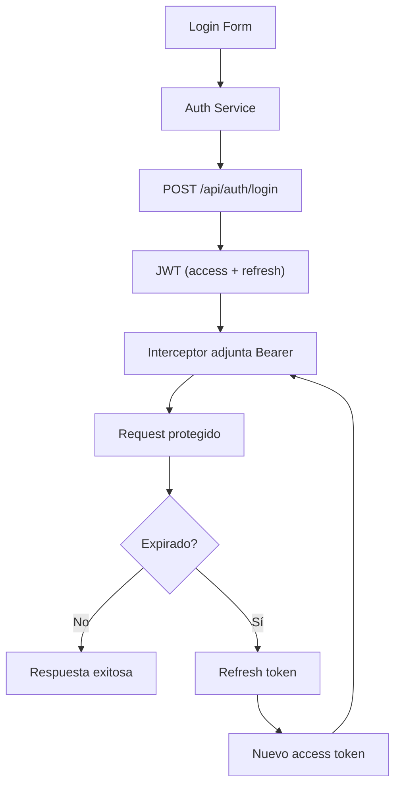

## 14 — Autenticación JWT Completa

JWT con access y refresh tokens, interceptor de autenticación, renovación automática, guards de roles.

> **Propósito:** Implementar autenticación JWT completa con interceptor Bearer, refresh tokens automáticos, mock backend y guard por roles.
>
> **Problema que resuelve:** JWT requiere manejo de tokens expirados, refresh automático, almacenamiento seguro y rutas por rol; mal implementado causa fugas de sesión y peticiones fallidas.
>
> **Cómo lo resuelve:** AuthService con refresh token automático (intercepta 401 → refresh → retry), jwtDecode para roles, canMatchFn guard por rol, mock backend interceptor para desarrollo.
>
> **Por qué aprenderlo:** JWT es el estándar de autenticación moderno; toda app que consuma APIs REST lo necesita. El patrón refresh token es crítico para UX.




### Conceptos Clave

- **JWT**: access token (corto) + refresh token (largo)
- **`HttpInterceptorFn`**: attach Bearer token a cada petición
- **Refresh flow**: interceptor detecta 401, renueva token, reintenta
- **Decodificación**: `jwtDecode` para leer payload sin verificar
- **`canActivateFn`**: guard con verificación de rol
- **`canMatchFn`**: guard para rutas específicas por rol
- **Login/Register**: formularios reactivos con validación
- **Backends**: Spring Boot 4.1.0, .NET 10 o FastAPI (uno a elegir en backend/)

### Proyecto

Auth completo con login, registro, dashboard por rol (admin/user), refresh automático y logout.

### Ejercicios

1. Configura interceptor JWT para attach token
2. Implementa refresh automático en interceptor
3. Crea `canActivateFn` con verificación de rol
4. Decodifica JWT para obtener datos del usuario
5. Maneja expiración de sesión con redirect a login

### Cómo ejecutar

```bash
cd 14-login-jwt
npm install
ng serve --host 0.0.0.0 --port 8080
```

### Archivos del Proyecto

| Archivo | Propósito | Ruta |
|---------|-----------|------|
| `angular.json` | Configuración del proyecto Angular | `angular.json` |
| `package.json` | Dependencias y scripts del proyecto | `package.json` |
| `tsconfig.json` | Configuración base de TypeScript | `tsconfig.json` |
| `tsconfig.app.json` | Configuración TypeScript de la aplicación | `tsconfig.app.json` |
| `.gitignore` | Archivos ignorados por Git | `.gitignore` |
| `src/index.html` | Punto de entrada HTML de la aplicación | `src/index.html` |
| `src/main.ts` | Punto de entrada principal de Angular | `src/main.ts` |
| `src/styles.css` | Estilos globales de la aplicación | `src/styles.css` |
| `src/app/app.config.ts` | Configuración de providers de la aplicación | `src/app/app.config.ts` |
| `src/app/app.component.ts` | Componente raíz de la aplicación | `src/app/app.component.ts` |
| `src/app/app.routes.ts` | Definición de rutas con lazy loading | `src/app/app.routes.ts` |
| `src/app/guards/auth.guard.ts` | Guard funcional con verificación de roles JWT | `src/app/guards/auth.guard.ts` |
| `src/app/interceptors/auth.interceptor.ts` | Interceptor que adjunta token JWT Bearer | `src/app/interceptors/auth.interceptor.ts` |
| `src/app/interceptors/mock-backend.interceptor.ts` | Interceptor mock para desarrollo sin backend real | `src/app/interceptors/mock-backend.interceptor.ts` |
| `src/app/services/auth.service.ts` | Servicio de autenticación JWT con refresh token | `src/app/services/auth.service.ts` |
| `src/app/services/user.service.ts` | Servicio de usuarios | `src/app/services/user.service.ts` |
| `src/app/pages/login/login.component.ts` | Componente de formulario de login | `src/app/pages/login/login.component.ts` |
| `src/app/pages/dashboard/dashboard.component.ts` | Componente de dashboard según rol | `src/app/pages/dashboard/dashboard.component.ts` |
| `src/app/pages/admin/admin.component.ts` | Componente de panel de administración | `src/app/pages/admin/admin.component.ts` |
| `src/app/pages/profile/profile.component.ts` | Componente de perfil de usuario | `src/app/pages/profile/profile.component.ts` |
