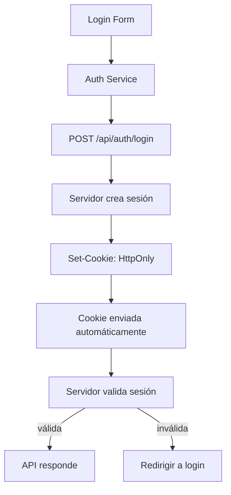

## 15 — Autenticación con Cookies

Autenticación con cookies HttpOnly, SameSite, XSRF/CSRF protection, y refresh de sesión silencioso.

> **Propósito:** Implementar autenticación con cookies HttpOnly, protección XSRF, withCredentials y configuración CORS para apps con backend same-origin.
>
> **Problema que resuelve:** JWT en localStorage es vulnerable a XSS; las cookies HttpOnly son más seguras pero requieren manejo de CSRF/XSRF y configuración cross-origin.
>
> **Cómo lo resuelve:** Cookies HttpOnly (inaccesibles desde JS), withCredentials para enviar cookies cross-origin, withXsrfConfiguration para token XSRF, y configuración CORS explícita.
>
> **Por qué aprenderlo:** Es el approach más seguro para autenticación web mitigando tanto XSS como CSRF. Preferido en apps bancarias y financieras.




### Conceptos Clave

- **HttpOnly Cookies**: cookies no accesibles desde JavaScript
- **SameSite**: `Strict`, `Lax`, `None` — protección contra CSRF
- **`withXsrfConfiguration()`**: configuración de XSRF en Angular
- **`HttpXsrfInterceptor`**: interceptor para agregar header XSRF automáticamente
- **Refresh silencioso**: cookie de sesión renovada automáticamente
- **CSRF Token**: Angular extrae del cookie y envía en header
- **Backend acoplado**: Angular servido desde el mismo origen (Express, Spring Boot, FastAPI sirviendo Angular)
- **Backend separado**: con proxy inverso (NGINX) o CORS configurado

### Proyecto

App con autenticación por cookies HttpOnly. Dos modos: servido por Express (mismo origen) y separado (con proxy).

### Ejercicios

1. Configura `withXsrfConfiguration` en Angular
2. Implementa login que establece cookie HttpOnly
3. Configura Express/Spring Boot/FastAPI para servir Angular y API
4. Alternativa: configura CORS para frontend y backend separados
5. Implementa renovación silenciosa de sesión

### Cómo ejecutar

```bash
cd 15-cookie-auth
npm install
ng serve --host 0.0.0.0 --port 8080
```
