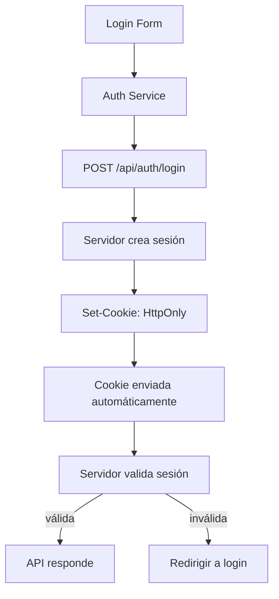

## 15 — Autenticación con Cookies

Autenticación con cookies HttpOnly, SameSite, XSRF/CSRF protection, y refresh de sesión silencioso.

> **Propósito:** Implementar autenticación con cookies HttpOnly, protección XSRF, withCredentials y configuración CORS para apps con backend same-origin.
>
> **Problema que resuelve:** JWT en localStorage es vulnerable a XSS; las cookies HttpOnly son más seguras pero requieren manejo de CSRF/XSRF y configuración cross-origin.
>
> **Cómo lo resuelve:** Cookies HttpOnly (inaccesibles desde JS), withCredentials para enviar cookies cross-origin, withXsrfConfiguration para token XSRF, y configuración CORS explícita.
>
> **Por qué aprenderlo:** Es el approach más seguro para autenticación web mitigando tanto XSS como CSRF. Preferido en apps bancarias y financieras.




### Conceptos

#### 1. HttpOnly Cookies — Tokens Seguros

- **Qué es:** Cookies que el servidor envía y que el navegador almacena pero JavaScript NO puede leer (ni acceder con `document.cookie`).
- **Por qué importa:** A diferencia de localStorage, las cookies HttpOnly no son vulnerables a ataques XSS que roban tokens.
- **Código:**
  ```typescript
  // El servidor envía la cookie con Set-Cookie: session=abc123; HttpOnly; SameSite=Strict
  // El navegador la envía automáticamente en cada petición al mismo origen
  login(email: string, password: string): Observable<User> {
    return this.http.post<User>('/api/auth/login', { email, password }).pipe(
      tap((user) => {
        this.user.set(user);
        this.isLoggedIn.set(true);
      }),
    );
  }
  ```
- **Analogía:** Como una caja fuerte que solo el cajero (servidor) puede abrir; el cliente (JS) nunca ve el contenido.

#### 2. `withXsrfConfiguration` — Protección CSRF/XSRF

- **Qué es:** Configuración que le dice a Angular qué cookie y header usar para protección contra Cross-Site Request Forgery.
- **Por qué importa:** Sin protección XSRF, un sitio malicioso podría hacer peticiones en nombre del usuario autenticado.
- **Código:**
  ```typescript
  // En app.config.ts
  provideHttpClient(
    withFetch(),
    withXsrfConfiguration({
      cookieName: 'XSRF-TOKEN',
      headerName: 'X-XSRF-TOKEN'
    }),
    withInterceptors([cookieInterceptor]),
  )
  
  // El servidor envía la cookie XSRF-TOKEN
  // Angular la lee y la envía como header en peticiones POST/PUT/DELETE
  ```
- **Analogía:** Como un sello de seguridad que el servidor pone en un sobre y el cliente devuelve intacto para demostrar que no es un impostor.

#### 3. `withCredentials` — Enviar Cookies Cross-Origin

- **Qué es:** Opción que le dice al navegador que envíe cookies en peticiones a un dominio diferente.
- **Por qué importa:** Sin `withCredentials: true`, las cookies NO se envían automáticamente en peticiones cross-origin.
- **Código:**
  ```typescript
  export const cookieInterceptor: HttpInterceptorFn = (req, next) => {
    const cloned = req.clone({ withCredentials: true });
    return next(cloned);
  };
  ```
- **Analogía:** Como decir al navegador: "Cuando hagas una petición a este servidor, también envía las galletas que ese servidor te dio antes."

#### 4. `HttpXsrfInterceptor` — Header XSRF Automático

- **Qué es:** Interceptor integrado de Angular que extrae el token XSRF de la cookie y lo envía como header.
- **Por qué importa:** Automatiza la protección CSRF sin que el desarrollador tenga que escribir código manual.
- **Código:**
  ```typescript
  // Angular configura automáticamente:
  // 1. Lee la cookie XSRF-TOKEN
  // 2. La envía como header X-XSRF-TOKEN en peticiones POST/PUT/DELETE
  // Solo funciona con cookies de mismo origen (no HttpOnly)
  ```
- **Analogía:** Como un sistema automático que verifica tu credencial de seguridad cada vez que entras por una puerta restringida.

#### 5. Refresh Silencioso de Sesión

- **Qué es:** Renovar la cookie de sesión antes de que expire, sin que el usuario lo note.
- **Por qué importa:** Mantiene la sesión activa indefinidamente mientras el usuario esté navegando.
- **Código:**
  ```typescript
  checkSession(): Observable<User> {
    return this.http.get<User>('/api/auth/status').pipe(
      tap((user) => {
        this.user.set(user);
        this.isLoggedIn.set(true);
      }),
    );
  }
  
  // Se ejecuta al iniciar la app para verificar si la cookie sigue válida
  constructor() {
    this.checkSession().subscribe();
  }
  ```
- **Analogía:** Como un abogado que renueva automáticamente tu visa antes de que expire, sin que tengas que ir al consulado.

### Proyecto

App con autenticación por cookies HttpOnly. Dos modos: servido por Express (mismo origen) y separado (con proxy).

### Ejercicios

1. **Configuración XSRF:** Configura `withXsrfConfiguration` en `app.config.ts` con `cookieName: 'XSRF-TOKEN'` y `headerName: 'X-XSRF-TOKEN'`. Verifica que Angular lea la cookie y envíe el header.
2. **Cookie interceptor:** Crea un interceptor funcional que agregue `withCredentials: true` a cada petición HTTP clonándola con `req.clone({ withCredentials: true })`.
3. **Login con cookies:** Implementa un `AuthService` con `login()` que envíe credenciales al servidor y espere la cookie HttpOnly en la respuesta. Usa `signal<boolean>` para `isLoggedIn` y `signal<User | null>` para `user`.
4. **Verificación de sesión:** Crea un método `checkSession()` que haga `GET /api/auth/status` al iniciar la app. Si la cookie es válida, actualiza los signals de usuario; si no, marca como no autenticado.
5. **Logout con destrucción de sesión:** Implementa `logout()` que envíe `POST /api/auth/logout` al servidor (para que destruya la cookie) y limpie los signals locales.

### Cómo ejecutar

```bash
cd 15-cookie-auth
npm install
ng serve --host 0.0.0.0 --port 8080
```

### Archivos del Proyecto

| Archivo | Propósito | Ruta |
|---------|-----------|------|
| `angular.json` | Configuración del proyecto Angular | `angular.json` |
| `package.json` | Dependencias y scripts del proyecto | `package.json` |
| `tsconfig.json` | Configuración base de TypeScript | `tsconfig.json` |
| `tsconfig.app.json` | Configuración TypeScript de la aplicación | `tsconfig.app.json` |
| `.gitignore` | Archivos ignorados por Git | `.gitignore` |
| `src/index.html` | Punto de entrada HTML de la aplicación | `src/index.html` |
| `src/main.ts` | Punto de entrada principal de Angular | `src/main.ts` |
| `src/styles.css` | Estilos globales de la aplicación | `src/styles.css` |
| `src/app/app.config.ts` | Configuración de providers con XSRF y withCredentials | `src/app/app.config.ts` |
| `src/app/app.component.ts` | Componente raíz de la aplicación | `src/app/app.component.ts` |
| `src/app/interceptors/cookie.interceptor.ts` | Interceptor para manejo de cookies HttpOnly | `src/app/interceptors/cookie.interceptor.ts` |
| `src/app/services/auth.service.ts` | Servicio de autenticación con cookies | `src/app/services/auth.service.ts` |
| `src/app/services/api.service.ts` | Servicio de API con withCredentials | `src/app/services/api.service.ts` |
| `src/app/pages/login.component.ts` | Componente de formulario de login | `src/app/pages/login.component.ts` |
| `src/app/pages/dashboard.component.ts` | Componente de dashboard protegido | `src/app/pages/dashboard.component.ts` |
