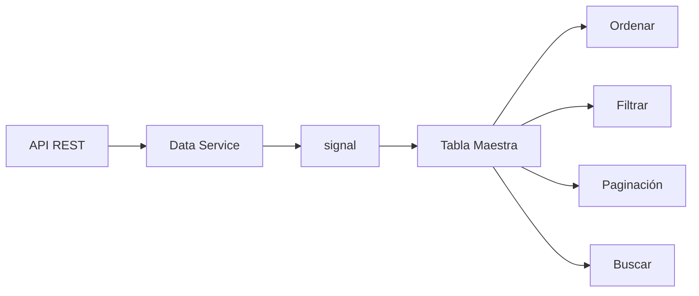

## 16 — Tabla Maestra

Tabla de datos completa: búsqueda, ordenamiento, paginación, y Angular CDK Table.

> **Propósito:** Construir tablas de datos completas con búsqueda, ordenamiento multi-columna, paginación y virtual scrolling usando Angular CDK/Material y señales.
>
> **Problema que resuelve:** Las tablas HTML básicas no soportan búsqueda, ordenamiento ni paginación; implementar esto manualmente resulta en código frágil y mal rendimiento con grandes datasets.
>
> **Cómo lo resuelve:** CdkTable/MatTable con señales para datos y filtros, computed para ordenamiento, paginación con signal de configuración, y virtual scrolling del CDK para +1000 filas.
>
> **Por qué aprenderlo:** Las tablas de datos son el componente UI más usado en apps empresariales; dominar su implementación es indispensable para dashboards y paneles de administración.




### Conceptos Clave

- **`@angular/cdk/table`**: `CdkTable`, columnas dinámicas
- **`@angular/material/table`**: `MatTable`, `MatSort`, `MatPaginator`
- **Señales para tabla**: datos como `signal<User[]>`, filtros como `signal<string>`
- **Ordenamiento**: `computed` para ordenar datos por columna
- **Búsqueda**: filtro con `debounceTime` y señales
- **Paginación**: `signal<PageConfig>`, `computed` para slice de datos
- **Virtual scrolling**: `@angular/cdk/scrolling` para grandes datasets
- **Columnas dinámicas**: `displayedColumns` como señal

### Proyecto

Tabla de usuarios con búsqueda en vivo, ordenamiento multi-columna, paginación cliente/servidor y scroll virtual.

### Ejercicios

1. Crea una tabla con `CdkTable` y datos como señal
2. Implementa ordenamiento por columna con `computed`
3. Añade búsqueda con debounce usando RxJS + señales
4. Implementa paginación (cliente y servidor)
5. Agrega virtual scrolling para +1000 filas

### Cómo ejecutar

```bash
cd 16-tabla-maestra
npm install
ng serve --host 0.0.0.0 --port 8080
```

### Archivos del Proyecto

| Archivo | Propósito | Ruta |
|---------|-----------|------|
| `angular.json` | Configuración del proyecto Angular | `angular.json` |
| `package.json` | Dependencias y scripts del proyecto | `package.json` |
| `tsconfig.json` | Configuración base de TypeScript | `tsconfig.json` |
| `tsconfig.app.json` | Configuración TypeScript de la aplicación | `tsconfig.app.json` |
| `src/index.html` | Punto de entrada HTML de la aplicación | `src/index.html` |
| `src/main.ts` | Punto de entrada principal de Angular | `src/main.ts` |
| `src/styles.css` | Estilos globales de la aplicación | `src/styles.css` |
| `src/app/app.config.ts` | Configuración de providers con CDK y Material | `src/app/app.config.ts` |
| `src/app/app.component.ts` | Componente raíz con la tabla maestra | `src/app/app.component.ts` |
| `src/app/models/user.model.ts` | Modelo de datos de usuario | `src/app/models/user.model.ts` |
| `src/app/services/user.service.ts` | Servicio de usuarios con datos mock | `src/app/services/user.service.ts` |
