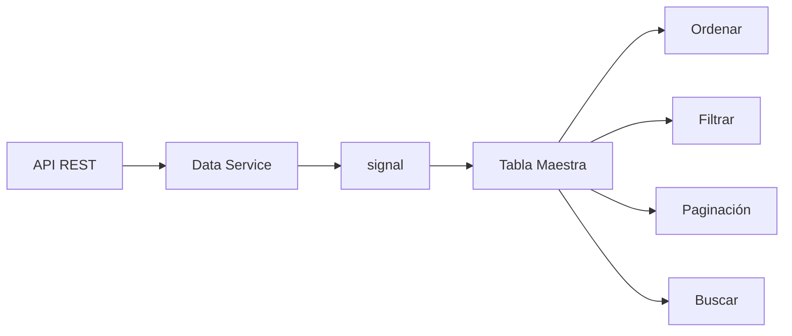

## 16 — Tabla Maestra

Tabla de datos completa: búsqueda, ordenamiento, paginación, y Angular CDK Table.

> **Propósito:** Construir tablas de datos completas con búsqueda, ordenamiento multi-columna, paginación y virtual scrolling usando Angular CDK/Material y señales.
>
> **Problema que resuelve:** Las tablas HTML básicas no soportan búsqueda, ordenamiento ni paginación; implementar esto manualmente resulta en código frágil y mal rendimiento con grandes datasets.
>
> **Cómo lo resuelve:** CdkTable/MatTable con señales para datos y filtros, computed para ordenamiento, paginación con signal de configuración, y virtual scrolling del CDK para +1000 filas.
>
> **Por qué aprenderlo:** Las tablas de datos son el componente UI más usado en apps empresariales; dominar su implementación es indispensable para dashboards y paneles de administración.




### Conceptos

#### 1. Señales para Estado de Tabla — `signal()` y `computed()`

- **Qué es:** Usar signals para manejar datos, filtros, ordenamiento y paginación de forma reactiva.
- **Por qué importa:** Las señales recalculan automáticamente los valores derivados cuando cambian los datos o filtros, sin lógica manual.
- **Código:**
  ```typescript
  // Signals para estado de la tabla
  users = this.userService.users;         // signal<User[]>
  searchTerm = signal('');                // signal<string>
  sortColumn = signal<SortColumn>(null);  // signal<'id'|'name'|null>
  sortDir = signal<SortDir>('asc');       // signal<'asc'|'desc'>
  currentPage = signal(1);                // signal<number>
  pageSize = signal(10);                  // signal<number>
  
  // Computed que se recalcula automáticamente
  filteredUsers = computed(() => {
    const term = this.searchTerm().toLowerCase();
    if (!term) return this.users();
    return this.users().filter(u =>
      u.name.toLowerCase().includes(term) ||
      u.email.toLowerCase().includes(term)
    );
  });
  ```
- **Analogía:** Como una hoja de cálculo donde las fórmulas se actualizan solas cuando cambias los datos.

#### 2. Ordenamiento con `computed` — Sort Multi-Columna

- **Qué es:** Un computed que ordena los datos según la columna y dirección seleccionadas.
- **Por qué importa:** Permite al usuario organizar datos por cualquier columna sin re-renderizar manualmente.
- **Código:**
  ```typescript
  sortedUsers = computed(() => {
    const col = this.sortColumn();
    const dir = this.sortDir();
    const users = this.filteredUsers();
    if (!col) return users;
    return [...users].sort((a, b) => {
      const va = String(a[col]).toLowerCase();
      const vb = String(b[col]).toLowerCase();
      return dir === 'asc' ? va.localeCompare(vb) : vb.localeCompare(va);
    });
  });
  
  toggleSort(col: SortColumn) {
    if (this.sortColumn() === col) {
      this.sortDir.update(d => d === 'asc' ? 'desc' : 'asc');
    } else {
      this.sortColumn.set(col);
      this.sortDir.set('asc');
    }
  }
  ```
- **Analogía:** Como hacer clic en el encabezado de una columna en Excel para ordenar de A-Z o Z-A.

#### 3. Búsqueda con Debounce — RxJS + Signals

- **Qué es:** Filtrar datos en tiempo real mientras el usuario escribe, con un delay de 300ms para evitar búsqueda excesiva.
- **Por qué importa:** Sin debounce, cada tecla dispara una búsqueda; con debounce, solo se busca cuando el usuario deja de escribir.
- **Código:**
  ```typescript
  private debounceTimer: ReturnType<typeof setTimeout> | null = null;
  
  onSearch(value: string) {
    if (this.debounceTimer) clearTimeout(this.debounceTimer);
    this.debounceTimer = setTimeout(() => {
      this.searchTerm.set(value);
      this.currentPage.set(1);  // Volver a página 1 al buscar
    }, 300);
  }
  ```
- **Analogía:** Como cuando escribes en Google y esperas a que dejes de escribir antes de mostrar resultados.

#### 4. Paginación Cliente con `computed`

- **Qué es:** Dividir datos en páginas calculando start/end con `slice()` basado en la página actual y tamaño.
- **Por qué importa:** Mejora rendimiento mostrando solo los elementos de la página actual, no todos a la vez.
- **Código:**
  ```typescript
  totalPages = computed(() =>
    Math.max(1, Math.ceil(this.sortedUsers().length / this.pageSize()))
  );
  
  pagedUsers = computed(() => {
    const size = this.pageSize();
    const page = this.currentPage();
    const start = (page - 1) * size;
    return this.sortedUsers().slice(start, start + size);
  });
  
  prevPage() {
    if (this.currentPage() > 1) this.currentPage.update(p => p - 1);
  }
  nextPage() {
    if (this.currentPage() < this.totalPages()) this.currentPage.update(p => p + 1);
  }
  ```
- **Analogía:** Como leer un libro una página a la vez, en lugar de intentar leer todas las páginas de golpe.

#### 5. `@for` con `track` — Renderizado Eficiente de Listas

- **Qué es:** Directiva de control de Angular para iterar sobre colecciones con tracking por identificador único.
- **Por qué importa:** `track` permite a Angular identificar qué elementos cambiaron, evitando re-renders innecesarios.
- **Código:**
  ```html
  <!-- Template: iterar con track por ID único -->
  @for (user of pagedUsers(); track user.id) {
    <tr>
      <td>{{ user.id }}</td>
      <td>{{ user.name }}</td>
      <td>{{ user.email }}</td>
    </tr>
  } @empty {
    <tr><td colspan="4">No se encontraron usuarios</td></tr>
  }
  ```
- **Analogía:** Como un maestro que solo corrige los deberes que cambiaron, en lugar de revisar todos de cero.

### Proyecto

Tabla de usuarios con búsqueda en vivo, ordenamiento multi-columna, paginación cliente/servidor y scroll virtual.

### Ejercicios

1. **Tabla con signals:** Crea un `UserService` que retorne `signal<User[]>` con datos mock. En el componente, usa `@for (user of users(); track user.id)` para renderizar filas en una tabla HTML.
2. **Ordenamiento multi-columna:** Implementa `sortColumn` y `sortDir` como signals. Crea un `computed sortedUsers` que ordene los datos según la columna seleccionada. Agrega `toggleSort()` para alternar dirección asc/desc.
3. **Búsqueda con debounce:** Agrega un campo de búsqueda con `[(ngModel)]` que use un timer de 300ms para evitar buscar en cada tecla. Crea un `computed filteredUsers` que filtre por nombre, email o rol.
4. **Paginación cliente:** Implementa `currentPage` y `pageSize` como signals. Crea `computed totalPages` y `computed pagedUsers` que use `slice()` para extraer solo los elementos de la página actual. Agrega botones Anterior/Siguiente.
5. **Paginación servidor:** Modifica la paginación para que el servicio haga `GET /api/users?page=1&limit=10` al servidor en lugar de filtrar en el cliente. Cambia el `computed` por una llamada HTTP con `switchMap`.

### Cómo ejecutar

```bash
cd 16-tabla-maestra
npm install
ng serve --host 0.0.0.0 --port 8080
```

### Archivos del Proyecto

| Archivo | Propósito | Ruta |
|---------|-----------|------|
| `angular.json` | Configuración del proyecto Angular | `angular.json` |
| `package.json` | Dependencias y scripts del proyecto | `package.json` |
| `tsconfig.json` | Configuración base de TypeScript | `tsconfig.json` |
| `tsconfig.app.json` | Configuración TypeScript de la aplicación | `tsconfig.app.json` |
| `src/index.html` | Punto de entrada HTML de la aplicación | `src/index.html` |
| `src/main.ts` | Punto de entrada principal de Angular | `src/main.ts` |
| `src/styles.css` | Estilos globales de la aplicación | `src/styles.css` |
| `src/app/app.config.ts` | Configuración de providers con CDK y Material | `src/app/app.config.ts` |
| `src/app/app.component.ts` | Componente raíz con la tabla maestra | `src/app/app.component.ts` |
| `src/app/models/user.model.ts` | Modelo de datos de usuario | `src/app/models/user.model.ts` |
| `src/app/services/user.service.ts` | Servicio de usuarios con datos mock | `src/app/services/user.service.ts` |
