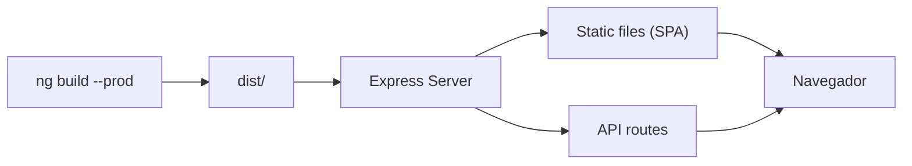

## 17 — Servir Angular con Express / FastAPI

Servir Angular desde un servidor backend: Express, FastAPI, y Spring Boot. SSR con Angular y configuración de proxy.

> **Propósito:** Servir una aplicación Angular desde Express.js con SPA fallback, proxy de API y preparación para SSR.
>
> **Problema que resuelve:** ng serve --host 0.0.0.0 --port 8080 no es apto para producción; necesitas un servidor web que sirva archivos estáticos, maneje rutas SPA (fallback a index.html) y proxyee peticiones API.
>
> **Cómo lo resuelve:** Express.js con express.static para assets, catch-all route para SPA fallback, proxy.conf.json para desarrollo, y estructura preparada para Angular Universal/SSR.
>
> **Por qué aprenderlo:** Todo proyecto Angular en producción necesita un servidor; Express es la opción más simple y flexible, y esta configuración es el puente a SSR.




### Conceptos

#### 1. `express.static()` — Servir Build de Angular

- **Qué es:** Middleware de Express que sirve archivos estáticos (HTML, CSS, JS) desde la carpeta `dist/browser`.
- **Por qué importa:** `ng serve` no es apto para producción; necesitas un servidor web que sirva los archivos compilados.
- **Código:**
  ```javascript
  const express = require('express');
  const path = require('path');
  const app = express();
  
  // Servir archivos estáticos del build de Angular
  app.use(express.static(path.join(__dirname, 'dist', 'browser')));
  
  app.listen(3000, () => {
    console.log('Servidor corriendo en http://localhost:3000');
  });
  ```
- **Analogía:** Como un mesero que te trae los platos (archivos) que ya están preparados (compilados) en la cocina (dist).

#### 2. SPA Fallback — Catch-All Route

- **Qué es:** Ruta que captura todas las peticiones y retorna `index.html`, permitiendo que Angular maneje las rutas del lado del cliente.
- **Por qué importa:** Sin esto, recargar `/dashboard` daría error 404 porque Express no encuentra ese archivo.
- **Código:**
  ```javascript
  // Después de express.static
  app.get('*', (req, res) => {
    res.sendFile(path.join(__dirname, 'dist', 'browser', 'index.html'));
  });
  ```
- **Analogía:** Como un comodín que dice "si no encuentras lo que buscas, abre el libro principal (index.html) y deja que el lector (Angular) decida qué página mostrar."

#### 3. `proxy.conf.json` — Proxy de API para Desarrollo

- **Qué es:** Archivo de configuración que redirige peticiones API a un servidor diferente durante el desarrollo.
- **Por qué importa:** Permite que `ng serve` proxyee peticiones `/api` a un backend real sin problemas de CORS.
- **Código:**
  ```json
  {
    "/api": {
      "target": "http://localhost:3000",
      "secure": false
    }
  }
  ```
  ```bash
  # Usar con ng serve
  ng serve --proxy-config proxy.conf.json
  ```
- **Analogía:** Como un asistente que reenvía tus cartas a la dirección correcta cuando el destinatario está en otra oficina.

#### 4. NGINX como Reverse Proxy — Producción

- **Qué es:** Servidor web que se coloca delante de Angular y el backend, redirigiendo peticiones según la ruta.
- **Por qué importa:** En producción, NGINX maneja SSL, balanceo de carga y sirve Angular + API desde el mismo dominio.
- **Código:**
  ```nginx
  server {
      listen 80;
      server_name miapp.com;
      
      # Servir Angular
      location / {
          root /usr/share/nginx/html;
          try_files $uri $uri/ /index.html;
      }
      
      # Proxy a API backend
      location /api {
          proxy_pass http://backend:3000;
      }
  }
  ```
- **Analogía:** Como un portero que decide a qué puerta enviar a cada visitante según su destino.

#### 5. Variables de Entorno — Configuración por Entorno

- **Qué es:** Valores que cambian según el entorno (desarrollo, staging, producción) sin modificar el código.
- **Por qué importa:** URLs de API, tokens y configuraciones sensibles no deben estar hardcodeadas en el código fuente.
- **Código:**
  ```javascript
  // server.js
  const port = process.env.PORT || 3000;
  const apiUrl = process.env.API_URL || 'http://localhost:3000';
  
  app.listen(port, () => {
    console.log(`Servidor en puerto ${port}, API: ${apiUrl}`);
  });
  ```
  ```bash
  # Producción
  PORT=8080 API_URL=https://api.miapp.com node server.js
  ```
- **Analogía:** Como un interruptor que cambia la configuración de la casa dependiendo de si es de día o de noche.

### Proyecto

Angular servido por Express (con SSR), FastAPI (separado), y Spring Boot (integrado). Tres configuraciones de despliegue.

### Ejercicios

1. **Servir build con Express:** Crea un `server.js` con `express.static('dist/browser')` y un catch-all `app.get('*', ...)` que retorne `index.html`. Ejecuta `ng build && node server.js` y verifica que funcione en `localhost:3000`.
2. **FastAPI con StaticFiles:** Implementa un servidor FastAPI que sirva Angular con `StaticFiles` y una ruta catch-all. Configura CORS para permitir peticiones cross-origin en desarrollo.
3. **Proxy para desarrollo:** Crea un `proxy.conf.json` que redirija `/api` a `http://localhost:3000`. Ejecuta `ng serve --proxy-config proxy.conf.json` y verifica que las llamadas a `/api` lleguen al backend.
4. **NGINX reverse proxy:** Escribe un archivo `nginx.conf` que sirva Angular con `try_files` y proxee `/api` a un contenedor backend. Incluye configuración SSL con certificados Let's Encrypt.
5. **Variables de entorno:** Modifica `server.js` para que lea `PORT` y `API_URL` de `process.env`. Crea scripts en `package.json` para desarrollo (`PORT=3000`) y producción (`PORT=8080`).

### Cómo ejecutar

```bash
cd 17-servir-express
npm install
ng build && node server.js
```

### Archivos del Proyecto

| Archivo | Propósito | Ruta |
|---------|-----------|------|
| `angular.json` | Configuración del proyecto Angular | `angular.json` |
| `package.json` | Dependencias y scripts del proyecto | `package.json` |
| `tsconfig.json` | Configuración base de TypeScript | `tsconfig.json` |
| `tsconfig.app.json` | Configuración TypeScript de la aplicación | `tsconfig.app.json` |
| `proxy.conf.json` | Configuración de proxy para desarrollo local | `proxy.conf.json` |
| `server.js` | Servidor Express para servir Angular en producción | `server.js` |
| `src/index.html` | Punto de entrada HTML de la aplicación | `src/index.html` |
| `src/main.ts` | Punto de entrada principal de Angular | `src/main.ts` |
| `src/styles.css` | Estilos globales de la aplicación | `src/styles.css` |
| `src/app/app.config.ts` | Configuración de providers de la aplicación | `src/app/app.config.ts` |
| `src/app/app.component.ts` | Componente raíz de la aplicación | `src/app/app.component.ts` |
