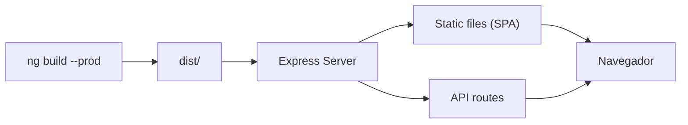

## 17 — Servir Angular con Express / FastAPI

Servir Angular desde un servidor backend: Express, FastAPI, y Spring Boot. SSR con Angular y configuración de proxy.

> **Propósito:** Servir una aplicación Angular desde Express.js con SPA fallback, proxy de API y preparación para SSR.
>
> **Problema que resuelve:** ng serve --host 0.0.0.0 --port 8080 no es apto para producción; necesitas un servidor web que sirva archivos estáticos, maneje rutas SPA (fallback a index.html) y proxyee peticiones API.
>
> **Cómo lo resuelve:** Express.js con express.static para assets, catch-all route para SPA fallback, proxy.conf.json para desarrollo, y estructura preparada para Angular Universal/SSR.
>
> **Por qué aprenderlo:** Todo proyecto Angular en producción necesita un servidor; Express es la opción más simple y flexible, y esta configuración es el puente a SSR.




### Conceptos Clave

- **Servir build**: Angular build producido con `ng build`, servido estáticamente
- **Express**: `express.static('dist/browser')`, catch-all para SPA
- **FastAPI**: `StaticFiles` para Angular + `mount` para API
- **Spring Boot**: recursos estáticos en `src/main/resources/static`
- **SSR con Angular**: `provideServerRendering`, `server.ts`, `AngularUniversalEngine`
- **Proxy**: `proxy.conf.json` para desarrollo, NGINX para producción
- **Variables de entorno**: `AngularEnvironment`, `process.env` en server
- **API Routes**: Express/FastAPI como BFF o API directa

### Proyecto

Angular servido por Express (con SSR), FastAPI (separado), y Spring Boot (integrado). Tres configuraciones de despliegue.

### Ejercicios

1. Sirve build Angular con `express.static`
2. Configura FastAPI con `StaticFiles` y ruta catch-all
3. Implementa SSR con `@angular/ssr` y Express
4. Crea `proxy.conf.json` para desarrollo
5. Configura NGINX como reverse proxy frontend + API

### Cómo ejecutar

```bash
cd 17-servir-express
npm install
ng build && node server.js
```

### Archivos del Proyecto

| Archivo | Propósito | Ruta |
|---------|-----------|------|
| `angular.json` | Configuración del proyecto Angular | `angular.json` |
| `package.json` | Dependencias y scripts del proyecto | `package.json` |
| `tsconfig.json` | Configuración base de TypeScript | `tsconfig.json` |
| `tsconfig.app.json` | Configuración TypeScript de la aplicación | `tsconfig.app.json` |
| `proxy.conf.json` | Configuración de proxy para desarrollo local | `proxy.conf.json` |
| `server.js` | Servidor Express para servir Angular en producción | `server.js` |
| `src/index.html` | Punto de entrada HTML de la aplicación | `src/index.html` |
| `src/main.ts` | Punto de entrada principal de Angular | `src/main.ts` |
| `src/styles.css` | Estilos globales de la aplicación | `src/styles.css` |
| `src/app/app.config.ts` | Configuración de providers de la aplicación | `src/app/app.config.ts` |
| `src/app/app.component.ts` | Componente raíz de la aplicación | `src/app/app.component.ts` |
