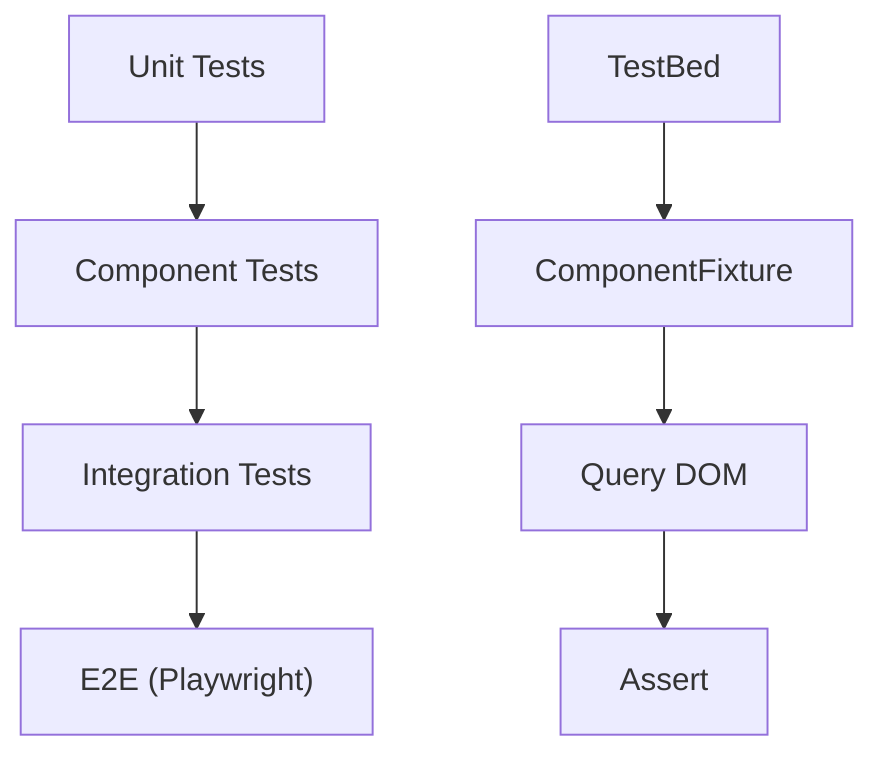

## 18 — Pruebas Unitarias

Testing en Angular con TestBed, Jasmine/Karma, y Jest: componentes, servicios, pipes, directivas y HTTP.

> **Propósito:** Escribir pruebas unitarias robustas con TestBed, HttpClientTestingController, spies y señales para servicios y componentes Angular.
>
> **Problema que resuelve:** Sin tests, cada cambio en el código puede romper funcionalidad existente sin previo aviso, especialmente en apps con múltiples servicios y dependencias.
>
> **Cómo lo resuelve:** TestBed configura módulos de prueba aislados, HttpClientTestingController mockea peticiones HTTP, spies verifican llamadas a métodos, y las señales simplifican la verificación de estado.
>
> **Por qué aprenderlo:** Las pruebas unitarias son la red de seguridad del desarrollador; permiten refactorizar con confianza y son requisito en todo proyecto enterprise.




### Conceptos Clave

- **TestBed**: `configureTestingModule`, `createComponent`, `inject`
- **`HttpClientTestingController`**: mock de peticiones HTTP
- **ComponentFixture**: `detectChanges`, `query(By.css)`, `nativeElement`
- **Jasmine**: `describe`, `it`, `expect`, `spyOn`, `jasmine.createSpy`
- **Jest**: configuración con `@angular-builders/jest` o `jest-preset-angular`
- **Mocks**: servicios mock, `provideMock`, `@angular/core/testing`
- **Pruebas de señales**: verificar valores de `signal()` y `computed()`
- **Pruebas de formularios**: setear valores, disparar eventos
- **Cobertura**: `ng test --code-coverage` o `jest --coverage`

### Proyecto

Suite completa de pruebas para componentes de la tabla maestra (módulo 16): pruebas unitarias con coverage > 80%.

### Ejercicios

1. Prueba un servicio con HttpClient mocking
2. Prueba un componente standalone con señales
3. Prueba un formulario reactivo (válido/inválido)
4. Prueba un pipe personalizado
5. Mockea una señal de servicio y verifica el rendering

### Cómo ejecutar

```bash
cd 18-pruebas-unitarias
npm install
ng test
```

### Archivos del Proyecto

| Archivo | Propósito | Ruta |
|---------|-----------|------|
| `angular.json` | Configuración del proyecto Angular | `angular.json` |
| `package.json` | Dependencias y scripts del proyecto | `package.json` |
| `tsconfig.json` | Configuración base de TypeScript | `tsconfig.json` |
| `tsconfig.app.json` | Configuración TypeScript de la aplicación | `tsconfig.app.json` |
| `tsconfig.spec.json` | Configuración TypeScript para pruebas | `tsconfig.spec.json` |
| `src/index.html` | Punto de entrada HTML de la aplicación | `src/index.html` |
| `src/main.ts` | Punto de entrada principal de Angular | `src/main.ts` |
| `src/styles.css` | Estilos globales de la aplicación | `src/styles.css` |
| `src/test.ts` | Punto de entrada de pruebas unitarias | `src/test.ts` |
| `src/app/app.config.ts` | Configuración de providers de la aplicación | `src/app/app.config.ts` |
| `src/app/app.component.ts` | Componente raíz de la aplicación | `src/app/app.component.ts` |
| `src/app/calculator.service.ts` | Servicio de calculadora para pruebas | `src/app/calculator.service.ts` |
| `src/app/calculator.service.spec.ts` | Pruebas unitarias del servicio calculadora | `src/app/calculator.service.spec.ts` |
| `src/app/calculator.component.spec.ts` | Pruebas unitarias del componente calculadora | `src/app/calculator.component.spec.ts` |
| `src/app/user.service.ts` | Servicio de usuarios para pruebas | `src/app/user.service.ts` |
| `src/app/user.service.spec.ts` | Pruebas unitarias del servicio de usuarios | `src/app/user.service.spec.ts` |
