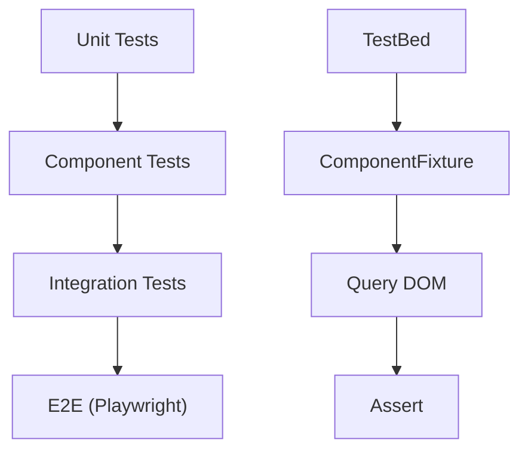

## 18 — Pruebas Unitarias

Testing en Angular con TestBed, Jasmine/Karma, y Jest: componentes, servicios, pipes, directivas y HTTP.

> **Propósito:** Escribir pruebas unitarias robustas con TestBed, HttpClientTestingController, spies y señales para servicios y componentes Angular.
>
> **Problema que resuelve:** Sin tests, cada cambio en el código puede romper funcionalidad existente sin previo aviso, especialmente en apps con múltiples servicios y dependencias.
>
> **Cómo lo resuelve:** TestBed configura módulos de prueba aislados, HttpClientTestingController mockea peticiones HTTP, spies verifican llamadas a métodos, y las señales simplifican la verificación de estado.
>
> **Por qué aprenderlo:** Las pruebas unitarias son la red de seguridad del desarrollador; permiten refactorizar con confianza y son requisito en todo proyecto enterprise.




### Conceptos

#### TestBed — Entorno de pruebas aislado

- **Qué es:** TestBed crea un "mini-Angular" aislado para probar componentes y servicios sin navegador real.
- **Por qué importa:** Sin TestBed, los componentes no tienen inyección de dependencias ni templates compilados; las pruebas serían incompletas.
- **Código:**
```typescript
TestBed.configureTestingModule({
  imports: [AppComponent, FormsModule],
  providers: [CalculatorService],
}).compileComponents();

fixture = TestBed.createComponent(AppComponent);
component = fixture.componentInstance;
fixture.detectChanges();
```
- **Analogía:** Es como un laboratorio de pruebas donde ensamblas el componente con todas sus piezas antes de probarlo.

#### HttpTestingController — Mock de peticiones HTTP

- **Qué es:** Simula peticiones HTTP sin conectar a un servidor real, permitiendo controlar respuestas y errores.
- **Por qué importa:** Las pruebas no deben depender de servicios externos; HttpTestingController aísla el código de la red.
- **Código:**
```typescript
const req = httpMock.expectOne('https://api.example.com/users');
expect(req.request.method).toBe('GET');
req.flush(mockUsers); // Simula respuesta exitosa
req.flush('Error', { status: 500, statusText: 'Server Error' }); // Simula error
```
- **Analogía:** Es como un actor que simula ser el servidor; tú controlas qué dice y cuándo responde.

#### ComponentFixture — Interacción con el DOM

- **Qué es:** Contenedor que crea el componente y permite acceder a su DOM real para verificar el rendering.
- **Por qué importa:** Permite assertar que el HTML muestra los datos correctos y que el usuario puede interactuar.
- **Código:**
```typescript
const title = fixture.debugElement.query(By.css('h1')).nativeElement;
expect(title.textContent).toContain('Calculadora');

fixture.debugElement.query(By.css('.result-value')).nativeElement;
fixture.detectChanges(); // Fuerza actualización del DOM
```
- **Analogía:** Es como una lupa que te deja examinar cada parte del componente renderizado.

#### Jasmine — Estructura de pruebas

- **Qué es:** Framework que define la sintaxis de pruebas: `describe` para agrupar, `it` para definir, `expect` para verificar.
- **Por qué importa:** Proporciona una estructura consistente y legible para todas las pruebas del proyecto.
- **Código:**
```typescript
describe('CalculatorService', () => {
  it('should add two numbers', () => {
    expect(service.add(2, 3)).toBe(5);
  });
  it('should throw on division by zero', () => {
    expect(() => service.divide(5, 0)).toThrowError('Cannot divide by zero');
  });
});
```
- **Analogía:** Es como el formato de un informe de laboratorio: `describe` es el título del experimento, `it` es la hipótesis, `expect` es la conclusión.

#### Pruebas de Signals

- **Qué es:** Verificar que las signals mantienen el estado correcto después de operaciones.
- **Por qué importa:** Las signals son la base de la reactividad moderna en Angular; sin pruebas, los bugs de estado pasan desapercibidos.
- **Código:**
```typescript
service.add(2, 3);
expect(service.result()).toBe(5);      // Lee el valor de la signal
expect(service.lastOperation()).toBe('add');
```
- **Analogía:** Es como verificar que un semáforo cambió de color después de presionar el botón peatón.

### Proyecto

Suite completa de pruebas para componentes de la tabla maestra (módulo 16): pruebas unitarias con coverage > 80%.

### Ejercicios

1. **Prueba un servicio con HttpClient mocking:** Crea un servicio que consuma una API REST, configura TestBed con `HttpClientTestingModule`, y verifica que retorna los datos correctos. Simula también un error 500 y verifica que se maneja correctamente.
2. **Prueba un componente standalone con señales:** Crea un componente que use `signal()` para estado interno, configura TestBed, simula interacciones del usuario, y verifica que las signals se actualizan correctamente en el DOM.
3. **Prueba un formulario reactivo (válido/inválido):** Crea un componente con `FormBuilder` que tenga campos requeridos y email, verifica que el formulario es inválido al inicio, completa los campos, y verifica que se vuelve válido.
4. **Prueba un pipe personalizado:** Crea un pipe `truncate` que recorte strings largos, escribe pruebas que verifiquen strings cortos sin modificar, strings largos que se recorten, y strings vacíos.
5. **Mockea una señal de servicio y verifica el rendering:** Crea un servicio con una signal de lista de items, inyéctalo en un componente, modifica la signal, y verifica que el DOM muestra los items actualizados usando `fixture.detectChanges()`.

### Cómo ejecutar

```bash
cd 18-pruebas-unitarias
npm install
ng test
```

### Archivos del Proyecto

| Archivo | Propósito | Ruta |
|---------|-----------|------|
| `angular.json` | Configuración del proyecto Angular | `angular.json` |
| `package.json` | Dependencias y scripts del proyecto | `package.json` |
| `tsconfig.json` | Configuración base de TypeScript | `tsconfig.json` |
| `tsconfig.app.json` | Configuración TypeScript de la aplicación | `tsconfig.app.json` |
| `tsconfig.spec.json` | Configuración TypeScript para pruebas | `tsconfig.spec.json` |
| `src/index.html` | Punto de entrada HTML de la aplicación | `src/index.html` |
| `src/main.ts` | Punto de entrada principal de Angular | `src/main.ts` |
| `src/styles.css` | Estilos globales de la aplicación | `src/styles.css` |
| `src/test.ts` | Punto de entrada de pruebas unitarias | `src/test.ts` |
| `src/app/app.config.ts` | Configuración de providers de la aplicación | `src/app/app.config.ts` |
| `src/app/app.component.ts` | Componente raíz de la aplicación | `src/app/app.component.ts` |
| `src/app/calculator.service.ts` | Servicio de calculadora para pruebas | `src/app/calculator.service.ts` |
| `src/app/calculator.service.spec.ts` | Pruebas unitarias del servicio calculadora | `src/app/calculator.service.spec.ts` |
| `src/app/calculator.component.spec.ts` | Pruebas unitarias del componente calculadora | `src/app/calculator.component.spec.ts` |
| `src/app/user.service.ts` | Servicio de usuarios para pruebas | `src/app/user.service.ts` |
| `src/app/user.service.spec.ts` | Pruebas unitarias del servicio de usuarios | `src/app/user.service.spec.ts` |
