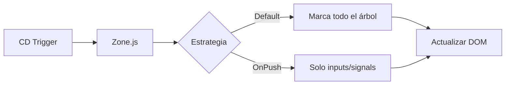

## 19 — Render y Performance

Optimización de renderizado: ChangeDetectionStrategy.OnPush, @defer, signals, y lazy loading de componentes.

> **Propósito:** Optimizar el renderizado Angular con OnPush, @defer (viewport/interaction/immediate/timer), and signals para detectar cambios precisos.
>
> **Problema que resuelve:** Angular con ChangeDetectionStrategy.Default detecta cambios en toda la aplicación ante cualquier evento, causando renders innecesarios y degradación de performance en apps grandes.
>
> **Cómo lo resuelve:** OnPush limita la detección al input del componente, @defer carga contenido bajo demanda (viewport, interaction, timer), y signals notifican cambios solo a consumidores directos.
>
> **Por qué aprenderlo:** La performance de renderizado impacta directamente en Core Web Vitals y UX; @defer solo está disponible desde Angular 17 y es clave para Lighthouse scores altos.




### Conceptos

#### ChangeDetectionStrategy.OnPush — Detección de cambios optimizada

- **Qué es:** Estrategia que le dice a Angular solo revisar cambios cuando cambian inputs o signals, no en cada evento.
- **Por qué importa:** Sin OnPush, Angular revisa todo el árbol de componentes en cada clic, teclado o timer; con OnPush, solo revisa donde realmente hay cambios.
- **Código:**
```typescript
@Component({
  selector: 'app-stats',
  standalone: true,
  changeDetection: ChangeDetectionStrategy.OnPush,
  template: `<span>{{ service.renderCount() }}</span>`
})
export class StatsComponent {
  service = inject(HeavyDataService);
}
```
- **Analogía:** Es como un semáforo inteligente que solo cambia cuando hay autos, no cada 5 segundos por si acaso.

#### @defer — Carga diferida de componentes

- **Qué es:** Block de Angular 17+ que carga un componente solo cuando se cumple una condición (trigger).
- **Por qué importa:** Reduce el tamaño inicial del bundle y mejora el tiempo de carga; los componentes pesados se cargan bajo demanda.
- **Código:**
```html
@defer (on viewport) {
  <app-expensive />
} @placeholder {
  <div>⬇ Scroll here to load</div>
} @loading {
  <div>Loading...</div>
}
```
- **Analogía:** Es como un botón "cargar más" automático: el contenido aparece solo cuando lo necesitas.

#### Triggers de @defer — Condiciones de carga

- **Qué es:** Definen cuándo se carga el componente diferido: `on viewport`, `on interaction`, `on timer`, `on hover`, `on immediate`.
- **Por qué importa:** Cada trigger responde a un caso de uso diferente; elegir el correcto optimiza la experiencia del usuario.
- **Código:**
```html
@defer (on interaction) { <app-expensive /> }     <!-- Carga al clic -->
@defer (on viewport) { <app-expensive /> }        <!-- Carga al entrar en pantalla -->
@defer (on timer(3000)) { <app-expensive /> }     <!-- Carga después de 3 segundos -->
@defer (on hover) { <app-expensive /> }           <!-- Carga al pasar el mouse -->
```
- **Analogía:** Son como sensores de presencia: cada uno detecta un tipo diferente de actividad del usuario.

#### Signals para reactividad sin Zone.js

- **Qué es:** Variables reactivas (`signal()`, `computed()`) que Angular vigila automáticamente para detectar cambios.
- **Por qué importa:** Con OnPush, las signals son la única forma de notificar a Angular que algo cambió; sin signals, necesitarías `markForCheck()`.
- **Código:**
```typescript
// Signal privada
private items = signal<DataItem[]>([]);
// Solo lectura para componentes
readonly itemsSignal = this.items.asReadonly();
// Actualización
this.items.set(newData);
this.renderCount.update(c => c + 1);
```
- **Analogía:** Es como un tablero de anuncios digital: cuando escribes algo nuevo, todos los que miran lo ven automáticamente.

#### @placeholder, @loading, @error — Estados de carga

- **Qué es:** Bloques auxiliares de @defer que muestran contenido según el estado de carga del componente diferido.
- **Por qué importa:** Mejoran la UX mostrando feedback visual mientras el componente se carga o si falla.
- **Código:**
```html
@defer (on viewport) {
  <app-expensive />
} @placeholder {
  <div class="placeholder">⬇ Scroll to load</div>
} @loading {
  <div class="loading">Loading component...</div>
}
```
- **Analogía:** Es como una pantalla de carga en un videojuego: sabes que algo está pasando mientras esperas.

### Proyecto

Dashboard con componentes pesados cargados con @defer, OnPush en todos los componentes, y profiling de rendimiento.

### Ejercicios

1. **Configura OnPush en todos los componentes:** Crea 3 componentes con datos dinámicos, agrega `changeDetection: ChangeDetectionStrategy.OnPush` a cada uno, y verifica que solo se re-renderizan cuando cambian sus signals.
2. **Implementa @defer con trigger on viewport:** Crea un componente pesado que calcule datos complejos, colócalo al fondo de una página larga, y usa `@defer (on viewport)` para que solo se cargue cuando el usuario haga scroll hasta él.
3. **Añade bloques placeholder, loading y error:** Al componente diferido del ejercicio anterior, agrega `@placeholder` con un skeleton, `@loading` con un spinner, y `@error` con un mensaje de error. Verifica que cada bloque se muestra en el momento correcto.
4. **Usa @defer (on interaction) para contenido bajo demanda:** Crea un componente de "ver detalles" que se cargue solo cuando el usuario haga clic en un botón. Incluye `@placeholder` con texto "Haz clic para ver detalles".
5. **Mide rendimiento con y sin OnPush:** Crea una lista de 1000 items con y sin OnPush, usa Chrome DevTools Performance tab para medir el tiempo de renderizado en cada caso, y documenta la diferencia.

### Cómo ejecutar

```bash
cd 19-render-performance
npm install
ng serve --host 0.0.0.0 --port 8080
```

### Archivos del Proyecto

| Archivo | Propósito | Ruta |
|---------|-----------|------|
| `angular.json` | Configuración del proyecto Angular | `angular.json` |
| `package.json` | Dependencias y scripts del proyecto | `package.json` |
| `tsconfig.json` | Configuración base de TypeScript | `tsconfig.json` |
| `tsconfig.app.json` | Configuración TypeScript de la aplicación | `tsconfig.app.json` |
| `src/index.html` | Punto de entrada HTML de la aplicación | `src/index.html` |
| `src/main.ts` | Punto de entrada principal de Angular | `src/main.ts` |
| `src/styles.css` | Estilos globales de la aplicación | `src/styles.css` |
| `src/app/app.config.ts` | Configuración de providers de la aplicación | `src/app/app.config.ts` |
| `src/app/app.component.ts` | Componente raíz con dashboard de rendimiento | `src/app/app.component.ts` |
| `src/app/expensive.component.ts` | Componente pesado para pruebas de `@defer` | `src/app/expensive.component.ts` |
| `src/app/heavy-data.service.ts` | Servicio con datos simulados pesados | `src/app/heavy-data.service.ts` |
| `src/app/stats.component.ts` | Componente de estadísticas de rendimiento | `src/app/stats.component.ts` |
