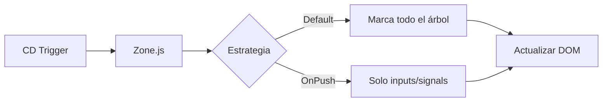

## 19 — Render y Performance

Optimización de renderizado: ChangeDetectionStrategy.OnPush, @defer, signals, y lazy loading de componentes.

> **Propósito:** Optimizar el renderizado Angular con OnPush, @defer (viewport/interaction/immediate/timer), and signals para detectar cambios precisos.
>
> **Problema que resuelve:** Angular con ChangeDetectionStrategy.Default detecta cambios en toda la aplicación ante cualquier evento, causando renders innecesarios y degradación de performance en apps grandes.
>
> **Cómo lo resuelve:** OnPush limita la detección al input del componente, @defer carga contenido bajo demanda (viewport, interaction, timer), y signals notifican cambios solo a consumidores directos.
>
> **Por qué aprenderlo:** La performance de renderizado impacta directamente en Core Web Vitals y UX; @defer solo está disponible desde Angular 17 y es clave para Lighthouse scores altos.




### Conceptos Clave

- **`ChangeDetectionStrategy.OnPush`**: detección solo cuando inputs/señales cambian
- **`@defer`**: carga diferida de componentes con trigger
- **Triggers**: `on viewport`, `on interaction`, `on hover`, `on immediate`, `on timer`
- **Placeholder/Loading/Error**: bloques para estados de carga diferida
- **`markForCheck()`**: marcar para detección manual (legacy, evitar con señales)
- **Signals y OnPush**: señales detectan cambios sin `markForCheck`
- **`@angular/core`**: `ChangeDetectionStrategy` en standalone components
- **`provideZoneChangeDetection`**: configuración de zone.js
- **Lazy components**: `loadComponent` en router

### Proyecto

Dashboard con componentes pesados cargados con @defer, OnPush en todos los componentes, y profiling de rendimiento.

### Ejercicios

1. Configura todos los componentes con `OnPush`
2. Implementa `@defer` con trigger `on viewport`
3. Añade bloques `placeholder`, `loading` y `error` en @defer
4. Usa `@defer (on interaction)` para contenido bajo demanda
5. Compara rendimiento con/without OnPush usando Chrome DevTools

### Cómo ejecutar

```bash
cd 19-render-performance
npm install
ng serve --host 0.0.0.0 --port 8080
```

### Archivos del Proyecto

| Archivo | Propósito | Ruta |
|---------|-----------|------|
| `angular.json` | Configuración del proyecto Angular | `angular.json` |
| `package.json` | Dependencias y scripts del proyecto | `package.json` |
| `tsconfig.json` | Configuración base de TypeScript | `tsconfig.json` |
| `tsconfig.app.json` | Configuración TypeScript de la aplicación | `tsconfig.app.json` |
| `src/index.html` | Punto de entrada HTML de la aplicación | `src/index.html` |
| `src/main.ts` | Punto de entrada principal de Angular | `src/main.ts` |
| `src/styles.css` | Estilos globales de la aplicación | `src/styles.css` |
| `src/app/app.config.ts` | Configuración de providers de la aplicación | `src/app/app.config.ts` |
| `src/app/app.component.ts` | Componente raíz con dashboard de rendimiento | `src/app/app.component.ts` |
| `src/app/expensive.component.ts` | Componente pesado para pruebas de `@defer` | `src/app/expensive.component.ts` |
| `src/app/heavy-data.service.ts` | Servicio con datos simulados pesados | `src/app/heavy-data.service.ts` |
| `src/app/stats.component.ts` | Componente de estadísticas de rendimiento | `src/app/stats.component.ts` |
