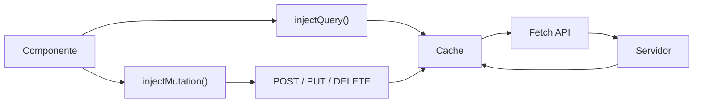

# AngularQuery

This project was generated using [Angular CLI](https://github.com/angular/angular-cli) version 22.0.1.

> **Propósito:** Manejar estado servidor con TanStack Query (Angular Query): caching, refetch automático, paginación, mutations y optimistic updates.
>
> **Problema que resuelve:** El fetching manual con HttpClient + services requiere manejar caching, refetch, loading states, errores y sincronización — código repetitivo y propenso a bugs.
>
> **Cómo lo resuelve:** Angular Query con injectQuery/injectMutation abstrae caching automático, stale-while-revalidate, refetch en background, paginación infinita y optimistic updates con rollback.
>
> **Por qué aprenderlo:** TanStack Query es la librería estándar para estado servidor en Angular; elimina ~60% del boilerplate de llamadas HTTP y sincroniza datos automáticamente.




### Conceptos

#### injectQuery — Gestión de estado del servidor

- **Qué es:** Hook de TanStack Query que crea una query reactiva para obtener datos del servidor con caché automático.
- **Por qué importa:** Elimina el manejo manual de `loading`, `error`, `caching` y `refetch`; todo se gestiona declarativamente.
- **Código:**
```typescript
postsQuery = injectQuery(() => ({
  queryKey: ['posts'],                    // Identificador de caché
  queryFn: () => lastValueFrom(          // Función que obtiene datos
    this.http.get<Post[]>('/api/posts')
  ),
  staleTime: 1000 * 60 * 5,             // 5 min antes de considerar obsoleto
}));
// En template: postsQuery.data(), postsQuery.isLoading(), postsQuery.error()
```
- **Analogía:** Es como un bibliotecario que guarda los libros que pediste; si alguien pide los mismos, los da de la estantería sin ir al almacén.

#### injectMutation — Modificación de datos

- **Qué es:** Hook que crea una mutación para enviar datos al servidor (crear, actualizar, eliminar).
- **Por qué importa:** Separa la lógica de escritura de la de lectura, y permite invalidar caché automáticamente después de cambios.
- **Código:**
```typescript
createMutation = injectMutation(() => ({
  mutationFn: (title: string) =>
    lastValueFrom(this.http.post('/api/posts', { title })),
  onSuccess: () => {
    // Invalida la caché para refrescar la lista
    this.queryClient.invalidateQueries({ queryKey: ['posts'] });
  },
}));
// Uso: this.createMutation.mutate('Nuevo post')
```
- **Analogía:** Es como un mensajero que lleva paquetes al servidor; cuando regresa, avisa que la información debe actualizarse.

#### QueryClient — Administrador de caché

- **Qué es:** El objeto central que gestiona todas las queries, caché, reintentos y sincronización de datos.
- **Por qué importa:** Permite invalidar caché, forzar refetch, y configurar comportamiento global de todas las queries.
- **Código:**
```typescript
// En app.config.ts
provideAngularQuery(new QueryClient())

// En un componente
private queryClient = injectQueryClient();
this.queryClient.invalidateQueries({ queryKey: ['posts'] });
```
- **Analogía:** Es como un directorio de archivos central donde se guardan todas las consultas; cuando algo cambia, se marca como "desactualizado".

#### staleTime — Tiempo de frescura

- **Qué es:** Define cuánto tiempo los datos se consideran "frescos" y no necesitan refetch del servidor.
- **Por qué importa:** Evita peticiones HTTP innecesarias; si el usuario navega y vuelve, usa la caché mientras no esté obsoleta.
- **Código:**
```typescript
injectQuery(() => ({
  queryKey: ['posts'],
  queryFn: () => lastValueFrom(this.http.get('/api/posts')),
  staleTime: 1000 * 60 * 5,  // 5 minutos: datos frescos por 5 min
}));
```
- **Analogía:** Es como la fecha de caducidad de un alimento: antes de esa fecha, no necesitas ir al supermercado.

#### lastValueFrom — Observable a Promise

- **Qué es:** Convierte un Observable de RxJS a una Promise, permitiendo usar `async/await` en las queries.
- **Por qué importa:** Simplifica el código asíncrono; en lugar de `subscribe`, usas `await` que es más legible.
- **Código:**
```typescript
queryFn: () =>
  lastValueFrom(
    this.http.get<Post[]>('/api/posts').pipe(
      map(posts => posts.slice(0, 10))  // Transforma los datos
    )
  )
```
- **Analogía:** Es como traducir un idioma extranjero (Observable) a tu idioma nativo (Promise) para entenderlo mejor.

### Ejercicios

1. **Configura TanStack Query en una app:** Crea una app Angular nueva, instala `@tanstack/angular-query-experimental`, configura `provideAngularQuery(new QueryClient())` en `app.config.ts`, y verifica que no hay errores de compilación.
2. **Crea una query para obtener datos de una API:** Usa `injectQuery` para obtener posts de `jsonplaceholder.typicode.com/posts`, muestra los datos en un `@for`, y verifica que se muestra el estado de carga con `postsQuery.isLoading()`.
3. **Implementa una mutación con invalidación de caché:** Crea un formulario que envíe un POST para crear un post, usa `injectMutation`, y en `onSuccess` invalida la query de posts para que se refresque automáticamente.
4. **Configura staleTime y observa el comportamiento:** Haz dos peticiones rápidas a la misma query, verifica que la segunda usa caché (no hace HTTP request), ajusta `staleTime` a 0 y verifica que siempre refresca.
5. **Maneja estados de error:** Configura la query para apuntar a una URL inexistente, muestra un mensaje de error usando `postsQuery.error()`, y verifica que el usuario ve retroalimentación clara.

### Development server

To start a local development server, run:

```bash
ng serve --host 0.0.0.0 --port 8080
```

Once the server is running, open your browser and navigate to `http://localhost:4200/`. The application will automatically reload whenever you modify any of the source files.

## Code scaffolding

Angular CLI includes powerful code scaffolding tools. To generate a new component, run:

```bash
ng generate component component-name
```

For a complete list of available schematics (such as `components`, `directives`, or `pipes`), run:

```bash
ng generate --help
```

## Building

To build the project run:

```bash
ng build
```

This will compile your project and store the build artifacts in the `dist/` directory. By default, the production build optimizes your application for performance and speed.

## Running unit tests

To execute unit tests with the [Vitest](https://vitest.dev/) test runner, use the following command:

```bash
ng test
```

## Running end-to-end tests

For end-to-end (e2e) testing, run:

```bash
ng e2e
```

Angular CLI does not come with an end-to-end testing framework by default. You can choose one that suits your needs.

## Additional Resources

For more information on using the Angular CLI, including detailed command references, visit the [Angular CLI Overview and Command Reference](https://angular.dev/tools/cli) page.

### Archivos del Proyecto

| Archivo | Propósito | Ruta |
|---------|-----------|------|
| `angular.json` | Configuración del proyecto Angular | `angular.json` |
| `package.json` | Dependencias y scripts del proyecto | `package.json` |
| `tsconfig.json` | Configuración base de TypeScript | `tsconfig.json` |
| `tsconfig.app.json` | Configuración TypeScript de la aplicación | `tsconfig.app.json` |
| `tsconfig.spec.json` | Configuración TypeScript para pruebas | `tsconfig.spec.json` |
| `.editorconfig` | Configuración del editor de código | `.editorconfig` |
| `.gitignore` | Archivos ignorados por Git | `.gitignore` |
| `.prettierrc` | Configuración de formateo Prettier | `.prettierrc` |
| `.vscode/extensions.json` | Extensiones recomendadas de VSCode | `.vscode/extensions.json` |
| `.vscode/launch.json` | Configuración de depuración en VSCode | `.vscode/launch.json` |
| `.vscode/tasks.json` | Tareas automatizadas de VSCode | `.vscode/tasks.json` |
| `public/favicon.ico` | Icono de la aplicación | `public/favicon.ico` |
| `src/index.html` | Punto de entrada HTML de la aplicación | `src/index.html` |
| `src/main.ts` | Punto de entrada principal de Angular | `src/main.ts` |
| `src/styles.css` | Estilos globales de la aplicación | `src/styles.css` |
| `src/app/app.ts` | Componente raíz de la aplicación | `src/app/app.ts` |
| `src/app/app.html` | Template del componente raíz | `src/app/app.html` |
| `src/app/app.css` | Estilos del componente raíz | `src/app/app.css` |
| `src/app/app.config.ts` | Configuración de providers de la aplicación | `src/app/app.config.ts` |
| `src/app/app.spec.ts` | Pruebas unitarias del componente raíz | `src/app/app.spec.ts` |
