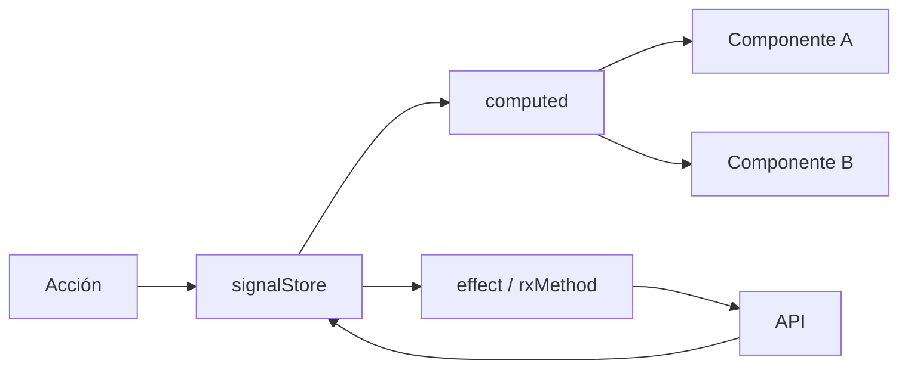

# EstadoGlobal

This project was generated using [Angular CLI](https://github.com/angular/angular-cli) version 22.0.1.

> **Propósito:** Gestionar estado global con NgRx Signals (signalStore): withState, withComputed, withMethods, withHooks para una store tipada y reactiva.
>
> **Problema que resuelve:** El estado compartido entre rutas y componentes lejanos requiere una solución global; sin ella, los datos se duplican, desincronizan y la lógica de negocio se dispersa.
>
> **Cómo lo resuelve:** signalStore proporciona una store centralizada con estado como señales, computed properties derivadas, métodos para actualizaciones y hooks de ciclo de vida — todo tipado.
>
> **Por qué aprenderlo:** NgRx Signals es el estado global moderno de Angular; combina la reactividad de signals con la estructura predecible de NgRx, sin el boilerplate de Redux clásico.




### Conceptos

#### signalStore — Estado global reactivo

- **Qué es:** Crea un almacén de estado centralizado usando signals de Angular, con estructura predecible y tipada.
- **Por qué importa:** Sin una store, el estado se duplica entre componentes, se desincroniza y la lógica de negocio se dispersa.
- **Código:**
```typescript
import { signalStore, withState, withMethods, patchState } from '@ngrx/signals';

export const CartStore = signalStore(
  { providedIn: 'root' },
  withState<{ items: CartItem[] }>({ items: [] }),
  withMethods((store) => ({
    addItem(item: CartItem) {
      patchState(store, { items: [...store.items(), item] });
    },
  }))
);
```
- **Analogía:** Es como un banco de datos central que todos los componentes consultan; nadie tiene su propia copia desactualizada.

#### withState — Definición de estado

- **Qué es:** Define la forma y valores iniciales del estado que la store gestionará.
- **Por qué importa:** TypeScript infiere tipos correctamente en toda la store; errores de tipado se detectan en compilación.
- **Código:**
```typescript
interface CartState {
  items: CartItem[];
  loading: boolean;
}

withState<CartState>({
  items: [],
  loading: false,
})
```
- **Analogía:** Es como definir los campos de un formulario antes de empezar a recibir datos.

#### withComputed — Valores derivados

- **Qué es:** Crea valores que se calculan automáticamente cuando cambia el estado base.
- **Por qué importa:** Evita duplicar cálculos; si cambian los items, el total se recalcula solo.
- **Código:**
```typescript
withComputed(({ items }) => ({
  totalItems: computed(() => items().reduce((sum, i) => sum + i.quantity, 0)),
  totalPrice: computed(() =>
    items().reduce((sum, i) => sum + i.price * i.quantity, 0)
  ),
}))
```
- **Analogía:** Es como una calculadora automática: cuando cambian los números de entrada, el resultado se actualiza sin que hagas nada.

#### withMethods — Acciones para modificar estado

- **Qué es:** Define métodos que encapsulan la lógica para cambiar el estado de la store.
- **Por qué importa:** Centraliza la lógica de negocio; los componentes solo llaman métodos, no modifican el estado directamente.
- **Código:**
```typescript
withMethods((store) => ({
  addItem(item: { id: number; name: string; price: number }) {
    const existing = store.items().find(i => i.id === item.id);
    if (existing) {
      const updated = store.items().map(i =>
        i.id === item.id ? { ...i, quantity: i.quantity + 1 } : i
      );
      patchState(store, { items: updated });
    } else {
      patchState(store, { items: [...store.items(), { ...item, quantity: 1 }] });
    }
  },
  clearCart() {
    patchState(store, { items: [] });
  },
}))
```
- **Analogía:** Es como los botones de un control remoto: cada botón hace una acción específica sobre el estado.

#### withHooks — Ciclo de vida de la store

- **Qué es:** Hooks que se ejecutan al inicializar la store, permitiendo carga de datos iniciales o efectos secundarios.
- **Por qué importa:** Permite cargar estado persistente (localStorage) o inicializar datos al arrancar la app.
- **Código:**
```typescript
withHooks({
  onInit(store) {
    // Carga carrito desde localStorage
    const saved = localStorage.getItem('cart');
    if (saved) {
      patchState(store, { items: JSON.parse(saved) });
    }
    // Effect: sincroniza cambios con localStorage
    effect(() => {
      localStorage.setItem('cart', JSON.stringify(store.items()));
    });
  },
})
```
- **Analogía:** Es como el evento "onOpen" de una app: lo primero que pasa cuando la tiendas.

#### patchState — Actualización parcial

- **Qué es:** Actualiza solo las propiedades que specifies sin reemplazar todo el estado.
- **Por qué importa:** Es más eficiente que reemplazar el estado completo y evita perder propiedades no mencionadas.
- **Código:**
```typescript
// Actualiza solo items, loading sigue igual
patchState(store, { items: newItems });

// Actualiza solo loading
patchState(store, { loading: true });
```
- **Analogía:** Es como cambiar solo el aceite del auto sin desarmar todo el motor.

### Ejercicios

1. **Crea una store de contador:** Usa `signalStore` con `withState` para un contador, `withMethods` para increment/decrement/reset, y `withComputed` para un valor derivado que muestre si el contador es par o impar.
2. **Implementa persistencia con localStorage:** Agrega `withHooks` a la store del ejercicio anterior para que el contador se guarde en localStorage al cambiar y se cargue al iniciar la app.
3. **Crea una store de carrito de compras:** Define `withState` con items, `withComputed` para totalPrice y totalItems, `withMethods` para addItem (con lógica de incrementar cantidad si ya existe) y removeItem, y `withHooks` para persistir.
4. **Conecta la store a dos componentes:** Crea un componente que muestre la lista de productos y otro que muestre el carrito; ambos comparten la misma store y se actualizan automáticamente.
5. **Agrega un efecto reactivo:** Usa `effect()` dentro de `withHooks` para que cada cambio en el carrito se guarde automáticamente en localStorage sin llamar manualmente a `saveCart()`.

## Development server

To start a local development server, run:

Once the server is running, open your browser and navigate to `http://localhost:4200/`. The application will automatically reload whenever you modify any of the source files.

## Code scaffolding

Angular CLI includes powerful code scaffolding tools. To generate a new component, run:

```bash
ng generate component component-name
```

For a complete list of available schematics (such as `components`, `directives`, or `pipes`), run:

```bash
ng generate --help
```

## Building

To build the project run:

```bash
ng build
```

This will compile your project and store the build artifacts in the `dist/` directory. By default, the production build optimizes your application for performance and speed.

## Running unit tests

To execute unit tests with the [Vitest](https://vitest.dev/) test runner, use the following command:

```bash
ng test
```

## Running end-to-end tests

For end-to-end (e2e) testing, run:

```bash
ng e2e
```

Angular CLI does not come with an end-to-end testing framework by default. You can choose one that suits your needs.

## Additional Resources

For more information on using the Angular CLI, including detailed command references, visit the [Angular CLI Overview and Command Reference](https://angular.dev/tools/cli) page.
