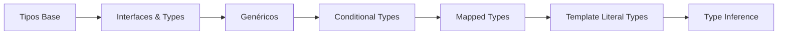

# 22TypescriptAvanzado

This project was generated using [Angular CLI](https://github.com/angular/angular-cli) version 22.0.1.

> **Propósito:** Utilizar características avanzadas de TypeScript (template literals, conditional types, satisfies, mapped types) para tipar APIs y servicios genéricos Angular.
>
> **Problema que resuelve:** El tipado básico no cubre patrones complejos como transformaciones de tipos dinámicos, tipos condicionales según input, o validación de objetos literales contra interfaces.
>
> **Cómo lo resuelve:** Template literal types construyen tipos dinámicamente, conditional types adaptan el tipo según condiciones, satisfies valida objetos literales, y mapped types transforman propiedades.
>
> **Por qué aprenderlo:** TypeScript avanzado permite escribir librerías y servicios genéricos con tipado perfecto; es el nivel necesario para contribuir a frameworks y crear abstracciones elegantes.




### Conceptos

#### Template Literal Types — Tipos dinámicos con patrones de texto

- **Qué es:** Permiten crear tipos que siguen patrones de strings específicos, como prefijos o formatos.
- **Por qué importa:** Detectan errores de tipado en strings antes de ejecutar el código; por ejemplo, rechazar una ruta que no empiece con `/api/`.
- **Código:**
```typescript
type EventName = `on${Capitalize<string>}`;    // 'onClick', 'onChange'
type ApiRoute = `/api/${string}`;               // '/api/users'
type CssSize = `${number}${'px' | 'rem' | '%'}`; // '16px', '2rem'

// Uso seguro: TypeScript valida el patrón
const valid: EventName = 'onClick';  // ✅ Válido
const invalid: EventName = 'click';  // ❌ Error de compilación
```
- **Analogía:** Es como un molde de字母eras: solo puedes crear palabras que encajen en el molde.

#### Conditional Types — Tipos que toman decisiones

- **Qué es:** Crean tipos que cambian su estructura según una condición, como un `if/else` pero a nivel de tipos.
- **Por qué importa:** Permiten extraer o transformar tipos automáticamente según su forma, reduciendo código repetitivo.
- **Código:**
```typescript
type ApiResponse<T> =
  | { status: 'success'; data: T; timestamp: number }
  | { status: 'error'; error: string; code: number };

type ExtractSuccess<T> = T extends { status: 'success'; data: infer D } ? D : never;

// Extrae el tipo de data de una respuesta exitosa
type UserData = ExtractSuccess<ApiResponse<User>>; // User
```
- **Analogía:** Es como un semáforo que cambia de color según la condición: verde si el tipo tiene éxito, rojo si tiene error.

#### satisfies — Verificación sin ampliación

- **Qué es:** Verifica que un valor cumple con un tipo SIN perder la información del tipo literal original.
- **Por qué importa:** A diferencia de `as`, `satisfies` conserva los valores literales (`'localhost'` en lugar de `string`), manteniendo autocompletado y tipos precisos.
- **Código:**
```typescript
interface ServerConfig { host: string; port: number; ssl: boolean; }

// satisfies: host sigue siendo "localhost" (literal)
const config = {
  host: 'localhost',
  port: 4200,
  ssl: false,
} satisfies ServerConfig;

// Sin satisfies: host sería tipo "string" (genérico)
// Con satisfies: host es tipo "localhost" (literal)
```
- **Analogía:** Es como un examen de ortografía: verifica que la palabra sea correcta sin cambiar cómo la escribes.

#### Mapped Types — Transformación de tipos

- **Qué es:** Crea un tipo nuevo transformando cada propiedad de un tipo existente, como una fábrica de tipos.
- **Por qué importa:** Evita escribir tipos repetitivos; un mapped type puede generar un estado de formulario completo a partir de una interfaz simple.
- **Código:**
```typescript
type FormState<T extends Record<string, unknown>> = {
  [K in keyof T]: {
    value: T[K];
    dirty: boolean;
    touched: boolean;
    errors: string[];
  };
};

// Genera automáticamente un estado de formulario para User
type UserForm = FormState<{ name: string; email: string; age: number }>;
// = { name: { value: string, dirty: boolean, ... }, email: {...}, age: {...} }
```
- **Analogía:** Es como una línea de ensamblaje: tomas un tipo de entrada y produces un tipo de salida transformado.

#### Servicio Genérico CRUD

- **Qué es:** Un servicio Angular que funciona con CUALQUIER tipo que tenga un campo `id`, eliminando código duplicado.
- **Por qué importa:** Un solo servicio sirve para usuarios, productos, pedidos, etc.; si cambias la lógica CRUD, cambias en un solo lugar.
- **Código:**
```typescript
interface Identifiable { id: string | number; }

@Injectable()
export class GenericCrudService<T extends Identifiable> {
  protected items: T[] = [];

  getAll(): T[] { return [...this.items]; }
  getById(id: T['id']): T | undefined { return this.items.find(i => i.id === id); }
  create(item: T): T { this.items.push(item); return item; }
  update(id: T['id'], partial: Partial<T>): T | undefined { /* ... */ }
  delete(id: T['id']): boolean { /* ... */ }
}

// Uso: funciona con cualquier tipo que tenga "id"
const userCrud = new GenericCrudService<User>();
const productCrud = new GenericCrudService<Product>();
```
- **Analogía:** Es como un administrador de archivos universal: da igual si guardas facturas, contratos o fotos; el proceso es el mismo.

### Ejercicios

1. **Crea un tipo Template Literal para rutas API:** Define un tipo `ApiVersion` que solo acepte strings como `v1`, `v2`, `v3`, y un tipo `VersionedRoute` que combine versión con ruta (`/v1/users`). Valida que rutas como `v4/orders` fallen en compilación.
2. **Implementa un tipo condicional para respuestas HTTP:** Crea un tipo `HttpStatus<T>` que retorne `T` si el status es 200, o `Error` si es 404 o 500. Úsalo en un servicio que maneje respuestas de diferentes códigos.
3. **Usa `satisfies` para configurar un objeto de theme:** Define una interfaz `ThemeConfig` con colores, crea un objeto `darkTheme` que satisfaga la interfaz, y verifica que los colores se mantienen como literales (`'#1a1a2e'` no `string`).
4. **Crea un Mapped Type `Nullable` que haga todas las propiedades opcionales a null:** Úsalo en un formulario donde todos los campos empiezan como `null` y se llenan progresivamente.
5. **Extiende el GenericCrudService para un tipo `Product`:** Crea una interfaz `Product extends Identifiable` con `name`, `price`, `category`, instancía `GenericCrudService<Product>`, y demuestra las 5 operaciones CRUD (getAll, getById, create, update, delete).

## Development server

To start a local development server, run:

Once the server is running, open your browser and navigate to `http://localhost:4200/`. The application will automatically reload whenever you modify any of the source files.

## Code scaffolding

Angular CLI includes powerful code scaffolding tools. To generate a new component, run:

```bash
ng generate component component-name
```

For a complete list of available schematics (such as `components`, `directives`, or `pipes`), run:

```bash
ng generate --help
```

## Building

To build the project run:

```bash
ng build
```

This will compile your project and store the build artifacts in the `dist/` directory. By default, the production build optimizes your application for performance and speed.

## Running unit tests

To execute unit tests with the [Vitest](https://vitest.dev/) test runner, use the following command:

```bash
ng test
```

## Running end-to-end tests

For end-to-end (e2e) testing, run:

```bash
ng e2e
```

Angular CLI does not come with an end-to-end testing framework by default. You can choose one that suits your needs.

## Additional Resources

For more information on using the Angular CLI, including detailed command references, visit the [Angular CLI Overview and Command Reference](https://angular.dev/tools/cli) page.
