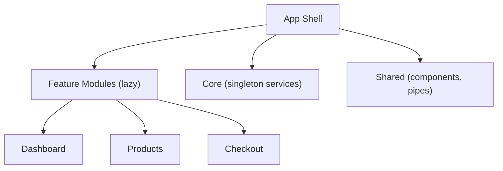

# 23Arquitectura

This project was generated using [Angular CLI](https://github.com/angular/angular-cli) version 22.0.1.

> **Propósito:** Estructurar proyectos Angular profesionales con separación por features (feature folders), core/shared/layouts, barrel exports y lazy loading por dominio.
>
> **Problema que resuelve:** Proyectos sin estructura crecen desordenadamente con archivos mezclados, imports largos y dependencias circulares que dificultan el mantenimiento y onboarding.
>
> **Cómo lo resuelve:** Feature folders agrupan por dominio de negocio, core/shared separa infraestructura de utilidades, layouts centralizan estructuras de página, y barrel exports simplifican imports.
>
> **Por qué aprenderlo:** La estructura del proyecto determina su mantenibilidad a largo plazo; una buena arquitectura reduce el costo de cambios y facilita escalar el equipo.




### Conceptos

#### Feature Folders — Organización por dominio

- **Qué es:** Agrupa archivos relacionados por功能 de negocio (dashboard, products, auth) en lugar de por tipo (components, services).
- **Por qué importa:** Facilita encontrar código relacionado, reduce imports largos, y permite lazy loading por dominio.
- **Código:**
```
src/app/
├── features/
│   ├── auth/           # Todo lo de autenticación
│   │   ├── components/
│   │   ├── pages/
│   │   ├── services/
│   │   └── index.ts
│   ├── dashboard/      # Todo lo del dashboard
│   └── products/       # Todo lo de productos
├── core/               # Servicios singleton
├── shared/             # Componentes reutilizables
└── layouts/            # Estructuras de página
```
- **Analogía:** Es como organizar una casa por habitaciones (cocina, dormitorio, baño) en vez de juntar todos los electrodomésticos en un lado y toda la ropa en otro.

#### Barrel Exports — Importaciones limpias

- **Qué es:** Archivos `index.ts` que re-exportan elementos de un módulo para simplificar imports.
- **Por qué importa:** En lugar de imports largos y frágiles, usas una sola línea que no cambia si reorganizas archivos internos.
- **Código:**
```typescript
// shared/ui/index.ts
export { ButtonComponent } from './button.component';
export { CardComponent } from './card.component';

// Uso en cualquier componente
import { ButtonComponent, CardComponent } from './shared/ui';
// En lugar de:
import { ButtonComponent } from './shared/ui/button.component';
import { CardComponent } from './shared/ui/card.component';
```
- **Analogía:** Es como un índice de libro: en vez de buscar cada capítulo por separado, miras el índice y encuentras todo en un lugar.

#### Layouts — Estructuras de página reutilizables

- **Qué es:** Componentes que envuelven las páginas proporcionando estructura común (sidebar, header, footer).
- **Por qué importa:** Evita repetir la navegación y el layout en cada página; si cambia el sidebar, cambia en todas partes.
- **Código:**
```typescript
// Layout principal con sidebar
@Component({
  template: `
    <div class="layout">
      <nav class="sidebar"><router-outlet /></nav>
      <main><router-outlet /></main>
    </div>
  `
})
export class MainLayoutComponent {}

// Rutas usan el layout como padre
{ path: '', component: MainLayoutComponent, children: [
  { path: 'dashboard', component: DashboardPage },
  { path: 'products', component: ProductListPage },
]}
```
- **Analogía:** Es como el marco de una puerta: todas las hojas de la puerta usan el mismo marco, pero cada una tiene su propio diseño.

#### Guards — Protección de rutas

- **Qué es:** Funciones que verifican condiciones antes de permitir el acceso a una ruta (autenticación, permisos).
- **Por qué importa:** Sin guards, cualquier usuario podría acceder a rutas protegidas; el guard actúa como barriera de seguridad.
- **Código:**
```typescript
export const authGuard = () => {
  const auth = inject(AuthService);
  const router = inject(Router);

  if (auth.isLoggedIn()) return true;        // Permite acceso
  return router.parseUrl('/auth/login');     // Redirige al login
};

// Uso en rutas
{ path: 'dashboard', component: DashboardPage, canActivate: [authGuard] }
```
- **Analogía:** Es como un guardia de seguridad en un edificio: si tienes credencial, pasas; si no, te envían a recepción.

#### Interceptors — Manipulación de peticiones HTTP

- **Qué es:** Funciones que interceptan cada petición HTTP para agregar headers, tokens o transformar datos.
- **Por qué importa:** Evita repetir lógica de autenticación en cada petición; el interceptor la agrega automáticamente.
- **Código:**
```typescript
export const authInterceptor: HttpInterceptorFn = (req, next) => {
  const token = localStorage.getItem('token');
  if (token) {
    const cloned = req.clone({
      setHeaders: { Authorization: `Bearer ${token}` },
    });
    return next(cloned);
  }
  return next(req);
};

// Configurar en app.config.ts
provideHttpClient(withInterceptors([authInterceptor]))
```
- **Analogía:** Es como un cartero que siempre lleva tu identificación en cada carta que envías; no tienes que acordarte de ponérsela a cada una.

### Ejercicios

1. **Crea una feature folder completa:** Organiza un módulo `users` con `components/`, `pages/`, `services/`, e `index.ts`. Mueve un componente existente a esta estructura y actualiza los imports.
2. **Implementa barrel exports en shared:** Crea `shared/ui/index.ts` que re-exporte 3 componentes compartidos, y actualiza todos los imports del proyecto para usar el barrel.
3. **Crea un layout con sidebar y header:** Diseña un `MainLayoutComponent` con navegación lateral y un header, define rutas anidadas que usen este layout, y verifica que el contenido cambia al navegar.
4. **Implementa un authGuard funcional:** Crea un `AuthService` con signal `isLoggedIn`, un `authGuard` que redirija al login si no está autenticado, y aplícalo a rutas protegidas.
5. **Agrega un interceptor de logging:** Crea un interceptor que loguee cada petición HTTP (método, URL, timestamp) en la consola, configúralo con `withInterceptors`, y verifica en DevTools que cada request aparece en el log.

## Development server

To start a local development server, run:

Once the server is running, open your browser and navigate to `http://localhost:4200/`. The application will automatically reload whenever you modify any of the source files.

## Code scaffolding

Angular CLI includes powerful code scaffolding tools. To generate a new component, run:

```bash
ng generate component component-name
```

For a complete list of available schematics (such as `components`, `directives`, or `pipes`), run:

```bash
ng generate --help
```

## Building

To build the project run:

```bash
ng build
```

This will compile your project and store the build artifacts in the `dist/` directory. By default, the production build optimizes your application for performance and speed.

## Running unit tests

To execute unit tests with the [Vitest](https://vitest.dev/) test runner, use the following command:

```bash
ng test
```

## Running end-to-end tests

For end-to-end (e2e) testing, run:

```bash
ng e2e
```

Angular CLI does not come with an end-to-end testing framework by default. You can choose one that suits your needs.

## Additional Resources

For more information on using the Angular CLI, including detailed command references, visit the [Angular CLI Overview and Command Reference](https://angular.dev/tools/cli) page.
