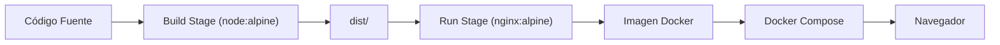

# 24DockerDespliegue

This project was generated using [Angular CLI](https://github.com/angular/angular-cli) version 22.0.1.

> **Propósito:** Desplegar Angular en producción con Docker multi-stage (node → nginx), docker-compose multi-servicio y CI/CD con GitHub Actions.
>
> **Problema que resuelve:** ng serve --host 0.0.0.0 --port 8080/build no produce un artefacto desplegable portable; sin Docker, el entorno de producción difiere del desarrollo causando errores inesperados.
>
> **Cómo lo resuelve:** Docker multi-stage build (compile con node, sirve con nginx), docker-compose orquesta Angular + API + DB, y GitHub Actions automatiza build/test/deploy.
>
> **Por qué aprenderlo:** Docker es el estándar de despliegue moderno; todo proyecto Angular en producción se despliega en contenedor. GitHub Actions completa el pipeline CI/CD.




### Conceptos

#### Docker Multi-Stage Build — Build optimizado

- **Qué es:** Un Dockerfile con dos fases: la primera compila la app con Node.js, la segunda sirve los archivos estáticos con Nginx.
- **Por qué importa:** La imagen final solo contiene los archivos de producción (~20MB) sin Node.js ni dependencias de desarrollo (~500MB+).
- **Código:**
```dockerfile
# Fase 1: Build — compila la app Angular
FROM node:22-alpine AS build
WORKDIR /app
COPY package*.json ./
RUN npm ci
COPY . .
RUN npx ng build

# Fase 2: Runtime — sirve con Nginx
FROM nginx:alpine
COPY --from=build /app/dist/24-docker-despliegue/browser /usr/share/nginx/html
COPY nginx.conf /etc/nginx/conf.d/default.conf
EXPOSE 80
```
- **Analogía:** Es como construir un mueble en una carpintería (fase build) y luego solo llevar la pieza terminada a la tienda (fase runtime), sin trasladar todas las herramientas.

#### Nginx — Servidor web para archivos estáticos

- **Qué es:** Servidor web ligero optimizado para servir archivos HTML, CSS y JS estáticos.
- **Por qué importa:** Angular produce archivos estáticos después del build; Nginx los sirve de forma rápida y eficiente, con soporte para SPA routing.
- **Código:**
```nginx
# nginx.conf
server {
    listen 80;
    root /usr/share/nginx/html;
    index index.html;

    # SPA routing: todas las rutas sirven index.html
    location / {
        try_files $uri $uri/ /index.html;
    }
}
```
- **Analogía:** Es como un mesero que siempre trae el mismo plato base (index.html) sin importar qué plato pidas, porque la app se encarga de mostrar la vista correcta.

#### Docker Compose — Orquestación de servicios

- **Qué es:** Herramienta que define y ejecuta múltiples contenedores (Angular + API + DB) con un solo comando.
- **Por qué importa:** En producción real, Angular no corre solo; necesita una API, base de datos, y otros servicios. Docker Compose orquesta todo.
- **Código:**
```yaml
services:
  angular-app:
    build: .
    ports:
      - "80:80"
    restart: unless-stopped
  api:
    image: node:22-alpine
    ports:
      - "3000:3000"
  db:
    image: postgres:16
    environment:
      POSTGRES_DB: myapp
```
- **Analogía:** Es como un director de escena que coordina todos los actores (contenedores) para que trabajen juntos armoniosamente.

#### CI/CD con GitHub Actions — Automatización

- **Qué es:** Pipeline que automáticamente ejecuta build, tests y deploy cada vez que haces push al repositorio.
- **Por qué importa:** Elimina el deploy manual, reduce errores humanos, y garantiza que cada cambio pase por las mismas verificaciones.
- **Código:**
```yaml
# .github/workflows/deploy.yml
name: Deploy
on:
  push:
    branches: [main]
jobs:
  build-and-deploy:
    runs-on: ubuntu-latest
    steps:
      - uses: actions/checkout@v4
      - run: npm ci
      - run: npm test
      - run: npm run build
      - run: docker build -t my-app .
      - run: docker push registry/my-app:latest
```
- **Analogía:** Es como una línea de ensamblaje automática: cada pieza pasa por verificación de calidad antes de llegar al producto final.

#### Imagen Docker — Paquete portátil

- **Qué es:** Una imagen que contiene todo lo necesario para ejecutar la app: sistema operativo, servidor web, y archivos compilados.
- **Por qué importa:** La imagen corre igual en cualquier computadora, servidor o nube; elimina el problema "en mi máquina funciona".
- **Código:**
```bash
# Construir la imagen
docker build -t angular-app .

# Ejecutar el contenedor
docker run -d -p 80:80 angular-app

# Verificar que funciona
curl http://localhost:80
```
- **Analogía:** Es como una maleta preparada para viaje: contiene todo lo que necesitas sin depender de lo que haya en el destino.

### Ejercicios

1. **Crea un Dockerfile multi-stage para Angular:** Escribe un Dockerfile que use `node:22-alpine` para compilar y `nginx:alpine` para servir. Construye la imagen, ejecuta el contenedor, y verifica que la app carga en `http://localhost`.
2. **Configura nginx.conf para SPA routing:** Escribe un `nginx.conf` que maneje rutas de Angular (todas las rutas sirvan `index.html`). Prueba navegando a rutas directas como `/dashboard` y verifica que no devuelve 404.
3. **Agrega docker-compose.yml con dos servicios:** Define un servicio `angular-app` y un servicio `api` (puede ser un `node:22-alpine` simple). Ejecuta `docker-compose up` y verifica que ambos contenedores corren.
4. **Mide el tamaño de la imagen:** Compara el tamaño de una imagen sin multi-stage (~500MB+) con la imagen optimizada (~20MB). Documenta la diferencia y explica por qué importa en producción.
5. **Crea un pipeline básico de CI/CD:** Escribe un archivo `.github/workflows/ci.yml` que ejecute `npm ci`, `npm test` y `ng build` en cada push a `main`. Verifica que el workflow aparece en la pestaña Actions de GitHub.

## Development server

To start a local development server, run:

Once the server is running, open your browser and navigate to `http://localhost:4200/`. The application will automatically reload whenever you modify any of the source files.

## Code scaffolding

Angular CLI includes powerful code scaffolding tools. To generate a new component, run:

```bash
ng generate component component-name
```

For a complete list of available schematics (such as `components`, `directives`, or `pipes`), run:

```bash
ng generate --help
```

## Building

To build the project run:

```bash
ng build
```

This will compile your project and store the build artifacts in the `dist/` directory. By default, the production build optimizes your application for performance and speed.

## Running unit tests

To execute unit tests with the [Vitest](https://vitest.dev/) test runner, use the following command:

```bash
ng test
```

## Running end-to-end tests

For end-to-end (e2e) testing, run:

```bash
ng e2e
```

Angular CLI does not come with an end-to-end testing framework by default. You can choose one that suits your needs.

## Additional Resources

For more information on using the Angular CLI, including detailed command references, visit the [Angular CLI Overview and Command Reference](https://angular.dev/tools/cli) page.
