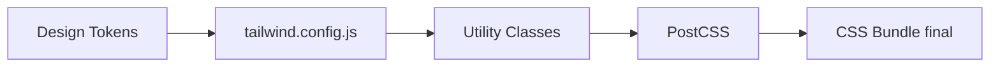

## 26 — Tailwind CSS con Angular

Estilos utilitarios con Tailwind CSS en proyectos Angular: configuración, responsive, dark mode, componentes.

> **Propósito:** Integrar Tailwind CSS con Angular para desarrollo UI utility-first con dark mode, responsive design y purga de CSS no usado en build.
>
> **Problema que resuelve:** CSS tradicional lleva a estilos globales conflictivos, nombres de clases inconsistentes y archivos CSS enormes con reglas no utilizadas.
>
> **Cómo lo resuelve:** Tailwind con clases utility atómicas (padding-4, text-lg), PostCSS purge elimina clases no usadas en build, dark mode con clase toggleada, responsive con prefijos sm/md/lg.
>
> **Por qué aprenderlo:** Tailwind es el framework CSS más popular; acelera el desarrollo UI en 3x y produce bundles CSS mínimos. Integración con Angular es directa vía PostCSS.




### Conceptos Clave

- **Instalación**: Tailwind CSS + Angular, PostCSS config
- **`@apply`**: extraer estilos utilitarios a clases personalizadas
- **Responsive**: `sm:`, `md:`, `lg:`, `xl:`, `2xl:` breakpoints
- **Dark Mode**: `class` strategy, toggle con señal
- **Componentes con Tailwind**: componentes Angular estilizados con utilidades
- **Animaciones**: clases `transition`, `animate-*`, custom animations
- **`ngClass` y Tailwind**: clases dinámicas con señales y `ngClass`
- **Design tokens**: colores, espaciados, tipografía como variables CSS

### Proyecto

Dashboard responsivo con dark mode, sidebar colapsable, y componentes Angular estilizados completamente con Tailwind.

### Ejercicios

1. Configura Tailwind CSS en proyecto Angular
2. Implementa layout responsivo (sidebar + main)
3. Crea toggle de dark mode con señal
4. Extrae utilidades repetidas con `@apply`
5. Construye un `Button` component con variantes Tailwind

### Cómo ejecutar

```bash
cd 26-tailwind-css
npm install
ng serve --host 0.0.0.0 --port 8080
```
