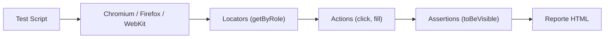

## 27 — E2E Testing con Playwright

Testing end-to-end con Playwright en Angular: Page Object Model, fixtures, y pruebas multi-navegador.

> **Propósito:** Automatizar pruebas end-to-end con Playwright: navegación multi-browser, assertions visuales, interceptación de red y testing de componentes con data-testid.
>
> **Problema que resuelve:** Las pruebas manuales y unitarias no cubren flujos completos de usuario; los bugs aparecen en integración real de componentes y servicios.
>
> **Cómo lo resuelve:** Playwright automatiza navegadores reales (Chromium/Firefox/WebKit), intercepta peticiones HTTP para mockear APIs, y usa selectores data-testid para tests robustos.
>
> **Por qué aprenderlo:** E2E testing es la última línea de defensa antes de producción; Playwright es más rápido y confiable que Selenium/Cypress, con auto-wait y trazabilidad integrada.




### Conceptos Clave

- **Playwright**: instalación, `playwright.config.ts`, navegadores
- **Test Runner**: `test`, `expect`, `describe`, hooks
- **Page Object Model**: clases que encapsulan selectores y acciones
- **Fixtures**: `test.extend()` para page objects personalizados
- **Locators**: `getByRole`, `getByText`, `getByTestId`, `locator`
- **Angular específico**: esperar estabilidad, `page.waitForAngular`
- **Interceptar API**: `page.route`, mock de respuestas
- **Visual Regression**: `expect(page).toHaveScreenshot()`
- **Multi-navegador**: Chromium, Firefox, WebKit
- **CI**: Playwright en GitHub Actions

### Proyecto

Pruebas E2E para el dashboard (módulo 26): login, navegación, CRUD, responsive, y visual regression.

### Ejercicios

1. Configura Playwright con Angular
2. Implementa Page Object para LoginPage
3. Prueba flujo completo de login + dashboard
4. Intercepta API y prueba estados de carga/error
5. Agrega visual regression test para el dashboard

### Cómo ejecutar

```bash
cd 27-e2e-playwright
npm install
npx playwright test
```
