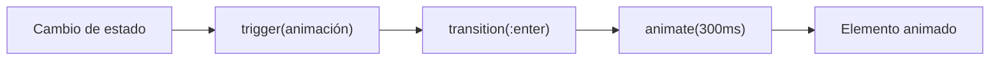

## 28 — Animaciones en Angular

Sistema de animaciones declarativas de Angular: trigger, state, transition, keyframes, y stagger.

> **Propósito:** Crear animaciones declarativas con @angular/animations: trigger, state, transition, animate, keyframes y animaciones de rutas.
>
> **Problema que resuelve:** Las animaciones CSS puras son difíciles de coordinar con el ciclo de vida de Angular y carecen de control programático sobre estados de animación.
>
> **Cómo lo resuelve:** Angular Animations con trigger/state/transition definen animaciones declarativas en el componente, con animate para temporización y keyframes para secuencias complejas.
>
> **Por qué aprenderlo:** Las animaciones mejoran la percepción de performance y UX; Angular Animations es el sistema más maduro del ecosistema frontend para animaciones declarativas.




### Conceptos Clave

- **`@angular/animations`**: `provideAnimations()`, `provideNoopAnimations()`
- **`trigger()`**: define un conjunto de animaciones
- **`state()`**: estado estático de estilo
- **`transition()`**: transición entre estados (`:enter`, `:leave`, `* => *`)
- **`style()`**, `animate()`, `keyframes()`: definición de estilos y tiempos
- **`query()`**, `stagger()`, `animateChild()`: animaciones secuenciales en listas
- **Route animations**: animaciones de transición entre rutas
- **`@defer` + animaciones**: combinar carga diferida con animaciones
- **Señales para animaciones**: control de estado con señales

### Proyecto

Página de productos con animaciones: entrada escalonada, hover, carrito con fly animation, transiciones de ruta.

### Ejercicios

1. Crea un `trigger` con fade-in al entrar
2. Implementa animación `:enter`/`:leave` en lista con `@for`
3. Usa `stagger` para animación escalonada de tarjetas
4. Añade route transition animations con Router
5. Controla estado de animación con una señal

### Cómo ejecutar

```bash
cd 28-animaciones
npm install
ng serve --host 0.0.0.0 --port 8080
```
