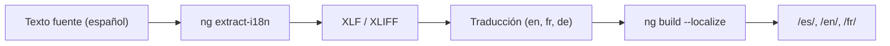

## 29 — Internacionalización (i18n)

i18n en Angular con `@angular/localize`: traducciones, pluralización, selección, detección de idioma.

> **Propósito:** Implementar internacionalización (i18n) completa en Angular: traducciones con `@angular/localize`, pluralización, selección de género, detección automática de idioma y cambio en runtime.
>
> **Problema que resuelve:** Las apps sin i18n solo hablan un idioma, excluyendo usuarios internacionales y requiriendo duplicar código para cada locale.
>
> **Cómo lo resuelve:** `@angular/localize` extrae textos a archivos XLIFF, el compilador genera bundles separados por locale, y `LOCALE_ID` + `registerLocaleData` manejan formatos regionales.
>
> **Por qué aprenderlo:** i18n es obligatorio en apps globales; Angular lo soporta nativamente con extracción de textos, pluralización, selección y builds por locale sin cambiar la lógica de componentes.



### Conceptos Clave

- **`@angular/localize`**: `$localize`, `ng extract-i18n`
- **Templates i18n**: `i18n` attribute, `i18n-*` para attributes
- **Traducciones**: archivos XLIFF (`.xlf`), JSON, o AOT
- **Pluralización**: `plural`, `=0 {no items} one {# item} other {# items}`
- **Selección**: `select`, gender/option selection
- **Detección de idioma**: `navigator.language`, guardar preferencia
- **Cambio de idioma en runtime**: recarga de app o lazy-load de traducciones
- **`LOCALE_ID`**: provider para locale activo
- **`registerLocaleData`**: registrar datos locales (fechas, monedas, números)

### Proyecto

App multi-idioma (es/en/fr) con selector de idioma, pluralización, formatos de fecha/moneda localizados.

### Ejercicios

1. Configura `@angular/localize` en un proyecto Angular
2. Marca textos con `i18n` en templates y extrae a XLIFF
3. Traduce a inglés y francés, genera builds localizados
4. Implementa selector de idioma con detección automática
5. Añade pluralización y formatos de fecha/moneda por locale

### Cómo ejecutar

```bash
cd 29-i18n
npm install
npm run build:all-locales
npx http-server dist/es
```
