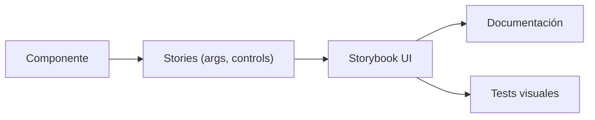

## 30 — Storybook

Catálogo de componentes con Storybook para Angular: stories, controles, decoradores, y Composition API.

> **Propósito:** Documentar y desarrollar componentes aislados con Storybook: stories, controles interactivos, addons de accesibilidad y testing visual de cada estado del componente.
>
> **Problema que resuelve:** Los componentes desarrollados dentro de la app completa son difíciles de testear visualmente, documentar y compartir con diseñadores/producto.
>
> **Cómo lo resuelve:** Storybook aísla cada componente con stories que muestran todos sus estados (loading, empty, error, edge cases), con controles interactivos y addons de testing visual.
>
> **Por qué aprenderlo:** Storybook es el estándar de desarrollo component-driven; mejora la colaboración diseño-desarrollo y sirve como catálogo vivo de UI.




### Conceptos Clave

- **Storybook**: `npx storybook@latest init`, configuración Angular
- **Stories**: `Meta`, `StoryObj`, args, render function
- **Controles**: `argTypes`, controles automáticos (text, number, select, boolean)
- **Decoradores**: `moduleMetadata`, `componentWrapperDecorator`
- **Actions**: `action` para eventos de componentes
- **Docs**: `Autodocs`, `@mdx` para documentación
- **Composition API**: Storybook compuesto (microfrontends/design system)
- **Addons**: `@storybook/addon-essentials`, `@storybook/addon-a11y`, `@storybook/addon-interactions`
- **Design tokens**: integración con tokens de diseño visual

### Proyecto

Catálogo completo del design system UI: Button, Input, Card, Modal, Table con documentación visual y controles.

### Ejercicios

1. Inicializa Storybook en el proyecto Angular
2. Crea story para Button con controles de variante/tamaño
3. Crea story para un formulario con interacciones
4. Agrega addon de accesibilidad y corrige issues
5. Publica Storybook como catálogo estático

### Cómo ejecutar

```bash
cd 30-storybook
npm run storybook
```
