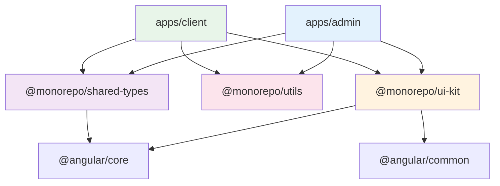

## 31 — Monorepo con Nx

Monorepo real con Nx para proyectos Angular: 2 apps (admin, client) y 3 librerías compartidas (ui-kit, utils, shared-types).

### Propósito

Aprender a configurar y usar un monorepo Nx real con múltiples apps Angular y librerías compartidas. Comprender project.json, path aliases, affected commands y computation caching.

### Problema que resuelve

Mantener múltiples apps Angular por separado lleva a:
- Duplicación de componentes y utilidades
- Configuración inconsistente entre proyectos
- Builds lentos que procesan todo el código
- Imposibilidad de compartir tipos y lógica entre apps
- CI/CD que ejecuta todo sin importar qué cambió

### Cómo lo resuelve

Nx con project.json por proyecto:
- **`apps/`**: Aplicaciones independientes (admin, client)
- **`libs/`**: Librerías compartidas (ui-kit, utils, shared-types)
- **`nx.json`**: Configuración global de targets, cache y plugins
- **`tsconfig.base.json`**: Path aliases (`@monorepo/ui-kit`, etc.)
- **Affected commands**: Solo ejecuta lo que cambió
- **Computation cache**: No rebuilda lo que no cambió

### Por qué aprenderlo

Nx es el estándar de monorepos Angular en la industria. Usado por Google, Netflix, Microsoft y grandes empresas. Reduce tiempos de CI en hasta 70% y facilita compartir código entre equipos de desarrollo.

### Conceptos Clave

#### 1. Estructura del Monorepo

```
31-monorepo/
├── apps/
│   ├── admin/          # App de administración
│   │   ├── src/
│   │   ├── project.json
│   │   └── tsconfig*.json
│   └── client/         # App de cliente
│       ├── src/
│       ├── project.json
│       └── tsconfig*.json
├── libs/
│   ├── ui-kit/         # Componentes reutilizables
│   ├── utils/          # Funciones utilitarias
│   └── shared-types/   # Interfaces y tipos
├── nx.json             # Configuración Nx
├── tsconfig.base.json  # Configuración TypeScript base
└── package.json
```

#### 2. Project.json (por proyecto)

Cada app y lib tiene su propio `project.json`:
- Define targets: build, serve, test, lint
- Usa builders de Angular (`@angular/build:application`)
- Configura dependencias entre targets (`dependsOn`)
- Asigna tags para module boundaries

#### 3. Path Aliases

En `tsconfig.base.json` se definen alias para imports limpios:
```typescript
// Sin alias (feo)
import { ButtonComponent } from '../../../libs/ui-kit/src/lib/button/button.component';

// Con alias (limpio)
import { ButtonComponent } from '@monorepo/ui-kit';
```

#### 4. Computation Cache

Nx cachea automáticamente los resultados de build, test y lint:
- Si el código no cambió, reutiliza el resultado anterior
- Cache local en `.nx/` y cache remota con Nx Cloud
- Reduce tiempos de CI significativamente

#### 5. Affected Commands

Solo ejecuta lo que cambió:
```bash
nx affected:test    # Solo test de proyectos afectados
nx affected:build   # Solo build de proyectos afectados
nx affected:lint    # Solo lint de proyectos afectados
```

### Ejercicios

1. Ejecuta `npm install` para instalar dependencias
2. Ejecuta `nx serve admin` para iniciar la app admin
3. Ejecuta `nx serve client` para iniciar la app client
4. Ejecuta `nx build` para construir todas las apps
5. Ejecuta `nx graph` para ver la grafo de dependencias
6. Modifica un archivo en `libs/utils/` y ejecuta `nx affected:build`
7. Importa un componente de `@monorepo/ui-kit` en la app admin
8. Crea un nuevo componente en `libs/ui-kit/` y exportalo desde `index.ts`

### Cómo ejecutar

```bash
cd 31-monorepo

# Instalar dependencias
npm install

# Desarrollo
nx serve admin          # App admin en http://localhost:4200
nx serve client         # App client en http://localhost:4200
nx run-many -t serve    # Ambas apps

# Build
nx build admin          # Build solo admin
nx build client         # Solo client
nx run-many -t build    # Todas las apps

# Test y Lint
nx run-many -t test
nx run-many -t lint

# Análisis
nx graph                # Grafo de dependencias visual
nx affected:test        # Solo test de lo modificado
nx affected:build       # Solo build de lo modificado
```

### Archivos del Proyecto

| Archivo | Propósito |
|---------|-----------|
| `nx.json` | Configuración global de Nx (cache, targets, plugins) |
| `tsconfig.base.json` | TypeScript base con path aliases |
| `package.json` | Dependencias y scripts del workspace |
| `apps/admin/project.json` | Configuración de la app admin |
| `apps/admin/src/main.ts` | Punto de entrada de admin |
| `apps/admin/src/app/app.component.ts` | Componente raíz de admin |
| `apps/admin/src/app/dashboard/` | Dashboard de admin |
| `apps/client/project.json` | Configuración de la app client |
| `apps/client/src/main.ts` | Punto de entrada de client |
| `apps/client/src/app/app.component.ts` | Componente raíz de client |
| `libs/ui-kit/project.json` | Configuración de la lib ui-kit |
| `libs/ui-kit/src/lib/button/` | Componente Button reutilizable |
| `libs/ui-kit/src/lib/card/` | Componente Card reutilizable |
| `libs/utils/project.json` | Configuración de la lib utils |
| `libs/utils/src/lib/format.ts` | Funciones de formateo |
| `libs/utils/src/lib/validators.ts` | Funciones de validación |
| `libs/shared-types/project.json` | Configuración de la lib shared-types |
| `libs/shared-types/src/lib/user.model.ts` | Interfaz User |
| `libs/shared-types/src/lib/product.model.ts` | Interfaz Product |

### Diagrama de Dependencias


