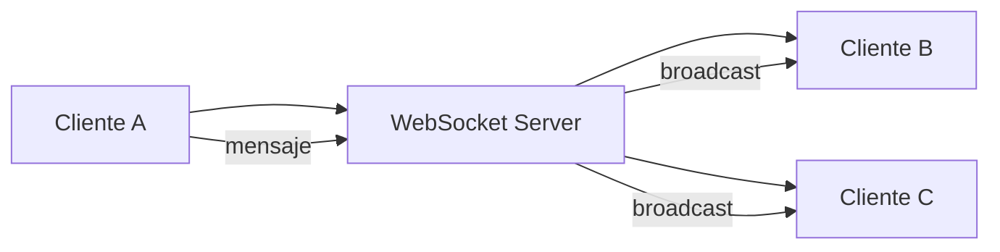

## 32 — WebSockets y Tiempo Real

Comunicación en tiempo real con RxJS WebSocket y Socket.io + Angular.

> **Propósito:** Implementar comunicación bidireccional en tiempo real con RxJS webSocket: conexión, auto-reconnect con retry, manejo de estados y chat en vivo.
>
> **Problema que resuelve:** HTTP es unidireccional (cliente→servidor); para notificaciones en vivo, chats o dashboards en tiempo real, el polling HTTP es ineficiente y lento.
>
> **Cómo lo resuelve:** RxJS webSocket crea una conexión persistente bidireccional, retry con backoff reconecta automáticamente, y los mensajes fluyen como streams RxJS componibles con otros operadores.
>
> **Por qué aprenderlo:** Tiempo real es requisito creciente (chats, notificaciones, dashboards); webSocket + RxJS es la combinación más potente para streaming en Angular.




### Conceptos Clave

- **`WebSocketSubject`**: `webSocket()` de RxJS, multicasting
- **Socket.io**: `socket.io-client`, eventos, rooms, namespaces
- **Conexión**: `connect()`, `disconnect()`, reconexión automática
- **Eventos**: `emit()`, `on()`, `off()` con RxJS
- **Señales + WebSocket**: convertir eventos a señales con `toSignal()`
- **Reconexión**: retry with backoff, `retryWhen` / `retry`
- **Rooms**: unirse/salir de canales específicos
- **Broadcast**: enviar a todos los clientes conectados
- **Backends**: Socket.io (Node), Spring Boot WebSocket, FastAPI WebSocket

### Proyecto

Chat en tiempo real con salas, notificaciones de typing, mensajes con timestamp, y estado de conexión.

### Ejercicios

1. Configura `WebSocketSubject` para conectar al servidor
2. Convierte mensajes WebSocket a señal con `toSignal()`
3. Implementa reconexión automática con retry
4. Crea sistema de salas/rooms
5. Muestra indicador de typing en tiempo real

### Cómo ejecutar

```bash
cd 32-websockets
npm install
ng serve --host 0.0.0.0 --port 8080
```
