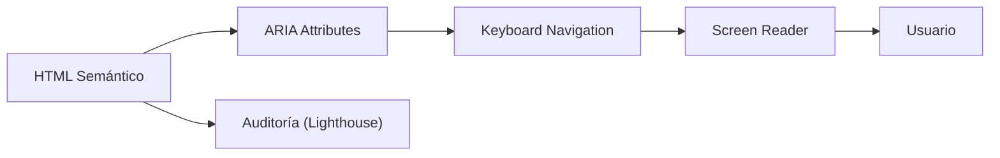

## 33 — Accesibilidad Web (a11y)

Accesibilidad en Angular con WCAG 2.2, ARIA, Angular CDK A11y, y mejores prácticas.

> **Propósito:** Hacer aplicaciones Angular accesibles con ARIA, LiveAnnouncer, focus trap, navegación por teclado y contraste suficiente siguiendo WCAG.
>
> **Problema que resuelve:** El ~15% de la población tiene alguna discapacidad; las apps sin accesibilidad excluyen usuarios y pueden enfrentar demandas por incumplimiento de WCAG.
>
> **Cómo lo resuelve:** Angular CDK A11y proporciona LiveAnnouncer para lectores de pantalla, cdkTrapFocus para modales, cdkMonitorFocus para teclado, y ARIA attributes semánticos.
>
> **Por qué aprenderlo:** Accesibilidad es requisito legal en muchos países (ADA, EU Accessibility Act) y mejora la UX para todos. Angular CDK facilita implementar WCAG sin frameworks externos.




### Conceptos Clave

- **WCAG 2.2**: Perceptible, Operable, Comprensible, Robusto (POUR)
- **ARIA**: `aria-label`, `aria-describedby`, `aria-live`, `role`, `aria-expanded`
- **Angular CDK A11y**: `@angular/cdk/a11y`, `FocusMonitor`, `InteractivityChecker`
- **`LiveAnnouncer`**: anunciar cambios a screen readers
- **`FocusTrap`**: atrapar foco en modales
- **`cdkTrapFocus`**: directiva para trampa de foco
- **Teclado**: `KeyboardEvent`, manejo de `Tab`, `Enter`, `Escape`
- **Contraste**: ratio 4.5:1 mínimo, herramientas de verificación
- **`@angular/cdk/testing`**: test de accesibilidad con `TestBed`
- **Storybook a11y addon**: `@storybook/addon-a11y`

### Proyecto

Auditoría y mejora de accesibilidad del design system: contraste, foco, ARIA, screen reader, y teclado.

### Ejercicios

1. Audita contraste de colores y corrige
2. Implementa `FocusTrap` en un modal
3. Usa `LiveAnnouncer` para feedback dinámico
4. Añade ARIA labels a componentes interactivos
5. Navega toda la app solo con teclado

### Cómo ejecutar

```bash
cd 33-accesibilidad
npm install
ng serve --host 0.0.0.0 --port 8080
```

### Archivos del Proyecto

| Archivo | Carpeta | Propósito |
|---------|---------|-----------|
| `README.md` | Raíz | Documentación del proyecto |
| `angular.json` | Raíz | Configuración del workspace Angular |
| `package.json` | Raíz | Dependencias y scripts del proyecto |
| `tsconfig.json` | Raíz | Configuración base de TypeScript |
| `tsconfig.app.json` | Raíz | Configuración de TypeScript para la app |
| `package-lock.json` | Raíz | Bloqueo de versiones de dependencias |
| `src/index.html` | `src/` | HTML principal de la aplicación |
| `src/main.ts` | `src/` | Punto de entrada de la aplicación |
| `src/styles.css` | `src/` | Estilos globales |
| `src/app/app.config.ts` | `src/app/` | Configuración de providers de Angular |
| `src/app/app.component.ts` | `src/app/` | Componente raíz de la aplicación |
| `src/app/announcer.component.ts` | `src/app/` | Componente de LiveAnnouncer para screen readers |
| `src/app/contrast-card.component.ts` | `src/app/` | Componente que verifica contraste de colores |
| `src/app/modal.component.ts` | `src/app/` | Componente modal con FocusTrap |
