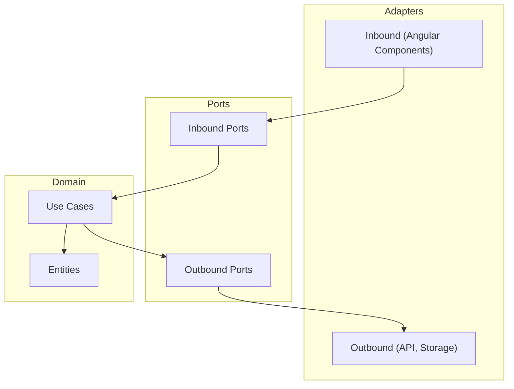

## 34 — Arquitectura Hexagonal (Ports & Adapters)

Arquitectura hexagonal en Angular: separación de dominio, aplicación e infraestructura. Puertos y adaptadores intercambiables.

> **Propósito:** Implementar arquitectura hexagonal (Ports & Adapters) en Angular con dominio puro, puertos como interfaces, adaptadores intercambiables e inversión de dependencias.
>
> **Problema que resuelve:** El acoplamiento directo a frameworks (HttpClient, localStorage) impide testear la lógica de negocio aisladamente y dificulta cambiar de proveedor de infraestructura.
>
> **Cómo lo resuelve:** Puertos (interfaces) en dominio puro sin imports de Angular, adaptadores concretos implementan esos puertos, DI con InjectionToken intercambia implementaciones sin modificar consumidores.
>
> **Por qué aprenderlo:** Es la arquitectura que permite testear lógica de negocio sin Angular y cambiar infraestructura sin tocar dominio; estándar en proyectos enterprise grandes.




### Conceptos Clave

- **Puertos** (interfaces): `UserRepository` como interfaz, no implementación
- **Adaptadores**: `HttpUserRepository`, `InMemoryUserRepository`, `MockUserRepository`
- **Dominio puro**: entidades, VO, casos de uso sin dependencias de Angular
- **Casos de uso**: `loginUseCase`, `getProductsUseCase` — orquestan flujos
- **Inversión de dependencias**: depende de abstracciones, no de implementaciones
- **DI con tokens**: `InjectionToken` para cada puerto
- **Testabilidad**: intercambiar adaptadores fácilmente (API local vs remota)
- **Separación**: `core/` (dominio), `infrastructure/` (adaptadores), `application/` (casos de uso)

### Proyecto

Sistema de usuarios con 3 adaptadores intercambiables: InMemory, Http, y Mock. Casos de uso independientes del framework.

### Ejercicios

1. Define puertos como interfaces en `core/ports`
2. Implementa adaptador InMemory y Http para el mismo puerto
3. Crea un caso de uso puro (sin imports de Angular)
4. Configura DI con `InjectionToken` y `useClass`
5. Cambia adaptador sin modificar componentes

### Cómo ejecutar

```bash
cd 34-arquitectura-hexagonal
npm install
ng serve --host 0.0.0.0 --port 8080
```

### Archivos del Proyecto

| Archivo | Capa | Propósito |
|---------|------|-----------|
| `README.md` | Raíz | Documentación del proyecto |
| `angular.json` | Raíz | Configuración del workspace Angular |
| `package.json` | Raíz | Dependencias y scripts del proyecto |
| `tsconfig.json` | Raíz | Configuración base de TypeScript |
| `tsconfig.app.json` | Raíz | Configuración de TypeScript para la app |
| `package-lock.json` | Raíz | Bloqueo de versiones de dependencias |
| `public/favicon.ico` | `public/` | Favicon de la aplicación |
| `src/index.html` | `src/` | HTML principal de la aplicación |
| `src/main.ts` | `src/` | Punto de entrada de la aplicación |
| `src/styles.css` | `src/` | Estilos globales |
| `src/app/app.config.ts` | `src/app/` | Configuración de providers de Angular |
| `src/app/app.ts` | `src/app/` | Componente raíz de la aplicación |
| `src/app/app.css` | `src/app/` | Estilos del componente raíz |
| `src/app/app.html` | `src/app/` | Template del componente raíz |
| `src/app/domain/entities/user.entity.ts` | `domain/` | Entidad de dominio User |
| `src/app/domain/ports/user-repository.port.ts` | `domain/` | Puerto (interfaz) del repositorio de usuarios |
| `src/app/domain/value-objects/email.value-object.ts` | `domain/` | Value Object Email con validación |
| `src/app/domain/value-objects/user-id.value-object.ts` | `domain/` | Value Object UserId |
| `src/app/application/create-user.use-case.ts` | `application/` | Caso de uso para crear usuario |
| `src/app/application/get-users.use-case.ts` | `application/` | Caso de uso para listar usuarios |
| `src/app/infrastructure/adapters/http-user-repository.adapter.ts` | `infrastructure/` | Adaptador HTTP del repositorio de usuarios |
| `src/app/infrastructure/adapters/in-memory-user-repository.adapter.ts` | `infrastructure/` | Adaptador en memoria del repositorio de usuarios |
