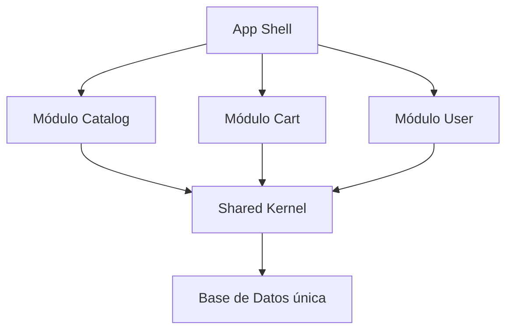

## 35 — Monolito Modular

Arquitectura de monolito modular en Angular: módulos independientes con sus propios límites, APIs y dependencias controladas.

> **Propósito:** Organizar aplicaciones monolíticas en módulos independientes (Orders, Inventory, Billing) con boundaries claros, shared kernel y API pública explícita.
>
> **Problema que resuelve:** Los monolitos sin modularidad crecen caóticamente con dependencias cruzadas entre features, making the codebase impossible to maintain and scale.
>
> **Cómo lo resuelve:** Feature modules aislados con sus propias rutas/servicios/componentes, shared kernel con contratos compartidos, barrel exports que definen API pública explícita de cada módulo.
>
> **Por qué aprenderlo:** El 90% de las apps Angular son monolitos; modularizarlos bien es la diferencia entre un código mantenible y un legacy inmanejable.




### Conceptos Clave

- **Módulo independiente**: feature completo con sus propias rutas, servicios, componentes
- **Shared Kernel**: código compartido mínimo y estable (tipos, utils, contrato de eventos)
- **APIs explícitas**: cada módulo exporta una interfaz pública clara
- **Prohibición de dependencias directas**: módulos no importan otros módulos directamente
- **Comunicación**: a través de shared kernel o event bus
- **Module Boundaries**: reglas de lint para mantener independencia
- **Lazy Loading**: cada módulo cargado bajo demanda
- **Aislamiento**: un módulo puede extraerse a microfrontend sin refactor

### Proyecto

App e-commerce con módulos Auth, Catalog, Cart, Checkout independientes. Cada uno con su propia ruta, estado y servicios.

### Ejercicios

1. Define el shared kernel con tipos y contratos
2. Implementa módulo `Catalog` completamente independiente
3. Implementa módulo `Cart` que se comunica via shared kernel
4. Verifica boundaries con ESLint/Nx module boundary rules
5. Extrae un módulo como librería independiente

### Cómo ejecutar

```bash
cd 35-monolito-modular
npm install
ng serve --host 0.0.0.0 --port 8080
```

### Archivos del Proyecto

| Archivo | Módulo | Propósito |
|---------|--------|-----------|
| `README.md` | Raíz | Documentación del proyecto |
| `angular.json` | Raíz | Configuración del workspace Angular |
| `package.json` | Raíz | Dependencias y scripts del proyecto |
| `tsconfig.json` | Raíz | Configuración base de TypeScript |
| `tsconfig.app.json` | Raíz | Configuración de TypeScript para la app |
| `package-lock.json` | Raíz | Bloqueo de versiones de dependencias |
| `public/favicon.ico` | `public/` | Favicon de la aplicación |
| `src/index.html` | `src/` | HTML principal de la aplicación |
| `src/main.ts` | `src/` | Punto de entrada de la aplicación |
| `src/styles.css` | `src/` | Estilos globales |
| `src/app/app.config.ts` | `src/app/` | Configuración de providers de Angular |
| `src/app/app.ts` | `src/app/` | Componente raíz de la aplicación |
| `src/app/app.css` | `src/app/` | Estilos del componente raíz |
| `src/app/app.html` | `src/app/` | Template del componente raíz |
| `src/app/app.routes.ts` | `src/app/` | Configuración de rutas principales |
| `src/app/shared/contracts.ts` | `shared/` | Contratos e interfaces compartidas |
| `src/app/shared/index.ts` | `shared/` | Barrel exports del shared kernel |
| `src/app/shared/types.ts` | `shared/` | Tipos compartidos entre módulos |
| `src/app/billing/billing.component.ts` | `billing/` | Componente del módulo de facturación |
| `src/app/billing/billing.component.html` | `billing/` | Template del módulo de facturación |
| `src/app/billing/billing.component.css` | `billing/` | Estilos del módulo de facturación |
| `src/app/billing/billing.service.ts` | `billing/` | Servicio del módulo de facturación |
| `src/app/billing/billing.routes.ts` | `billing/` | Rutas del módulo de facturación |
| `src/app/inventory/inventory.component.ts` | `inventory/` | Componente del módulo de inventario |
| `src/app/inventory/inventory.component.html` | `inventory/` | Template del módulo de inventario |
| `src/app/inventory/inventory.component.css` | `inventory/` | Estilos del módulo de inventario |
| `src/app/inventory/inventory.service.ts` | `inventory/` | Servicio del módulo de inventario |
| `src/app/inventory/inventory.routes.ts` | `inventory/` | Rutas del módulo de inventario |
| `src/app/orders/orders.component.ts` | `orders/` | Componente del módulo de pedidos |
| `src/app/orders/orders.component.html` | `orders/` | Template del módulo de pedidos |
| `src/app/orders/orders.component.css` | `orders/` | Estilos del módulo de pedidos |
| `src/app/orders/orders.service.ts` | `orders/` | Servicio del módulo de pedidos |
| `src/app/orders/orders.routes.ts` | `orders/` | Rutas del módulo de pedidos |
