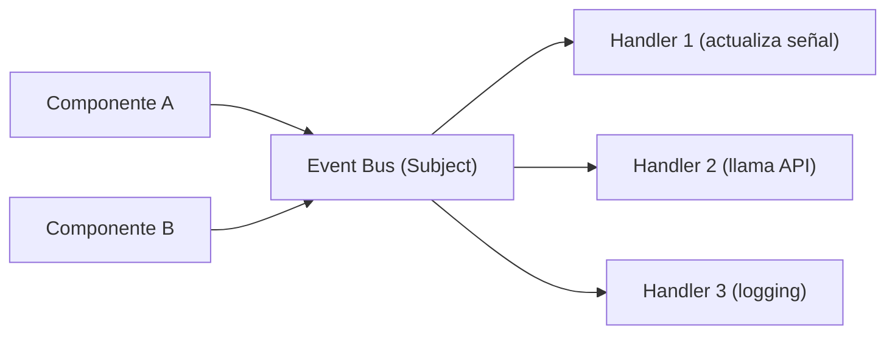

## 36 — Arquitectura Orientada a Eventos

Patrón Event-Driven con RxJS Event Bus, SAGA pattern, eventos de dominio y comunicación desacoplada entre módulos.

> **Propósito:** Implementar arquitectura event-driven con EventBus, typed domain events, SAGA pattern y compensating transactions para flujos distribuidos.
>
> **Problema que resuelve:** Las operaciones de negocio multi-paso (crear orden → cobrar → actualizar inventario) sin eventos son acopladas, difíciles de extender y sin capacidad de rollback.
>
> **Cómo lo resuelve:** EventBusService con Subject tipado, dominio events (OrderPlaced, PaymentReceived, etc.), SAGA orquesta flujos multi-paso, compensating transactions revierten operaciones fallidas.
>
> **Por qué aprenderlo:** Event-driven es el patrón para sistemas desacoplados y resilientes; la SAGA pattern es esencial para transacciones distribuidas en microservicios.




### Conceptos Clave

- **Event Bus**: servicio RxJS que emite/escucha eventos desacoplados
- **Eventos de dominio**: `OrderPlaced`, `PaymentReceived`, `InventoryUpdated`
- **`Subject` como bus**: `Subject<DomainEvent>`, filtro por tipo
- **SAGA pattern**: coreografía de eventos, rollback compensatorio
- **Comunicación cross-module**: sin importar módulos, solo eventos
- **Tipado**: eventos con tipo discriminado (`type` + `payload`)
- **Middleware**: logging, auditoría, metrics en el bus
- **Escalabilidad**: módulos reaccionan sin conocerse

### Proyecto

Sistema de pedidos con SAGA: OrderPlaced -> PaymentProcessed -> InventoryUpdated -> NotificationSent. Rollback en fallo.

### Ejercicios

1. Crea un `EventBusService` con RxJS Subject
2. Define eventos de dominio tipados con uniones discriminadas
3. Implementa SAGA para flujo de pedido completo
4. Añade rollback compensatorio en caso de error
5. Desacopla dos módulos usando solo eventos

### Cómo ejecutar

```bash
cd 36-event-driven
npm install
ng serve --host 0.0.0.0 --port 8080
```

### Archivos del Proyecto

| Archivo | Capa | Propósito |
|---------|------|-----------|
| `README.md` | Raíz | Documentación del proyecto |
| `angular.json` | Raíz | Configuración del workspace Angular |
| `package.json` | Raíz | Dependencias y scripts del proyecto |
| `tsconfig.json` | Raíz | Configuración base de TypeScript |
| `tsconfig.app.json` | Raíz | Configuración de TypeScript para la app |
| `public/favicon.ico` | `public/` | Favicon de la aplicación |
| `src/index.html` | `src/` | HTML principal de la aplicación |
| `src/main.ts` | `src/` | Punto de entrada de la aplicación |
| `src/styles.css` | `src/` | Estilos globales |
| `src/app/app.config.ts` | `src/app/` | Configuración de providers de Angular |
| `src/app/app.ts` | `src/app/` | Componente raíz de la aplicación |
| `src/app/app.css` | `src/app/` | Estilos del componente raíz |
| `src/app/app.html` | `src/app/` | Template del componente raíz |
| `src/app/events/domain-events.ts` | `events/` | Definición de eventos de dominio tipados |
| `src/app/events/event-bus.ts` | `events/` | EventBus con RxJS Subject para comunicación desacoplada |
| `src/app/events/event-logger.ts` | `events/` | Middleware de logging para eventos |
| `src/app/sagas/order-saga.ts` | `sagas/` | SAGA pattern para flujo de pedidos multi-paso |
