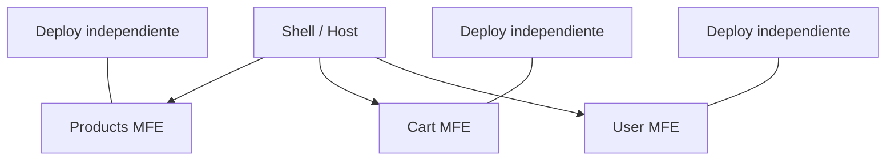

## 37 — Microfrontends con Module Federation

⚠️ **Estado actual:** Este proyecto es una simulación de microfrontends con dos aplicaciones Angular independientes. La implementación real con Module Federation (@angular-architects/module-federation) está pendiente. Las apps se ejecutan por separado en puertos diferentes.

Microfrontends en Angular con Module Federation: host/remote, comunicación cross-MF, y despliegue independiente.

> **Propósito:** Implementar microfrontends con Module Federation: shell (host) que orquesta remotos, comunicación cross-app y despliegue independiente por equipo.
>
> **Problema que resuelve:** Las SPAs monolíticas crecen hasta ser imposibles de mantener por un solo equipo; el despliegue requiere coordinar a todos los equipos simultáneamente.
>
> **Cómo lo resuelve:** Module Federation (Webpack 5) permite cargar aplicaciones Angular independientes en tiempo de ejecución, cada una con su propio deploy, y un shell las coordina.
>
> **Por qué aprenderlo:** Microfrontends son la evolución natural de microservicios al frontend; permiten escalar equipos independientemente y desplegar sin coordinar releases.




### Conceptos Clave

- **Module Federation**: `@angular-architects/module-federation`, webpack/esbuild
- **Host**: aplicación contenedora que carga remotos
- **Remote**: aplicación expuesta como microfrontend
- **`loadRemoteModule`**: cargar remoto en lazy loading
- **Comunicación**: Event Bus compartido, props, custom events
- **Estado compartido**: librería de estado común (NGXS/NgRx Signals)
- **Routing**: ruteo integrado host + remotos
- **Despliegue independiente**: cada MF con su propio CI/CD
- **Versionado**: estrategias de compatibilidad y version matching

### Proyecto

Shell host + 2 remotos (Dashboard + Admin). Comunicación por Event Bus y estado global compartido. Despliegue independiente.

### Ejercicios

1. Configura Module Federation en proyecto Angular
2. Crea un remote que expone un componente standalone
3. Configura host que carga el remoto dinámicamente
4. Implementa comunicación host-remote con Event Bus
5. Despliega remoto y host por separado en diferentes puertos

### Cómo ejecutar

```bash
cd 37-microfrontends
npm install
# En terminal 1: shell host
ng serve --host 0.0.0.0 --port 8080 shell
# En terminal 2: remote
ng serve --host 0.0.0.0 --port 8080 remote
```

### Archivos del Proyecto

| Archivo | App | Propósito |
|---------|-----|-----------|
| `README.md` | Raíz | Documentación del proyecto |
| `angular.json` | Raíz | Configuración del workspace Angular |
| `package.json` | Raíz | Dependencias y scripts del proyecto |
| `tsconfig.json` | Raíz | Configuración base de TypeScript |
| `package-lock.json` | Raíz | Bloqueo de versiones de dependencias |
| `projects/shell-app/public/favicon.ico` | `shell-app` | Favicon del shell host |
| `projects/shell-app/src/index.html` | `shell-app` | HTML principal del shell |
| `projects/shell-app/src/main.ts` | `shell-app` | Punto de entrada del shell |
| `projects/shell-app/src/styles.css` | `shell-app` | Estilos globales del shell |
| `projects/shell-app/src/app/app.config.ts` | `shell-app` | Configuración de providers del shell |
| `projects/shell-app/src/app/app.ts` | `shell-app` | Componente raíz del shell |
| `projects/shell-app/src/app/app.css` | `shell-app` | Estilos del componente raíz del shell |
| `projects/shell-app/src/app/app.html` | `shell-app` | Template del componente raíz del shell |
| `projects/shell-app/src/app/event-bus.ts` | `shell-app` | EventBus para comunicación cross-MF |
| `projects/shell-app/tsconfig.app.json` | `shell-app` | Configuración TS del shell |
| `projects/shell-app/webpack.mf.config.js` | `shell-app` | Configuración Module Federation del host |
| `projects/remote-app/public/favicon.ico` | `remote-app` | Favicon del remote |
| `projects/remote-app/src/index.html` | `remote-app` | HTML principal del remote |
| `projects/remote-app/src/main.ts` | `remote-app` | Punto de entrada del remote |
| `projects/remote-app/src/styles.css` | `remote-app` | Estilos globales del remote |
| `projects/remote-app/src/app/app.config.ts` | `remote-app` | Configuración de providers del remote |
| `projects/remote-app/src/app/app.ts` | `remote-app` | Componente raíz del remote |
| `projects/remote-app/src/app/app.css` | `remote-app` | Estilos del componente raíz del remote |
| `projects/remote-app/src/app/app.html` | `remote-app` | Template del componente raíz del remote |
| `projects/remote-app/src/app/event-bus.ts` | `remote-app` | EventBus para comunicación cross-MF |
| `projects/remote-app/tsconfig.app.json` | `remote-app` | Configuración TS del remote |
| `projects/remote-app/webpack.mf.config.js` | `remote-app` | Configuración Module Federation del remote |
